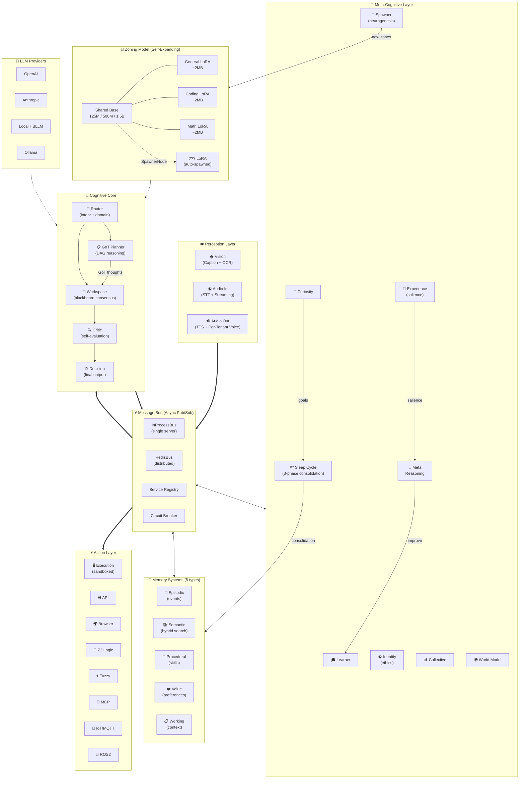

<div align="center">
  <h1>🧠 HBLLM Core</h1>
  <p><b>Human-Brain Inspired Cognitive Architecture</b></p>
  <p><em>An open-source AGI framework that thinks, learns, and adapts — not just responds.</em></p>

  [](https://www.python.org/)
  [](https://pytorch.org/)
  [](https://www.rust-lang.org/)
  [](#)
  [](LICENSE)
</div>

<br/>

## What Makes This Different

**Standard LLMs** are monolithic transformers: prompt → model → response. One path, one perspective, stateless.

**HBLLM Core** is a **modular cognitive architecture** with 25+ specialized brain nodes that communicate over an asynchronous message bus — like a real brain:

```
                        ┌─────────────────────────────────────────┐
    Input ───────────►  │              HBLLM Core Brain           │
    (text, vision,      │                                         │
     audio, sensors)    │   Router ──► Planner ──► Decision       │
                        │     │          │            │           │
                        │   Memory    Learner      Critic        │
                        │   (5 types)    │            │           │
                        │              World       Identity      │
                        │              Model       (ethics)      │
                        │                │                        │
                        │           Curiosity ──► Spawner        │
                        │           (explores)    (creates new   │
                        │                          specialists)  │
                        └───────────────────────────┬─────────────┘
                                                    │
    Output ◄────────────────────────────────────────┘
    (actions, speech, motor control, API calls)
```

## 🔧 The Zoning Model — Why We Don't Need 70B Parameters

Most AI companies chase **bigger models** — 70B, 405B, even trillion-parameter behemoths. HBLLM takes the opposite approach: **small, specialized models working together in zones**, like the human brain.

### The Problem with Monolithic LLMs

```
Traditional Approach:                    HBLLM Zoning Approach:
                                         
┌──────────────────────┐                 ┌──────┐ ┌──────┐ ┌──────┐
│                      │                 │ 125M │ │ 125M │ │ 125M │
│   ONE MASSIVE MODEL  │                 │General│ │Coding│ │ Math │
│     70B+ params      │                 │  +    │ │  +   │ │  +   │
│                      │                 │ LoRA  │ │ LoRA │ │ LoRA │
│  Knows everything    │                 └──┬───┘ └──┬───┘ └──┬───┘
│  but not deeply      │                    │        │        │
│                      │                    └────┬───┘────────┘
│  Costs $$$$ to run   │                         │
│  Needs 80GB GPU      │                 ┌───────┴────────┐
│                      │                 │ Shared Base LLM │
└──────────────────────┘                 │   125M-1.5B     │
                                         │ Runs on CPU/Pi  │
                                         └─────────────────┘
```

### How Zoning Works

HBLLM uses **one small base model** (125M, 500M, or 1.5B parameters) with **lightweight LoRA adapters** that hot-swap depending on the task:

| Component           | Size        | Purpose                                             |
| ------------------- | ----------- | --------------------------------------------------- |
| **Base Model**      | 125M–1.5B   | Shared transformer backbone (GQA + SwiGLU + RoPE)   |
| **LoRA Adapters**   | ~2MB each   | Domain specialization (General, Coding, Math, ...)  |
| **MoE Router**      | Tiny        | Routes to the right expert automatically            |
| **Cognitive Nodes** | Zero params | Orchestration, planning, memory — no weights needed |

```python
# How it works internally:
#
# 1. Query arrives: "Write a sorting algorithm"
# 2. Router Node identifies: this is a CODING task
# 3. Base model loads the Coding LoRA adapter (2MB swap, <1ms)
# 4. Coding expert generates the response
# 5. Critic Node evaluates quality
# 6. If quality < threshold → try Math expert too (ensemble)
# 7. Decision Node picks the best answer
```

### 🧬 Self-Expanding Zones — The Brain Grows Itself

This is the part that no other framework does. **Zones are NOT hardcoded.** HBLLM ships with 3 starter zones (General, Coding, Math), but the **SpawnerNode** creates new specialists automatically when the Router encounters an unfamiliar domain:

```
User asks: "What's the best soil pH for tomatoes?"

Router: "I don't have a GARDENING zone..."
   │
   ▼
SpawnerNode activates:
   │
   ├── 1. Generates synthetic training data for "gardening"
   │
   ├── 2. Trains a new LoRA adapter (~2MB, takes seconds)
   │
   ├── 3. Creates DomainModuleNode("domain_gardening")
   │
   ├── 4. Wires it to the live MessageBus
   │
   └── 5. Announces SPAWN_COMPLETE → new zone is active!
       
Next gardening question → routes directly to the new expert.
The brain literally grew a new region. 🧠
```

```python
# This happens automatically — no restart, no redeployment:
#
# Boot:     [General] [Coding] [Math]           ← 3 starter zones
# Week 1:   + [Gardening] + [Cooking]           ← spawned on demand
# Week 4:   + [Home_Automation] + [IoT]         ← from smart home usage
# Month 2:  + [Energy_Management] + [Security]  ← deeper specialization
#
# Each new zone is a 2MB LoRA adapter on the shared base model.
# Total memory: base model + (N × 2MB) — scales to hundreds of zones.
```

This is **artificial neurogenesis** — the same process biological brains use to grow new neural pathways for new skills.

### Why This Matters

| Metric             | GPT-4 / Claude      | HBLLM Zoning                 |
| ------------------ | ------------------- | ---------------------------- |
| **Parameters**     | 70B–1.7T            | 125M–1.5B                    |
| **GPU Required**   | 80GB A100           | CPU / 4GB GPU / Raspberry Pi |
| **Cost per Query** | $0.01–0.06          | $0.0001 (local)              |
| **Domain Depth**   | Generalist          | Deep specialist per zone     |
| **Add New Domain** | Retrain everything  | Auto-spawns in seconds       |
| **Privacy**        | Cloud-only          | 100% on-device               |
| **Latency**        | 200–2000ms (API)    | 10–50ms (local)              |
| **Self-Expanding** | ❌ Fixed at training | ✅ Grows new zones at runtime |

### Model Presets

| Preset | Params | Layers | Heads | Context | Best For                  |
| ------ | ------ | ------ | ----- | ------- | ------------------------- |
| `125M` | ~125M  | 12     | 12    | 2048    | Edge / Raspberry Pi / IoT |
| `500M` | ~500M  | 24     | 16    | 4096    | Desktop / Home Server     |
| `1.5B` | ~1.5B  | 32     | 32    | 4096    | Workstation / GPU         |

### Built-in MoE (Mixture of Experts)

For advanced deployments, HBLLM supports **Mixture of Experts** — 16 micro-experts with only 2 active per token:

```yaml
# config/model.yaml
use_moe: true
num_experts: 16        # Total specialist micro-experts
num_active_experts: 2  # Only 2 fire per token (efficient!)
use_shared_expert: true # One expert always active (stability)
```

This means a 1.5B MoE model has the **capacity of a much larger model** but the **compute cost of a small one**.

### The Key Insight

> **Intelligence isn't about having the biggest brain. It's about having the right specialists — and growing new ones when you need them.**
>
> A 125M base model + self-expanding LoRA zones + cognitive nodes = an AI that **gets smarter the more you use it**, on hardware you already own.

---

## Architecture

### Full System Overview



### 🧠 Brain Nodes (25+ cognitive modules — growing)

| Node                     | Role                                          | Analog               |
| ------------------------ | --------------------------------------------- | -------------------- |
| **Router**               | Routes inputs to the right cognitive path     | Thalamus             |
| **Planner**              | Breaks goals into multi-step plans (GoT DAG)  | Prefrontal cortex    |
| **Process Reward**       | Continuous scoring of reasoning steps         | Value function       |
| **Tool Router**          | Multiplexes external agentic tool calls       | Basal ganglia        |
| **Decision**             | Makes final decisions from evidence           | Executive function   |
| **Critic**               | Self-evaluates quality and correctness        | Error monitoring     |
| **Learner**              | Updates knowledge from outcomes               | Hippocampal learning |
| **Curiosity**            | Explores novel situations proactively         | Dopaminergic system  |
| **World Model**          | Builds internal model of the environment      | Predictive coding    |
| **World Simulator**      | Simulates outcomes before committing actions  | Mental rehearsal     |
| **Identity**             | Maintains values, ethics, and personality     | Self-model           |
| **Meta Reasoning**       | Reasons about reasoning (Reflection Engine)   | Metacognition        |
| **Workspace**            | Shared cognitive workspace for integration    | Global workspace     |
| **Collective**           | Ensemble reasoning from multiple nodes        | Neural ensemble      |
| **Sleep Cycle**          | Consolidates learning during idle time        | Memory consolidation |
| **Spawner**              | Dynamically creates specialist sub-agents     | Neurogenesis         |
| **Experience**           | Records experiences and detects salience      | Amygdala             |
| **Rule Extractor**       | Mines if→then behavioral rules from events    | Pattern recognition  |
| **Revision Node**        | Self-critique and iterative refinement loop   | Error correction     |
| **Sentinel Node**        | Proactive governance monitoring               | Immune system        |
| **Confidence Estimator** | Scores response reliability                   | Uncertainty modeling |
| **Goal Manager**         | Tracks and prioritizes autonomous goals       | Motivational system  |
| **Self Model**           | Tracks own capabilities and performance       | Self-awareness       |
| **Cognitive Metrics**    | Live dashboard of reasoning performance       | Interoception        |
| **Skill Registry**       | Manages learned procedural skills             | Motor cortex         |
| **Owner Rules**          | Enforces owner-defined behavioral constraints | Superego             |
| **Context Window**       | Manages attention and context allocation      | Working memory       |

### 👁️ Perception (3 input channels)

| Node             | Capability                                |
| ---------------- | ----------------------------------------- |
| **Vision**       | Image understanding and visual processing |
| **Audio Input**  | Speech recognition and sound analysis     |
| **Audio Output** | Speech synthesis and audio generation     |

### 🧬 Memory Systems (5 types + knowledge graph — like human memory)

| Memory              | What It Stores             | Example                                     |
| ------------------- | -------------------------- | ------------------------------------------- |
| **Episodic**        | Events and experiences     | "User came home at 6:30pm on Tuesday"       |
| **Semantic**        | Facts & extracted patterns | "Living room temp preference = 23°C"        |
| **Procedural**      | Skills and how-to          | "To make coffee: fill water → grind → brew" |
| **Value**           | Preferences and judgments  | "User prefers warm lighting over cool"      |
| **Working**         | Current task context       | Active conversation state                   |
| **Knowledge Graph** | Entity-relation network    | Concepts, relationships, and ontologies     |
| **Tool Memory**     | Tool usage patterns        | Which tools work best for which tasks       |

### ⚡ Action Nodes (8 output channels)

| Node           | Capability                           | Optional Dependency |
| -------------- | ------------------------------------ | ------------------- |
| **Execution**  | Run tasks and commands               | —                   |
| **API**        | Call external APIs and services      | —                   |
| **Browser**    | Web interaction and scraping         | playwright          |
| **Logic**      | Formal logical reasoning (Z3 solver) | z3-solver           |
| **Fuzzy**      | Probabilistic/fuzzy reasoning        | —                   |
| **MCP Client** | Model Context Protocol integration   | —                   |
| **IoT/MQTT**   | Home automation device control       | paho-mqtt           |
| **ROS2**       | Robotics (Nav2, MoveIt2, sensors)    | rclpy               |

### 🔌 Infrastructure

| Component              | Purpose                                       |
| ---------------------- | --------------------------------------------- |
| **MessageBus**         | Async pub/sub communication between all nodes |
| **RedisBus**           | Distributed bus with HMAC auth & TTL          |
| **DurableBus**         | Persistent message queuing                    |
| **Service Registry**   | Dynamic node discovery and routing            |
| **Circuit Breaker**    | Fault tolerance and graceful degradation      |
| **Load Balancer**      | Distribute work across node replicas          |
| **Policy Engine**      | YAML-based governance rules                   |
| **Cognition Router**   | Smart routing across cognitive subsystems     |
| **Token Optimizer**    | LLM cost optimization and model selection     |
| **Tracing**            | Full observability of cognitive processing    |
| **Plugin Manager**     | Dynamic plugin loading and management         |

---

## Use Cases

### 🏠 Smart Home & Home Automation

HBLLM Core can power truly intelligent home systems that **learn and adapt** — not just follow rules:

```python
from hbllm.network.bus import InProcessBus
from hbllm.brain.router_node import RouterNode
from hbllm.brain.planner_node import PlannerNode
from hbllm.brain.decision_node import DecisionNode
from hbllm.brain.learner_node import LearnerNode
from hbllm.brain.world_model_node import WorldModelNode
from hbllm.memory.memory_node import MemoryNode

# The brain learns your patterns over time:
#
# Week 1:  "Turn on lights" → turns on lights
# Week 4:  Notices you always dim lights at 9pm → does it automatically  
# Month 2: Learns your wake-up routine → starts coffee before alarm
# Month 6: Predicts energy usage → optimizes heating/cooling schedule
```

**What makes it different from Google Home / Alexa:**

| Feature    | Alexa/Google            | HBLLM Core                              |
| ---------- | ----------------------- | --------------------------------------- |
| Learning   | Pre-programmed routines | Learns from observation                 |
| Memory     | Stateless commands      | Episodic + semantic + procedural memory |
| Planning   | Single-step actions     | Multi-step plans (Planner node)         |
| Adaptation | Manual rule updates     | Self-improving (Learner node)           |
| Privacy    | Cloud-dependent         | Runs 100% locally                       |
| Reasoning  | Pattern matching        | Logical + fuzzy + world model           |

### 🤖 Robotics

HBLLM Core provides the cognitive layer for autonomous robots:

```
Sensors ──► Perception Nodes ──► Router ──► Planner ──► Decision ──► Motors
  │                                │                        │
  │                          World Model              Critic
  │                        (understands               (checks
  │                         physics,                   safety)
  │                         obstacles)                   │
  └────── Memory ◄──────── Learner ◄────────────────────┘
         (remembers         (improves
          what worked)       from mistakes)
```

**Capabilities:**
- **Path planning** — Planner node breaks navigation into steps
- **Object manipulation** — World Model understands physical constraints  
- **Failure recovery** — Critic detects errors, Learner adapts
- **Task learning** — Procedural memory stores learned skills
- **Human interaction** — Audio + Vision perception for natural communication
- **Safety** — Policy engine enforces hard safety constraints

### 🏭 Industrial Automation

| Application                  | How HBLLM Core Helps                                     |
| ---------------------------- | -------------------------------------------------------- |
| **Predictive maintenance**   | World Model learns equipment patterns, predicts failures |
| **Quality control**          | Vision node + Critic node detect defects and anomalies   |
| **Process optimization**     | Learner node continuously improves production parameters |
| **Multi-robot coordination** | Message bus enables distributed swarm intelligence       |

### 🧪 Research & General AI

- **Cognitive science** — Experiment with different brain architectures
- **Reinforcement learning** — Built-in reward/feedback loops
- **Multi-agent systems** — Spawner creates specialized sub-agents
- **Embodied AI** — Connect perception and action for physical agents

---

## Quick Start

### Installation

```bash
pip install -e .

# Optional dependencies (only needed if you use these features):
pip install paho-mqtt        # For IoT/MQTT home automation
# ROS2: install rclpy from your ROS2 distribution, then:
export HBLLM_ROS2_ENABLED=1  # Enable real robot control
```

### CLI

```bash
hbllm info               # Show architecture summary
hbllm nodes              # List all 25 brain nodes
hbllm serve              # Start the API server
hbllm serve --port 9000  # Custom port
hbllm data --dataset fineweb --samples 100000  # Data pipeline
hbllm train --model-size 125m                  # Training
```

### Run the API Server

```bash
# Full brain mode (requires model weights)
python -m hbllm.serving.api

# Provider mode (uses OpenAI/Anthropic as backend)
HBLLM_PROVIDER=openai OPENAI_API_KEY=sk-... python -m hbllm.serving.api
```

### Run Benchmarks

```bash
python -m hbllm.benchmarks.runner --suite all          # All 4 suites
python -m hbllm.benchmarks.runner --suite latency       # Bus latency
python -m hbllm.benchmarks.runner --suite memory        # LoRA vs monolithic
python -m hbllm.benchmarks.runner --suite multi_tenant  # Tenant isolation
python -m hbllm.benchmarks.runner --output results.json # Save JSON
```

### Python API

```python
import asyncio
from hbllm.brain.factory import BrainFactory

async def main():
    # One-line brain setup with any LLM provider
    brain = await BrainFactory.create("openai/gpt-4o-mini")
    
    # Process a query through the full cognitive pipeline
    result = await brain.process("What's the optimal temperature for my living room?")
    print(result.text)
    print(f"Latency: {result.latency_ms:.0f}ms")
    print(f"LLM usage: {brain.usage}")
    
    await brain.shutdown()

asyncio.run(main())
```

**Supported providers:**

```python
# OpenAI (default)
brain = await BrainFactory.create("openai/gpt-4o-mini")

# Anthropic
brain = await BrainFactory.create("anthropic/claude-sonnet-4-20250514")

# Local model (runs on CPU/GPU, no API needed)
brain = await BrainFactory.create("local", model=my_model, tokenizer=my_tokenizer)
```

<details>
<summary><b>Advanced: Manual node wiring</b></summary>

```python
import asyncio
from hbllm.network.bus import InProcessBus
from hbllm.brain.router_node import RouterNode
from hbllm.brain.decision_node import DecisionNode
from hbllm.memory.memory_node import MemoryNode
from hbllm.network.messages import Message, MessageType

async def main():
    bus = InProcessBus()
    await bus.start()

    memory = MemoryNode(node_id="memory_01", db_path="brain.db")
    router = RouterNode(node_id="router_01")
    decision = DecisionNode(node_id="decision_01")

    for node in [memory, router, decision]:
        await node.start(bus)

    msg = Message(
        type=MessageType.QUERY,
        source_node_id="user",
        topic="router.query",
        payload={"text": "What's the optimal temperature for my living room?"},
    )
    await bus.publish("router.query", msg)

asyncio.run(main())
```

</details>

---

## Project Structure

```
hbllm-core/
├── hbllm/                    # Python cognitive architecture
│   ├── brain/                # 25+ cognitive nodes
│   │   ├── router_node.py    #   Input routing (thalamus)
│   │   ├── planner_node.py   #   Graph-of-Thoughts planning
│   │   ├── decision_node.py  #   Final decision making
│   │   ├── critic_node.py    #   Self-evaluation
│   │   ├── learner_node.py   #   Learning from outcomes
│   │   ├── curiosity_node.py #   Exploration drive
│   │   ├── world_model_node.py # Environment modeling
│   │   ├── world_simulator.py#   Action outcome simulation
│   │   ├── identity_node.py  #   Values and ethics
│   │   ├── meta_node.py      #   Meta-reasoning
│   │   ├── workspace_node.py #   Cognitive workspace (blackboard)
│   │   ├── collective_node.py#   Ensemble reasoning
│   │   ├── sleep_node.py     #   Memory consolidation
│   │   ├── spawner_node.py   #   Dynamic agent creation
│   │   ├── experience_node.py#   Salience detection
│   │   ├── rule_extractor.py #   Behavioral rule mining
│   │   ├── revision_node.py  #   Self-critique loop
│   │   ├── sentinel_node.py  #   Proactive governance
│   │   ├── confidence_estimator.py # Response reliability
│   │   ├── goal_manager.py   #   Autonomous goal tracking
│   │   ├── self_model.py     #   Capability self-tracking
│   │   ├── cognitive_metrics.py #  Live performance dashboard
│   │   ├── skill_registry.py #   Skill management
│   │   ├── owner_rules.py    #   Owner behavioral rules
│   │   ├── context_window.py #   Context/attention management
│   │   ├── policy_engine.py  #   Governance rules
│   │   ├── llm_interface.py  #   Local model interface
│   │   ├── provider_adapter.py # LLM provider adapter
│   │   └── factory.py        #   One-line brain setup (BrainFactory)
│   ├── memory/               # 5 memory systems + knowledge graph
│   │   ├── episodic.py       #   Event memory
│   │   ├── semantic.py       #   Fact memory (hybrid search)
│   │   ├── procedural.py     #   Skill memory
│   │   ├── value_memory.py   #   Preference memory
│   │   ├── knowledge_graph.py#   Entity-relation graph
│   │   ├── concept_extractor.py # Concept extraction
│   │   └── memory_node.py    #   Unified memory interface
│   ├── perception/           # Input channels
│   │   ├── vision_node.py    #   Image + OCR
│   │   ├── audio_in_node.py  #   STT + streaming
│   │   └── audio_out_node.py #   TTS + per-tenant voice
│   ├── actions/              # Output channels
│   │   ├── execution_node.py #   Sandboxed code execution
│   │   ├── api_node.py
│   │   ├── browser_node.py
│   │   ├── logic_node.py     #   Z3 theorem prover
│   │   ├── fuzzy_node.py     #   Fuzzy reasoning
│   │   ├── mcp_client_node.py
│   │   ├── tool_memory.py    #   Tool usage memory
│   │   ├── iot_mqtt_node.py  #   Home automation (paho-mqtt)
│   │   └── ros2_node.py      #   Robotics (rclpy)
│   ├── network/              # Communication infrastructure
│   │   ├── bus.py            #   InProcessBus (pub/sub)
│   │   ├── redis_bus.py      #   Distributed bus (HMAC + TTL)
│   │   ├── durable_bus.py    #   Persistent message queue
│   │   ├── node.py           #   Base node abstraction
│   │   ├── registry.py       #   Service discovery
│   │   ├── circuit_breaker.py#   Fault tolerance
│   │   ├── cognition_router.py #  Cognitive routing
│   │   ├── load_balancer.py  #   Node load distribution
│   │   ├── plugin_manager.py #   Dynamic plugin loading
│   │   ├── tracing.py        #   Full observability
│   │   └── ...
│   ├── model/                # Transformer model (GQA + SwiGLU + RoPE + MoE)
│   ├── data/                 # Data pipeline & interaction mining
│   ├── training/             # SFT, DPO, cognitive training, reward model
│   │   ├── cognitive_trainer.py # Knowledge graph + skills during training
│   │   ├── reward_model.py   #   Reward modeling
│   │   └── ...               #   SFT, DPO, evaluation, embeddings
│   ├── benchmarks/           # Cognitive arch vs monolithic benchmarks
│   │   └── runner.py         #   4 suites: latency, memory, routing, MT
│   └── serving/              # FastAPI server + MCP server
│       ├── token_optimizer.py#   LLM cost optimization
│       ├── mcp_server.py     #   Model Context Protocol server
│       └── ...               #   API, pipeline, providers
├── rust/                     # Rust accelerators
│   ├── tokenizer/            #   High-performance tokenizer
│   └── data_tools/           #   Data cleaning & dedup
├── tests/                    # 965+ tests
└── pyproject.toml
```

---

## Recent Additions

### Phase 4 — Agentic Capabilities & Performance

| Feature                     | Description                                                                                                          |
| --------------------------- | -------------------------------------------------------------------------------------------------------------------- |
| **Speculative Decoding**    | High-performance inference dual-model loop with **Adaptive Gamma** depth scaling                                     |
| **Process Reward Model**    | `ProcessRewardNode` (PRM) for continuous neural scoring [0-1] of intermediate reasoning steps                        |
| **Tool Router**             | `ToolRouterNode` provides generic XML-based tool call multiplexing for multi-step agentic chains                     |
| **Adaptive Context Window** | Middle-out truncation to manage huge GoT/MCTS reasoning trajectories without OOM                                     |
| **Workspace Stability**     | Tracked async lifecycles and strict race condition elimination for 100% stable, cross-test clean state execution     |

### Phase 3 — Cognitive Training & Governance

| Feature                     | Description                                                                                                          |
| --------------------------- | -------------------------------------------------------------------------------------------------------------------- |
| **Cognitive Trainer**       | Knowledge graph building, skill detection, and memory formation during training via `CognitiveTrainer`               |
| **Policy Engine**           | YAML-based governance with `PolicyEngine` enforcing safety, rate limits, and content rules                           |
| **Owner Rules**             | `OwnerRuleStore` for user-defined behavioral constraints persisted in SQLite                                          |
| **Sentinel Node**           | Proactive governance monitoring — scans bus traffic and flags policy violations                                       |
| **Rule Extractor**          | Mines if→then behavioral rules from high-salience events with auto-promotion to owner rules                          |
| **Revision Node**           | Self-critique loop with `ConfidenceEstimator` for iterative response refinement                                      |
| **Goal Manager**            | Autonomous goal tracking with priority scoring and progress monitoring                                               |
| **Self Model**              | Tracks per-domain capabilities, success rates, and latency for self-awareness                                        |
| **Cognitive Metrics**       | Live dashboard metrics: reasoning quality, latency, confidence distributions                                         |
| **Token Optimizer**         | LLM cost optimization — routes to cheapest capable model per query complexity                                        |
| **Reward Model**            | Reward scoring for interaction quality, feeds into DPO training loop                                                 |
| **Interaction Miner**       | Records query-response pairs with rewards for continuous self-improvement                                            |

### Phase 2 — Infrastructure & Perception

| Feature                    | Description                                                                                                                       |
| -------------------------- | --------------------------------------------------------------------------------------------------------------------------------- |
| **Distributed Bus**        | `RedisBus` hardened with exponential backoff reconnection, TTL enforcement, HMAC auth, and `BusMetrics`                           |
| **LLM Provider Adapter**   | Unified `LLMProvider` abstraction with `OpenAIProvider`, `AnthropicProvider`, `LocalProvider` + `ProviderLLM` adapter             |
| **SleepNode Phase 3**      | Curiosity goal replay during idle — accumulates goals from `system.sleep.goal`, replays during sleep, emits `system.sleep.report` |
| **GoT → Workspace Wiring** | `PlannerNode` now participates in workspace deliberation, posting GoT thoughts with graph metadata                                |
| **Audio Streaming**        | `AudioInputNode` supports real-time hex-encoded PCM streaming with session buffering and silence detection                        |
| **Per-Tenant Voice**       | `AudioOutputNode` supports custom voice embeddings per tenant and text chunking for long inputs                                   |
| **OCR Integration**        | `VisionNode` supports OCR via EasyOCR with pytesseract fallback                                                                   |
| **Structured Logging**     | JSON-formatted logs with correlation IDs, per-module levels, and context vars                                                     |
| **Sandboxed Execution**    | `ExecutionNode` runs code in isolated environment with memory/CPU limits and output truncation                                    |
| **E2E Cognitive Test**     | Full pipeline test with real nodes + MockLLM covering query flow, salience, memory, feedback loops                                |

---

## Extending for Your Use Case

### Adding a Custom Node

```python
from hbllm.network.node import Node, NodeType

class TemperatureSensorNode(Node):
    """Custom perception node for IoT temperature sensors."""

    def __init__(self, node_id: str, mqtt_topic: str):
        super().__init__(node_id, NodeType.DETECTOR, capabilities=["temperature"])
        self.mqtt_topic = mqtt_topic

    async def on_start(self):
        await self.bus.subscribe(self.mqtt_topic, self.handle_message)

    async def on_stop(self):
        pass

    async def handle_message(self, message):
        temp = message.payload.get("temperature")
        # Publish to the cognitive pipeline
        await self.publish("perception.temperature", Message(
            type=MessageType.EVENT,
            source_node_id=self.node_id,
            payload={"temperature": temp, "unit": "celsius"},
        ))
        return None
```

### Connecting to Hardware (Raspberry Pi / Jetson)

```python
# HBLLM runs on any Python 3.11+ system
# No GPU required in provider mode

# On Raspberry Pi:
pip install -e .
HBLLM_PROVIDER=openai python -m hbllm.serving.api --host 0.0.0.0 --port 8000
```

---

## Contributing

We welcome contributions! See [CONTRIBUTING.md](CONTRIBUTING.md) for guidelines.

Key areas where we need help:
- 🧠 **New cognitive nodes** — Emotion modeling, spatial reasoning, temporal reasoning
- 📱 **Edge optimization** — Running efficiently on Raspberry Pi / Jetson
- 🏠 **IoT integrations** — Extend MQTT node with new device protocols
- 🤖 **ROS2 packages** — Navigation planners, manipulation skills
- 🌐 **New LoRA domains** — Medical, legal, creative writing specialists

## License

MIT License — free to use in personal, commercial, and research projects.

---

<div align="center">
  <p><b>HBLLM Core</b> — AI that thinks, not just responds.</p>
  <p>⭐ Star this repo if you believe AI should be more than a chatbot.</p>
</div>
