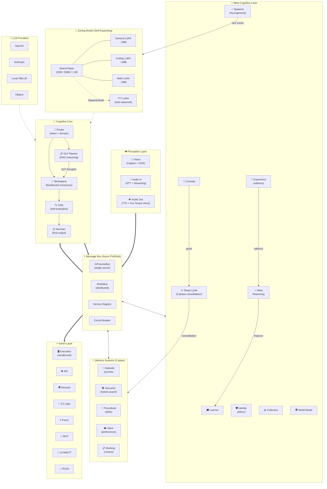

<div align="center">
  <h1>🧠 HBLLM Core</h1>
  <p><b>Human-Brain Inspired Cognitive Architecture</b></p>
  <p><em>An open-source AGI framework that thinks, learns, and adapts — not just responds.</em></p>

  [](https://www.python.org/)
  [](https://pytorch.org/)
  [](https://www.rust-lang.org/)
  [](#)
  [](LICENSE)
</div>

<br/>

## What Makes This Different?

**Standard LLMs** are monolithic transformers: prompt → model → response. One path, one perspective, stateless.

**HBLLM Core** is a **modular cognitive architecture** featuring 25+ specialized brain nodes that communicate over an asynchronous message bus — mimicking the localized processing of a biological brain.

```text
                        ┌─────────────────────────────────────────┐
    Input ───────────►  │              HBLLM Core Brain           │
    (text, vision,      │                                         │
     audio, sensors)    │   Router ──► Planner ──► Decision       │
                        │     │          │            │           │
                        │   Memory    Learner      Critic        │
                        │   (5 types)    │            │           │
                        │              World       Identity      │
                        │              Model       (ethics)      │
                        │                │                        │
                        │           Curiosity ──► Spawner        │
                        │           (explores)    (creates new   │
                        │                          specialists)  │
                        └───────────────────────────┬─────────────┘
                                                    │
    Output ◄────────────────────────────────────────┘
    (actions, speech, motor control, API calls)
```

By decoupling reasoning, memory, evaluation, and action, HBLLM can self-correct, execute multi-step tool chains, maintain lifelong memories, and optimize compute costs dynamically.

---

## 🔧 The Zoning Model — Efficiency Over Scale

Most AI platforms chase **massive monolithic models** (70B+ parameters). HBLLM takes the opposite approach: **small, specialized models working together in zones**.

### How Zoning Works

HBLLM uses **one highly-optimized base model** (e.g., 125M, 500M, or 1.5B parameters) paired with **lightweight LoRA adapters** that hot-swap depending on the active cognitive task.

| Component           | Size        | Purpose                                              |
| ------------------- | ----------- | ---------------------------------------------------- |
| **Base Model**      | 125M–1.5B   | Shared transformer backbone (GQA + SwiGLU + RoPE)    |
| **LoRA Adapters**   | ~2MB each   | Domain specialization (General, Coding, Math, etc.)  |
| **MoE Router**      | ~15MB       | Edge-optimized ONNX Vector Router. Blends domain experts dynamically without heavy PyTorch dependencies. |
| **Cognitive Nodes** | Zero params | Orchestration, planning, memory — isolated logic     |

### 🧬 Artificial Neurogenesis (Self-Expanding Zones)

HBLLM ships with 3 starter zones, but the **SpawnerNode** automatically creates new specialist zones when you enter an unfamiliar domain.
When encountering a completely new domain (e.g., "Gardening"), the system:
1. **Registry Resolution**: Checks the `AdapterRegistry` for pre-trained "gardening" adapters on the HuggingFace Hub or local cache.
2. **Security Audit**: If found, verifies the adapter's SHA-256 integrity and converts it from PEFT format to the internal HBLLM `state_dict`.
3. **Fallback Training**: If no adapter exists, generates synthetic training data and trains a new 2MB LoRA adapter in the background.
4. **Activation**: Spawns a new `DomainModuleNode` and hot-swaps the weights into the shared transformer backbone.
**The brain literally grows a new region at runtime.**

---

## 🏗️ Core Capabilities

### Full System Architecture



HBLLM Core isn't just a wrapper; it's a deeply engineered cognitive backend capable of production-scale agentic deployments.

### 🧠 Agentic Reasoning & Evaluation
- **Lock-Free LoRA Concurrency:** Isolated `ContextVars` allow asynchronous domain modules to share a single GPU lock-free, streaming tiny ~2MB adapters strictly during forward passes over the PCIe bus without blocking other cognitive nodes.
- **Secure Adapter Registry**: A hardened runtime system for resolving and downloading domain-specific LoRA adapters from the HuggingFace Hub with mandatory SHA-256 integrity checks and `weights_only=True` loading.
- **Continuous Lifetime Learning:** The `LearnerNode` implements contrastive DPO (Direct Preference Optimization) using a persistent, atomic JSON queue. It "sleeps" to consolidate feedback into permanent model updates without interrupting the main serving loop.
- **Dynamic MoE Blending:** Queries overlapping multiple domains (e.g., Coding + Math) mathematically synthesize custom blend-weights at runtime, forming custom experts out of base adapters globally across all layers.
- **Graph-of-Thoughts (GoT) Planning:** The `PlannerNode` breaks complex goals into dynamic, directed acyclic graphs of reasoning steps.
- **Process Reward Models (PRM):** The `ProcessRewardNode` provides continuous neural scoring `[0-1]` of intermediate reasoning steps, catching hallucinations before they compound.

### 💾 Multi-Tiered Memory Systems
HBLLM operates **5 distinct memory types** mirroring human cognitive psychology:
1. **Working Memory:** Adaptive Context Windows employing middle-out truncation to maintain huge reasoning trajectories without OOMs.
2. **Episodic Memory:** Event-based timelines mapping user interactions per session.
3. **Semantic Memory:** Fact and pattern extraction powered by hybrid dense/sparse (TF-IDF) vector search with deterministic UUID stability.
4. **Procedural Memory:** Learned tool patterns and skill execution registries.
5. **Knowledge Graph:** LRU-bounded (Least Recently Used) entity-relation graphs connecting concepts organically.

### 🛡️ Enterprise-Grade Governance & Multi-Tenancy
- **Strict Tenant Isolation:** API Key authenticators, per-tenant rate limiters (`RateLimiter`), and deeply isolated memory domains ensure zero data leakage.
- **Policy Engine & Sentinel Node:** YAML-based governance constraints and a proactive `SentinelNode` that continuously scans the async bus traffic for policy violations.
- **Owner Rules:** The `RuleExtractor` mines high-salience interactions for recurring *if→then* preferences, auto-promoting them to strict `OwnerRuleStore` behavioral guardrails.

### ⚙️ Scalable Infrastructure
- **Edge-Ready ONNX Router:** The Vector Routing Engine operates completely independently of PyTorch using `onnxruntime` and `tokenizers`. At under `15MB` of RAM footprint and ~0.0001ms native inference times, the routing engine thrives on constrained IoT devices like wearables or Raspberry Pis.
- **Distributed Async Message Bus:** Nodes communicate purely via Pub/Sub. Deploy locally via `InProcessBus` or scale across clusters via `RedisBus` (featuring HMAC auth, TTLs, and exponential backoff).
- **Token Optimization:** Dynamic routing to the cheapest capable provider. Automatically offsets easy queries to local ~125M models while elevating complex logic to GPT-4o or Claude 3.5.
- **Sandboxed Execution:** The `ExecutionNode` evaluates logic securely with strict compute/memory bounds.

---

## ⚡ Quick Start

### Installation

```bash
git clone https://github.com/your-org/hbllm-core.git
cd hbllm-core
pip install -e .

# Optional hardware/sensor integrations:
pip install paho-mqtt        # IoT / MQTT Home Automation
export HBLLM_ROS2_ENABLED=1  # ROS2 Robotics Integration (Requires rclpy)
```

### CLI Utilities

```bash
hbllm info               # View active brain architecture
hbllm nodes              # List 25+ loaded cognitive nodes
hbllm serve --port 8000  # Start the FastAPI + MCP Server
hbllm train --size 125m  # Kickoff local reinforcement loops
```

### Server & API Modes

Start the Brain as a standalone API:
```bash
# Full local autonomy (requires downloaded safetensors)
python -m hbllm.serving.api

# Cloud-Provider backend (Use OpenAI/Anthropic for the LLM heavy-lifting)
HBLLM_PROVIDER=openai OPENAI_API_KEY=sk-... python -m hbllm.serving.api
```

### Python API Usage

```python
import asyncio
from hbllm.brain.factory import BrainFactory

async def main():
    # One-line brain setup
    brain = await BrainFactory.create("openai/gpt-4o")
    
    # Process a complex, multi-step goal
    result = await brain.process("Analyze our server logs and design a firewall rule.")
    
    print(f"Decision: {result.text}")
    print(f"Nodes Activated: {result.path}")
    print(f"Latency: {result.latency_ms:.0f}ms")
    
    await brain.shutdown()

asyncio.run(main())
```

---

## 🌍 Example Use Cases

### 🏠 Smart Home Automation
HBLLM Core powers intelligent systems that **learn** rather than just triggering hardcoded routines.
- **Observation:** Notes you dim the lights when turning on the TV.
- **Procedural Encoding:** The `LearnerNode` creates a skill binding the two actions.
- **Anticipation:** The `WorldModelNode` begins proactively dimming lights when detecting TV audio signatures.

### 🤖 Autonomous Robotics (ROS2)
Functions as the cognitive layer for edge robots:
- **Perception:** Visual OCR (`VisionNode`) and Audio STT (`AudioInputNode`).
- **Pathing:** Breaking complex "fetch" requests into DAGs via the `PlannerNode`.
- **Validation:** Evaluating obstacle physics via the `WorldSimulator` before moving servos.

---

## 🛠 Extending HBLLM (Writing Custom Nodes)

Nodes are highly decoupled. You can easily inject a custom sensor or API into the cognitive loop by inheriting from `Node` and publishing to the bus:

```python
from hbllm.network.node import Node, NodeType
from hbllm.network.messages import Message, MessageType

class TemperatureSensorNode(Node):
    """Custom perception node reading from hardware."""

    def __init__(self, node_id: str, i2c_address: str):
        super().__init__(node_id, NodeType.DETECTOR, capabilities=["temperature"])
        self.i2c = i2c_address

    async def poll_hardware(self):
        temp = read_sensor(self.i2c)
        
        # Publish directly to the cognitive stream
        await self.publish("perception.temperature", Message(
            type=MessageType.EVENT,
            source_node_id=self.node_id,
            payload={"celsius": temp},
        ))
```

---

## 🤝 Contributing

We welcome contributions to push AGI forward! 
Key areas where we need help:
- 🧠 **New Cognitive Nodes:** Emotion modeling, temporal reasoning, multi-modal alignment.
- 📱 **Edge Devices:** Optimization patches for Raspberry Pi 5 & Jetson Orin Nano.
- 🌐 **Starter Zones:** Pre-trained 2MB LoRAs for Medicine, Law, or Creative Writing.

Please review our [CONTRIBUTING.md](CONTRIBUTING.md) for Pull Request guidelines.

## 📄 License

HBLLM Core is released under the **MIT License** — free for personal, commercial, and academic research use.

---

<div align="center">
  <p><b>HBLLM Core</b> — AI that thinks, not just responds.</p>
  <p>⭐ Star this repo if you believe AI should mimic human cognition.</p>
</div>
