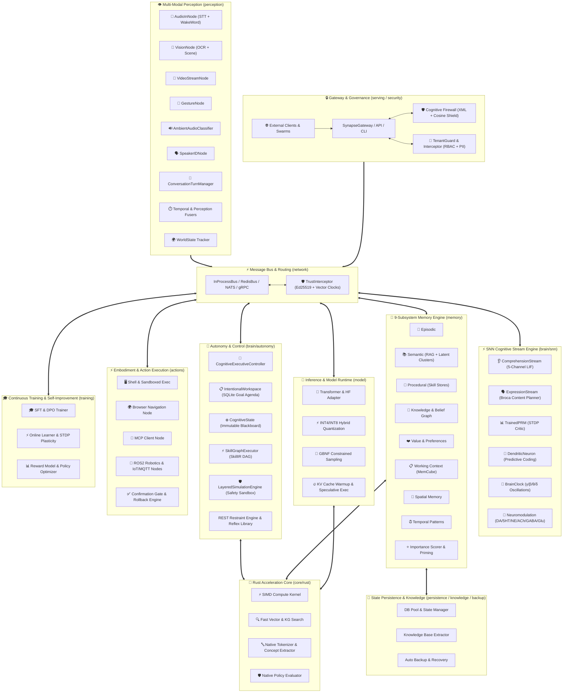

# ADR 001: HBLLM Core Master Cognitive System Architecture

- **Status**: Accepted
- **Deciders**: HBLLM Core Architecture Team
- **Date**: 2026-07-17
- **Technical Area**: Full HBLLM Core Engine (`core/hbllm`, `core/rust`, `core/plugins`)

---

## Context and Problem Statement

Traditional Large Language Model (LLM) agents suffer from three major operational bottlenecks:
1. **Excessive VRAM / Hardware Footprint**: Relying solely on massive models (70B+) for control flow, state tracking, memory indexing, and reflex gating requires expensive multi-GPU clusters (80GB+ VRAM).
2. **Brittle State & Context Collapses**: Unstructured text prompts lose causal context over long sessions, leading to hallucinated state transitions and unrecoverable error loops.
3. **Black-Box Autonomy & Security Risks**: Unconstrained autonomous agent tool execution lacks fine-grained restraint mechanisms, deterministic governance, multi-tenant boundaries, and real-time sensory groundings.

To solve these fundamental issues, **HBLLM Core** was designed as a zero-VRAM overhead, hardware-efficient, multi-modal cognitive brain architecture that runs locally on consumer CPUs while supporting distributed multi-agent swarms.

---

## Architectural Principles & Invariants

1. **Local-First Autonomy**: Full cognitive utility on a single consumer device (CPU-only SIMD) without mandatory cloud dependencies.
2. **Decoupled Control & Zero-VRAM Logic**: Cognitive routing, state tracking, goal decomposition, and memory scoring are zero-parameter pure-logic operations—adding 0 MB to GPU load.
3. **Strict Layer Separation**:
   - **SNN Layer (Dynamics)**: Temporal integration, decay dynamics, spiking events, Broca expression planning, and STDP-based PRM reward evaluations.
   - **Memory Layer (Storage)**: 9 distinct memory subsystems managing factual, spatial, temporal, procedural, and relational state.
   - **Retrieval Layer (Ranking)**: Hybrid blending of dense, sparse, knowledge graph, and SNN priming/boost signals.
   - **LLM Layer (Reasoning)**: Generative synthesis over structured working context and decision DAGs.
   - **Telemetry Layer (Observation)**: Strictly observational with zero side-effects on cognitive state or routing.
4. **Causal Consistency & Cryptographic Trust**: Unified chronological vector clocks and Ed25519 signed envelopes across all local and distributed message channels.

---

## Complete Core Subsystem Architecture

---

## Detailed Architectural Decisions (100% Core Module Coverage)

### 1. Multi-Modal Perception & Signal Fusion (`core/hbllm/perception`)
- **Decision**: Raw real-world inputs (audio streams, camera feeds, gesture tracking, ambient noise) are processed by dedicated streaming perception nodes (`AudioInNode`, `VisionNode`, `VideoStreamNode`, `GestureNode`, `AmbientAudioClassifier`, `SpeakerIdNode`).
- **Fusion Logic**: Signals pass through `TemporalFuser` and `PerceptionFuser` to construct a time-aligned, multi-sensor `WorldState` snapshot before emitting events onto the bus.
- **Turn Management**: `ConversationTurnManager` maintains strict acoustic state transitions (`IDLE` → `LISTENING` → `PROCESSING` → `SPEAKING`), preventing double-talk and voice race conditions.

### 2. SNN Cognitive Dynamics & Brain Clock (`core/hbllm/brain/snn`)
- **Decision**: Incorporate a 5-channel Leaky Integrate-and-Fire (LIF) Spiking Neural Network alongside artificial neuromodulators (Dopamine, Serotonin, Norepinephrine, Acetylcholine, GABA, Glutamate) and multi-band neural oscillations ($\gamma, \beta, \theta, \delta$).
- **Broca Expression Stream**: Content generation is gated by a spiking `ContentPlanNetwork` that produces explicit content blueprints (types, key points, sequencing) prior to LLM token rendering.
- **Online Reward Learning**: Output quality is evaluated in real-time by a `TrainedPRM` SNN using Spike-Timing-Dependent Plasticity (STDP) without standard backpropagation overhead.

### 3. 9-Subsystem Dual-Storage Memory Architecture (`core/hbllm/memory`)
- **Decision**: Implement nine specialized memory subsystems:
  1. **Episodic**: Multi-session interaction logs with decay profiles.
  2. **Semantic**: Dense vector RAG backed by latent clustering (`LatentCluster`).
  3. **Procedural**: Action sequences and tool invocation skills.
  4. **Knowledge Graph & Belief Graph**: Entity-relationship triples with belief confidence scoring (`BeliefGraph`).
  5. **Value Memory**: User preferences, ethical boundaries, and feedback vectors.
  6. **Working Context (MemCube)**: High-speed multi-dimensional working memory buffer.
  7. **Spatial Memory**: Physical and virtual location tracking.
  8. **Temporal Patterns**: Recurrent time-series behaviors and routine detection.
  9. **Importance Scorer & Priming**: Dynamic memory node weight activation based on continuous context cues.
- **Storage Strategy**: Dual-tier storage utilizing SQLite for structured relational integrity and native Rust SIMD structures for high-speed vector distance calculations.

### 4. Autonomous Executive Control & Safety Sandbox (`core/hbllm/brain/autonomy`)
- **Decision**: Orchestration is driven by `CognitiveExecutiveController` operating on an immutable, versioned blackboard (`CognitiveState`).
- **Goal Agenda**: High-level intent is stored in SQLite (`IntentionalWorkspace`) and decomposed into SkillIR Directed Acyclic Graphs executed by `SkillGraphExecutor`.
- **Safety & Restraint**: Before execution, action graphs pass through `LayeredSimulationEngine` (simulating safety, social, and resource outcomes) and `RestraintEngine` to prevent non-conforming or dangerous tool invocations.

### 5. Action Execution & Physical/Virtual Embodiment (`core/hbllm/actions`)
- **Decision**: Tool execution is isolated across explicit action nodes: `ShellNode`, `BrowserNode`, `McpClientNode`, `Ros2Node` (robotics), and `IotMqttNode`.
- **Safety Gates**: All mutating actions pass through `ConfirmationGate` for explicit user approval when high complexity thresholds are met, with transactional support for `RollbackEngine`.

### 6. Local Model Inference & Quantization Runtime (`core/hbllm/model`)
- **Decision**: Local model execution combines HuggingFace transformer primitives with GBNF grammar-constrained decoding (`grammar.py`), INT4/INT8 hybrid quantization (`quantization.py`), and KV cache warmup (`kv_warmup.py`) for low-latency CPU SIMD execution.

### 7. Serving, Gateway & Real-Time API (`core/hbllm/serving` & `cli`)
- **Decision**: `SynapseGateway` provides real-time FastAPI REST, WebSocket streaming (`streaming.py`), MCP server endpoints (`mcp_server.py`), and CLI interfaces (`_cli_app.py`) backed by proactive notification push drivers (`push_backends.py`).

### 8. Continuous Learning & Training Pipelines (`core/hbllm/training`)
- **Decision**: Continuous learning combines SFT (`sft.py`), Direct Preference Optimization (`dpo.py`), online STDP learning (`online_learner.py`), and simulated exploration sandboxes (`exploration_sandbox.py`) to adapt models on-device without full retraining.

### 9. Async Heterogeneous Bus & Cryptographic Trust (`core/hbllm/network` & `security`)
- **Decision**: Communication across nodes is decoupled via `InProcessBus`, with transparent distribution over `RedisBus`, `NATSBus`, or `gRPC`.
- **Security Envelope**: Messages pass through `TrustInterceptor`, requiring Ed25519 cryptographic signatures and causal Vector Clock metadata.
- **Cognitive Firewall**: External input payloads undergo XML sanitization and Cosine Prompt Shielding to thwart prompt injection and jailbreak attacks.
- **Multi-Tenancy**: Tenant boundaries are enforced at the network transport level by `TenantGuard` and `TenantInterceptor`.

### 10. Persistence, Backup & Knowledge Management (`core/hbllm/persistence`, `knowledge`, `backup.py`)
- **Decision**: Transactional state persistence (`state.py`) relies on connection pools (`db_pool.py`) with automated background backup routines (`backup.py`) and entity extraction pipelines (`extractor.py`).

### 11. Meta-Cognitive Self-Model & Compaction (`core/hbllm/brain/self_model` & `compaction`)
- **Decision**: Enable continuous system self-improvement without retraining base parameters.
- **Sleep Cycle**: An offline sleep process compacts episodic events, updates belief graphs, prunes stale memory nodes, and generalizes skills.
- **Neurogenesis Spawner**: Dynamically instantiates specialized LoRA adapters (`Spawner`) when encountering domain novelty tracked by `CuriosityNode`.

### 12. Native Rust Acceleration Core (`core/rust`)
- **Decision**: Performance-critical algorithms are implemented in Rust with PyO3 bindings:
  - `compute_kernel`: AVX2/NEON SIMD operations for tensor and matrix operations.
  - `semantic_search` & `knowledge_graph`: Sub-millisecond vector indexing and graph search.
  - `tokenizer` & `concept_extract`: Ultra-fast text tokenization and named entity extraction.
  - `policy_eval`: Real-time safety constraint check evaluation.
  - `perception` & `confidence`: Hardware-accelerated perceptual signal processing.

---

## Decision Consequences & Downstream Impact

### Positive Consequences
- **Complete End-to-End System Autonomy**: Every layer—from low-level SIMD kernels to multi-modal perception, model inference, SNN gating, 9 memory stores, tool embodiment, and REST APIs—is explicitly bounded and governed.
- **Zero-VRAM Overhead for Intelligence Control**: Over 50 cognitive nodes operate in pure Python/Rust CPU memory, consuming < 200 MB RAM and 0 MB VRAM.
- **Deterministic Auditability**: Complete chronological audit trails (`AuditLog`, `AuditTrail`) for every cognitive state transition, tool call, and memory retrieval.
- **Offline & Edge Capability**: Runs seamlessly on standard hardware (e.g., Apple Silicon, x86 laptop CPUs) without requiring cloud APIs.

### Negative / Trade-off Consequences
- **System Orchestration Complexity**: Managing 12 distinct core layers requires strict interface contracts, type hints, and automated unit/integration tests.
- **Polyglot Maintenance**: Demands expertise in Python 3.11+ async runtimes, C++ native tools, and Rust FFI bindings (`PyO3`).

---

## Status and Verification

- **MkDocs Documentation**: Integrated into `core/docs/architecture/overview.md` and `docs/index.md`.
- **System Integration**: Validated against core test suites in `core/tests`.
