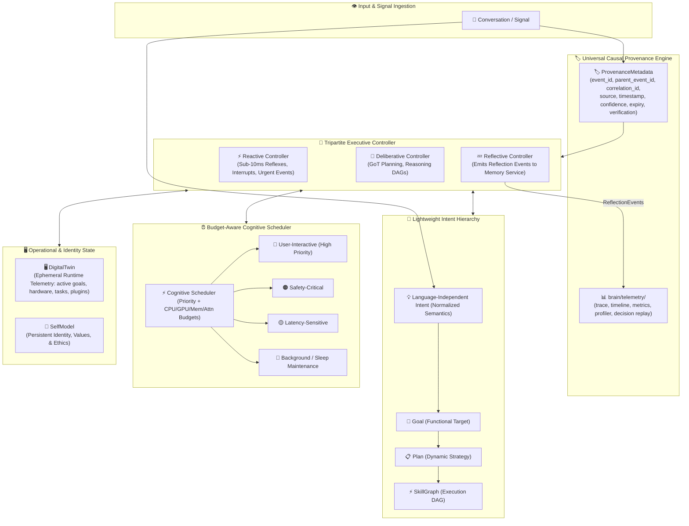

# ADR 002: Long-Term Operational Architecture, Tripartite Executive & Digital Twin

- **Status**: Implemented
- **Deciders**: HBLLM Core Architecture & Governance Team
- **Date**: 2026-07-17
- **Technical Area**: Executive Control, Provenance, Telemetry, Scheduling, and Operational Runtime (`core/hbllm/brain`, `core/hbllm/telemetry`)
- **Supercedes / Extends**: Extends [ADR 001](0001-hbllm-core-architecture.md)

---

## Context and Problem Statement

Following the baseline architecture established in [ADR 001](0001-hbllm-core-architecture.md), HBLLM Core has matured beyond standard LLM agent boundaries into a hardware-efficient cognitive operating system. 

To ensure resilience, zero architecture drift, and long-term operational excellence over years of open-source and enterprise evolution, we must resolve key operational challenges:
1. **Single-Controller Bottlenecks**: A unified executive controller risks coupling low-latency reflex handling with slow deliberative planning and post-execution reflection.
2. **Epistemic Drift & Stale Assumptions**: Autonomous reasoning nodes must distinguish fresh sensory observations from decayed or unverified historical facts without losing causal provenance chains.
3. **Rigid Goal Mapping**: Direct mapping from user conversation to goal execution lacks explicit Intent abstraction, making paraphrasing and plan adaptation brittle.
4. **Passive World State**: Monitoring without forward state forecasting and uncertainty estimation limits proactive safety simulations.
5. **Diagnostic & Replay Deficits**: Lack of full decision replay (capturing retrieved memories, planner choices, and simulation outcomes) and unified telemetry hampers production troubleshooting.
6. **Resource & Priority Contention**: Uncoordinated background cognitive tasks degrade user-facing latency without joint priority and resource budget arbitration.
7. **Identity vs. Runtime State Ambiguity**: Conflating `SelfModel` (identity and ethics) with live cluster hardware/task status complicates failover, migration, and swarm diagnostics.

---

## Complete Refined Architecture



---

## Detailed Architectural Decisions & Refinements

### 1. Tripartite Executive Separation & Event-Driven Reflection (`core/hbllm/brain/control`)
- **Decision**: Evolve the unified `ExecutiveController` into three distinct, cooperating control loops:
  - **`ReactiveController`**: Handles high-priority acoustic wake words, user interruptions, safety interrupts, and instant reflex arcs ($< 10\text{ ms}$).
  - **`DeliberativeController`**: Executes deep multi-step Graph-of-Thought (GoT) planning, tool sequencing, and complex reasoning DAGs.
  - **`ReflectiveController`**: Evaluates completed turns and emits `ReflectionEvent` payloads to the Memory Subsystem (`MemoryService`), keeping memory consolidation pipelines encapsulated within the memory layer.

### 2. Universal Causal & Epistemic Provenance (`core/hbllm/brain/core/provenance.py`)
- **Decision**: Every state object, memory triple, perception snapshot, and blackboard entry MUST carry standardized causal provenance metadata:
  ```python
  @dataclass(frozen=True)
  class ProvenanceMetadata:
      event_id: str           # Immutable UUID4 for the event
      parent_event_id: str | None # Causal parent event UUID
      correlation_id: str     # Conversation/session trace ID
      source: str             # Subsystem or node ID (e.g., "perception.audio_in")
      timestamp: float        # Monotonic ISO Unix timestamp
      confidence: float       # Confidence score [0.0 - 1.0]
      expiry: float | None    # Expiration TTL timestamp
      verification_state: str # VERIFIED | UNVERIFIED | HYPOTHETICAL | STALE
  ```

### 3. Lightweight Language-Independent Intent Abstraction
- **Decision**: Formalize the execution hierarchy:
  $$\text{Conversation} \longrightarrow \text{Intent} \longrightarrow \text{Goal} \longrightarrow \text{Plan} \longrightarrow \text{SkillGraph}$$
- **Invariant**: `Intent` represents normalized semantics (*what* is requested, independent of language or phrasing) and contains NO raw prompt text except inside its `ProvenanceMetadata`.

### 4. General Forecasting & Uncertainty Interface (`core/hbllm/perception/world_state.py`)
- **Decision**: Expose a generalized prediction interface on `WorldState`:
  ```python
  async def predict(self, horizon_seconds: float) -> StatePrediction: ...
  async def simulate(self, action_sequence: list[Action]) -> SimulationOutcome: ...
  async def estimate_uncertainty(self) -> UncertaintyMetrics: ...
  ```

### 5. Full Decision Replay & Observability Subsystem (`core/hbllm/telemetry`)
- **Decision**: Elevate observability to a first-class subsystem under `core/hbllm/telemetry/`.
- **Decision Replay**: In addition to events, `replay.py` captures complete decision context:
  - Retrieved memory snapshots
  - Active capability selections
  - Planner node choices
  - Simulation outcome vectors
  - Execution results

### 6. Resource-Budget-Aware Cognitive Scheduler (`core/hbllm/brain/control/cognitive_scheduler.py`)
- **Decision**: Schedule tasks based on both 5 priority levels (`USER_INTERACTIVE`, `SAFETY_CRITICAL`, `LATENCY_SENSITIVE`, `BACKGROUND`, `MAINTENANCE`) and explicit resource budget contracts (CPU shares, VRAM/RAM limits, network bandwidth, and attention allocation).

### 7. Ephemeral Operational DigitalTwin (`core/hbllm/brain/self_model/digital_twin.py`)
- **Decision**: `DigitalTwin` represents live runtime telemetry (active goals, hardware status, scheduler queues, memory consumption, connected IoT devices).
- **Invariants**:
  - `DigitalTwin` is strictly ephemeral and reconstructed on system startup.
  - Excluded from long-term episodic memory storage.
  - `SelfModel` retains exclusive domain over persistent identity, ethics, and values.

---

## Dependency Execution Order

To minimize cascading changes and ensure incremental testability, implementation across `core/hbllm` will follow strict dependency order:

1. **Step 1: Provenance Primitive** (`core/hbllm/brain/core/provenance.py` & `cognitive_event.py`)
2. **Step 2: Lightweight Intent Abstraction** (`core/hbllm/brain/control/intent.py`)
3. **Step 3: Tripartite Executive** (`reactive_controller.py`, `deliberative_controller.py`, `reflective_controller.py`, `executive_controller.py`)
4. **Step 4: Resource-Budget Cognitive Scheduler** (`cognitive_scheduler.py`)
5. **Step 5: Telemetry & Full Decision Replay** (`core/hbllm/telemetry/` - `replay.py`, `timeline.py`, `metrics.py`)
6. **Step 6: Generalized Forecasting Interface** (`world_state.py` prediction extensions)
7. **Step 7: Ephemeral DigitalTwin** (`digital_twin.py`)

---

## Status and Verification

- **Status**: ✅ **Implemented** (2026-07-17)
- **MkDocs Integration**: Updated in `core/mkdocs.yml`.
- **System Index**: Listed in `core/docs/adr/README.md`.
- **Test Suite**: `tests/test_adr002_operational.py` — **43/43 tests passing**.

### Implementation Mapping

| ADR Feature | Implementation File(s) | Tests |
| :--- | :--- | :---: |
| Universal Causal Provenance | `brain/core/provenance.py`, `brain/core/cognitive_event.py` | 10 |
| Lightweight Intent | `brain/control/intent.py` | 5 |
| Tripartite Executive | `brain/control/reactive_controller.py`, `deliberative_controller.py`, `reflective_controller.py`, `executive_controller.py` | 8 |
| Resource-Budget Scheduler | `brain/control/cognitive_scheduler.py` | 4 |
| Telemetry & Decision Replay | `telemetry/timeline.py`, `telemetry/replay.py` | 7 |
| Generalized Forecasting | `perception/world_state.py` (extended) | 3 |
| Ephemeral DigitalTwin | `brain/self_model/digital_twin.py` | 6 |

