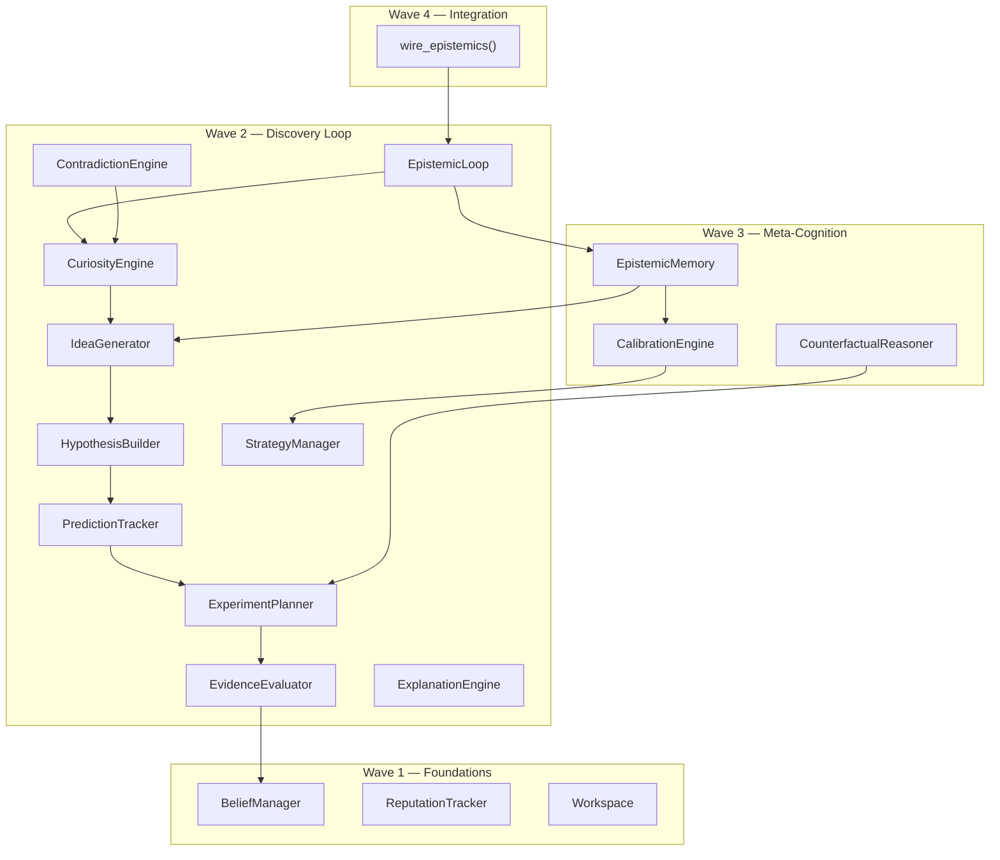

# ADR 003: Domain-Neutral Epistemic Runtime for Autonomous Discovery

- **Status**: Implemented
- **Deciders**: HBLLM Core Architecture Team
- **Date**: 2026-08-08
- **Technical Area**: Epistemic Cognition (`core/hbllm/brain/epistemics`)

---

## Context and Problem Statement

HBLLM's cognitive architecture (ADR 001) provides perception, memory, reasoning, and action execution — but lacks the ability to **autonomously discover knowledge**. Specifically, the system cannot:

1. **Form and test hypotheses**: No mechanism to generate testable claims from observations, track predictions, or revise beliefs based on outcomes.
2. **Evaluate its own reasoning quality**: No meta-epistemic layer to answer "How good am I at knowing things?" — leading to uncalibrated confidence and undetected biases.
3. **Learn from past reasoning failures**: No long-term memory of which hypotheses failed, which evidence was misleading, or which sources were unreliable.
4. **Explore proactively**: No self-directed curiosity — the system only reasons reactively when prompted.

Without these capabilities, HBLLM operates as a sophisticated retrieval-augmented generation system rather than a genuine autonomous reasoner.

### Requirements

- The system must autonomously generate hypotheses, design experiments, evaluate evidence, and revise beliefs.
- The system must track its own prediction accuracy and calibrate its confidence estimates.
- The system must remember past reasoning outcomes and avoid repeating known failures.
- **Critical constraint**: The epistemic layer must be **completely domain-neutral** — it must never contain domain-specific logic for medicine, robotics, chemistry, finance, or any other field.

---

## Decision Drivers

1. **Domain neutrality**: The same reasoning machinery must work across all knowledge domains without modification.
2. **Separation of concerns**: Reality modeling (WorldModel) must remain separate from reasoning about reality (Epistemics).
3. **Self-improvement**: The system must improve its own reasoning over time without retraining model weights.
4. **Auditability**: Every belief must be traceable back to its supporting observations through structured provenance chains.
5. **Integration simplicity**: The epistemic runtime must integrate with the existing AutonomyCore event bus via a single function call.

---

## Considered Alternatives

### Alternative 1: Domain-Specific Discovery Modules

Build separate discovery pipelines for each domain (e.g., `MedicalDiscovery`, `FinanceDiscovery`).

- **Pros**: Highly optimized per-domain; can incorporate domain ontologies.
- **Cons**: Combinatorial explosion of modules; violates DRY; cannot reason about novel domains; maintenance nightmare at scale.
- **Rejected because**: HBLLM is designed to be a general-purpose cognitive system. Domain-specific discovery would require rebuilding the same epistemic primitives (hypothesis, evidence, belief, prediction) for every new domain.

### Alternative 2: LLM-Only Reasoning

Use LLM chain-of-thought prompting for all epistemic reasoning (hypothesis generation, evidence evaluation, calibration).

- **Pros**: Simple implementation; leverages frontier model capabilities.
- **Cons**: No structured belief tracking; no persistent calibration; confidence estimates are uncalibrated token probabilities; no graph-based provenance; expensive LLM calls for every reasoning step; no memory of past failures.
- **Rejected because**: LLM confidence is systematically uncalibrated. Token probabilities do not correspond to epistemic confidence. Structured graph-based reasoning provides deterministic auditability that prompt-based reasoning cannot.

### Alternative 3: Probabilistic Programming Framework

Implement epistemics using a formal probabilistic programming language (e.g., Pyro, Stan).

- **Pros**: Mathematically rigorous; formal Bayesian inference.
- **Cons**: High computational cost; requires formal model specification; poor integration with graph-based HCIR; steep learning curve; overkill for belief-level reasoning.
- **Rejected because**: HBLLM needs lightweight, fast belief updates that operate on HCIR graph nodes — not full posterior inference over probabilistic models. The Bayesian-inspired update rules provide sufficient rigor at negligible computational cost.

---

## Decision

### Implement a domain-neutral Epistemic Runtime as a new cognitive layer (`hbllm/brain/epistemics/`)

The epistemic runtime operates exclusively on abstract epistemic primitives — **observations, evidence, uncertainty, hypotheses, predictions, experiments, and belief revision** — and never interprets content semantically.

### Core Architectural Principle

```
Reality belongs to World Model.
Epistemics reasons ABOUT reality.
```

The epistemic runtime does not model the world. It models the **system's knowledge about the world** — tracking what is known, unknown, believed, tested, falsified, and contested.

---

## Architecture

### Epistemic Hierarchy

```
Observation → Evidence → Belief
     ↑                      |
     |                      ↓
  Experiment ← Prediction ← Hypothesis
```

Every entity in this hierarchy is represented as an HCIR node in the shared `CognitiveGraph`. The epistemic runtime manipulates these nodes through graph operations, never through domain-specific logic.

### Module Structure (4 Waves)



### Key Decisions Within the Runtime

#### 1. Bayesian-Inspired Belief Revision (not raw LLM confidence)

- **Decision**: Belief confidence is updated via Bayesian-inspired delta rules weighted by evidence strength, not by LLM token probabilities.
- **Rationale**: LLM confidence is systematically uncalibrated. A belief supported by 3 replicated experiments should have different confidence than one supported by 1 blog post — regardless of what an LLM "thinks."
- **Implementation**: `DiscoveryBeliefManager` applies configurable deltas (`BayesianConfig`) with diminishing returns near confidence boundaries (0.0, 1.0). Evidence strength categories (anecdotal → replicated) map to multiplier weights.

#### 2. SQLite-Backed Epistemic Memory (separate from 9-subsystem memory)

- **Decision**: Create a dedicated `EpistemicMemory` backed by SQLite, separate from the existing 9-subsystem memory architecture (ADR 001 §3).
- **Rationale**: Epistemic memory tracks fundamentally different data — hypothesis outcomes, prediction accuracy, calibration curves, discovered biases — that don't fit the episodic/semantic/procedural taxonomy. Mixing epistemic history into general memory would create coupling between the reasoning layer and the storage layer.
- **Schema**: 6 tables: `hypothesis_outcomes`, `prediction_results`, `confidence_snapshots`, `discovered_biases`, `research_notes`, `calibration_reports`.

#### 3. Meta-Epistemic Self-Calibration

- **Decision**: Implement an `EpistemicCalibrationEngine` that computes Expected Calibration Error (ECE), detects systematic biases, and recommends strategy adjustments.
- **Rationale**: No AI system we're aware of asks "How good am I at knowing things?" This is the core differentiator. Without calibration, the system cannot distinguish between "I'm 80% confident and that's well-calibrated" vs "I'm 80% confident but historically wrong 50% of the time at that confidence level."
- **Implementation**: ECE is computed from bucketed prediction history in `EpistemicMemory`. Bias detection scans for systematic over/under-confidence by domain. Strategy recommendations feed into `ResearchStrategyManager`.

#### 4. Memory-Filtered Idea Generation (feedback loop)

- **Decision**: The `IdeaGenerator` queries `EpistemicMemory` before proposing new hypotheses, filtering out ideas with >50% keyword overlap to previously falsified hypotheses.
- **Rationale**: Without this filter, the system would repeatedly propose the same failed hypotheses, wasting investigation budget. This is the simplest effective feedback loop — more sophisticated methods (embedding similarity, causal ancestry) are deferred.

#### 5. Counterfactual Reasoning via Graph Manipulation

- **Decision**: Implement counterfactual analysis ("What if...") through temporary graph state manipulation — removing/modifying nodes and recomputing downstream confidence — rather than through LLM prompting.
- **Rationale**: Graph-based counterfactuals are deterministic, auditable, and cheap. LLM-based counterfactuals would be expensive, non-reproducible, and impossible to verify.
- **Implementation**: `CounterfactualReasoner` provides 5 methods: `what_if_hypothesis_wrong()`, `what_if_evidence_removed()`, `what_if_evidence_quality()`, `what_if_new_evidence()`, `sensitivity_analysis()`.

#### 6. Pluggable Research Strategies

- **Decision**: Support 5 configurable research strategies (Exploration, Verification, Synthesis, Counterexample Search, Consolidation) that control weight distribution across all epistemic engines.
- **Rationale**: Different phases of investigation require different cognitive emphasis. Early exploration should maximize idea generation; late verification should maximize falsification testing. Auto-switching via calibration feedback makes this adaptive.

#### 7. Single-Function AutonomyCore Integration

- **Decision**: The entire epistemic runtime is wired into AutonomyCore via a single `wire_epistemics()` function call that creates all engines, memory, and registers a proactive handler.
- **Rationale**: Minimizes integration complexity. The epistemic loop runs as a proactive handler on the AutonomyCore event bus, executing one discovery cycle per cognitive tick. No changes to existing AutonomyCore code are required.

---

## Decision Consequences

### Positive Consequences

- **Domain-Neutral Discovery**: The same 15-engine pipeline that reasons about chemistry also reasons about debugging, robotics, and finance — zero domain-specific code.
- **Self-Calibrating Confidence**: HBLLM can answer "How confident am I, and is that confidence justified?" — a capability no comparable system offers.
- **Structured Auditability**: Every belief is traceable through graph provenance chains to its supporting observations, evidence, and experiments.
- **Self-Improving Reasoning**: Memory-filtered idea generation and calibration-driven strategy switching create autonomous improvement without model retraining.
- **Lightweight Integration**: One function call (`wire_epistemics()`) adds the full discovery cycle to AutonomyCore.

### Negative / Trade-off Consequences

- **Separate Memory Store**: EpistemicMemory is a 7th SQLite database alongside the existing persistence layer. Future work should evaluate unifying storage.
- **No LLM-in-the-Loop (Yet)**: The current implementation uses deterministic graph operations. LLM-augmented hypothesis generation and natural language experiment design are deferred to a future wave.
- **Calibration Cold Start**: The calibration engine needs ~50+ prediction outcomes before ECE estimates become statistically meaningful. Early-stage calibration reports may be noisy.
- **Strategy Weights Are Hand-Tuned**: The 5 strategy configurations use manually chosen weight vectors. Future work should learn optimal weights from calibration history.

---

## Verification

- **Unit Tests**: 126 tests covering all 15 engines (belief manager, reputation, workspace, curiosity, idea generator, hypothesis builder, prediction tracker, experiment planner, evidence evaluator, contradiction engine, explanation engine, research strategy, epistemic loop, epistemic memory, calibration, counterfactual).
- **E2E Integration**: 3 tests covering the full discovery cycle (curiosity → ideas → hypotheses → evidence → revision → memory → calibration → falsification).
- **Cross-Component Integration**: 5 tests covering AutonomyCore wiring, tick simulation, idempotency, memory persistence across rewiring, and engine accessibility.
- **Lint**: Ruff clean (0 errors).
- **Architecture Documentation**: `docs/architecture/epistemics.md` (304 lines).

---

## References

- [ADR 001: HBLLM Core Master Architecture](0001-hbllm-core-architecture.md) — Parent architecture decision.
- [Architecture: Epistemic Runtime](../architecture/epistemics.md) — Full technical deep-dive.
- [Architecture: Overview](../architecture/overview.md) — Layer 4c listing.
