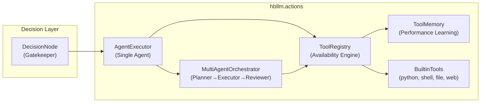

# Actions, Tools & Agent Execution

The `hbllm.actions` package provides the tool execution layer — everything the brain
needs to **do things** in the real world. It bridges LLM reasoning with concrete
actions: running code, reading files, searching the web, and calling external APIs.

---

## Architecture Overview



---

## ToolRegistry

::: hbllm.actions.tool_registry.ToolRegistry

The central registry for all tools in the system. Handles registration, invocation,
availability tracking, and lifecycle events.

### Key Methods

| Method | Description |
|---|---|
| `register(name, description, handler, parameters)` | Register a tool. Replaces if name already exists. |
| `unregister(name) → bool` | Remove a tool by name. Returns `True` if found. |
| `invoke(name, **kwargs) → ToolResult` | Invoke a tool. Checks availability first. |
| `set_availability(name, available, reason)` | Mark a tool as temporarily unavailable. |
| `get_availability(name) → dict` | Check a tool's registration and availability status. |
| `available_tools() → list[str]` | Names of all currently-available tools. |
| `list_tools(available_only=False) → list[dict]` | List tools with availability status. |

### Registration & Invocation

```python
from hbllm.actions.tool_registry import ToolRegistry, ToolResult

registry = ToolRegistry()

# Register a custom tool
async def my_tool(query: str = "") -> ToolResult:
    return ToolResult(tool="my_tool", success=True, output=f"Result: {query}")

registry.register("my_tool", "Does something useful", my_tool, {"query": "string"})

# Invoke it
result = await registry.invoke("my_tool", query="hello")
assert result.success
```

### Tool Resilience

Tools can be **temporarily unavailable** without being removed. This is used for
service outages, rate limiting, or maintenance windows:

```python
# Mark a tool as temporarily offline
registry.set_availability("web_search", False, reason="API rate limit exceeded")

# Invoke returns a clear error (no crash)
result = await registry.invoke("web_search", query="test")
# result.success == False
# result.error == "Tool 'web_search' is currently unavailable: API rate limit exceeded"

# Restore when the service recovers
registry.set_availability("web_search", True)
```

### Decision-Making Integration

When building LLM prompts, use `available_only=True` so the model never plans steps
using offline tools:

```python
# Only show available tools to the LLM
tools = registry.list_tools(available_only=True)
tool_desc = "\n".join(f"- {t['name']}: {t['description']}" for t in tools)
```

Both `AgentExecutor` and `MultiAgentOrchestrator` do this automatically.

### Bus Events

When connected to a `MessageBus`, the registry publishes lifecycle events:

| Event Topic | When |
|---|---|
| `system.tool.registered` | New tool registered |
| `system.tool.unregistered` | Tool removed |
| `system.tool.unavailable` | Tool marked offline |
| `system.tool.available` | Tool restored |

```python
from hbllm.network.bus import MessageBus

bus = MessageBus()
registry = ToolRegistry(bus=bus)  # Events auto-published
```

---

## ToolResult

Every tool invocation returns a `ToolResult`:

```python
@dataclass
class ToolResult:
    tool: str           # Tool name
    success: bool       # Did the tool succeed?
    output: str         # Output text (on success)
    error: str = ""     # Error message (on failure)
    duration_ms: float = 0.0  # Execution time
```

---

## Built-in Tools

The following tools ship with HBLLM core and are registered automatically by
`register_core_tools()`:

### `python_exec`

Execute Python code in a sandboxed subprocess with security restrictions:

- **Timeout**: 5 seconds
- **Memory limit**: 256 MB
- **Isolation**: `-I` flag (no user site-packages)
- **Validation**: Static analysis blocks `os.system`, `subprocess`, `eval`, `exec`, etc.

### `shell_exec`

Execute allowlisted shell commands. Only the following are permitted:

```
awk, cat, cut, date, df, diff, du, echo, file, find, grep, head,
ls, pwd, sed, sort, tail, tr, tree, uniq, uname, wc, which, whoami
```

### `file_read`

Read a file from the local filesystem (max 500 KB).

### `file_write`

Write content to a file. Restricted to within the home directory.

### `web_search`

Search the web using DuckDuckGo (no API key required). Requires the
`duckduckgo-search` package.

---

## ToolMemory

::: hbllm.actions.tool_memory.ToolMemory

Learns which tools perform best for which query types by recording usage history
in SQLite. Provides recommendations and sequence suggestions.

### Recording Usage

```python
from hbllm.actions.tool_memory import ToolMemory, ToolUsageRecord

memory = ToolMemory(data_dir="~/.hbllm")

memory.record(ToolUsageRecord(
    tool_name="web_search",
    query_type="factual",
    success=True,
    latency_ms=230.0,
    result_quality=0.9,
))
```

### Availability-Aware Recommendations

```python
# Without filter — may recommend offline tools
recs = memory.recommend_tool("factual")

# With filter — only recommend available tools
available = registry.available_tools()  # ["python_exec", "file_read"]
recs = memory.recommend_tool("factual", available_tools=available)

# Sequence recommendations skip sequences with unavailable tools
seq = memory.recommend_sequence("deploy", available_tools=available)
```

### Tool Discovery

```python
# Discover usage patterns
patterns = memory.discover_patterns()
# [{"query_type": "code", "best_tool": "python_exec", "avg_quality": 0.92}, ...]
```

---

## AgentExecutor

::: hbllm.actions.agent_executor.AgentExecutor

Single-agent tool-augmented chat. Parses `TOOL_CALL`/`TOOL_INPUT` pairs from
LLM responses, executes tools, and feeds results back.

```python
from hbllm.actions.agent_executor import AgentExecutor

executor = AgentExecutor(llm=my_llm, kb=my_knowledge_base)
response = await executor.execute(
    "Search for the latest Python release",
    agent_mode=True,  # Enable tool use
)
print(response.content)
print(response.steps)      # Execution trace
print(response.confidence)  # 0.0–1.0
```

When `agent_mode=True` and the task is complex (detected by `ComplexityDetector`),
the executor automatically delegates to `MultiAgentOrchestrator`.

---

## MultiAgentOrchestrator

::: hbllm.actions.orchestrator.MultiAgentOrchestrator

Runs a **Planner → Executor → Reviewer** pipeline using a single LLM:

1. **Planner** — Breaks the task into numbered steps with tool assignments
2. **Executor** — Runs each step, invoking tools as needed
3. **Reviewer** — Evaluates the results and provides a final answer

The planner prompt is **dynamic** — it injects the actual list of available tools
(not a hardcoded list), and includes a pre-execution availability check so if a tool
goes offline between planning and execution, the system degrades gracefully.

---

## `@tool` Decorator

Register functions as tools using the decorator pattern:

```python
from hbllm.actions.tool_registry import tool, get_tool_registry

@tool(name="calculator", description="Evaluate math expressions")
def calculator(expression: str) -> float:
    return eval(expression)  # simplified example

# Automatically registered in the global registry
registry = get_tool_registry()
assert "calculator" in registry
```

---

## `create_tool_from_code`

Dynamically create tools from code strings at runtime:

```python
from hbllm.actions.tool_registry import create_tool_from_code

code = '''
def multiply(a, b):
    return a * b
'''
func = create_tool_from_code(code, "multiply")
assert func(3, 4) == 12
```

This powers the skill induction pipeline where the system learns new capabilities
by generating and testing code.
