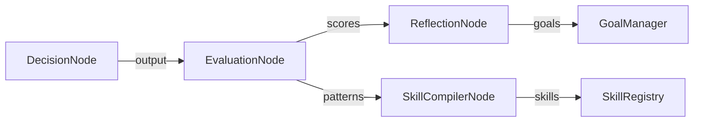
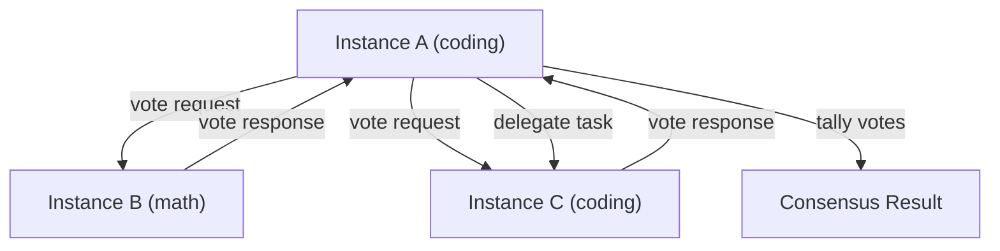

# Brain Subsystems

Beyond the core cognitive nodes, HBLLM includes specialized subsystems that provide intelligence capabilities to the `Brain` instance. These are wired by `BrainFactory` and accessible via `brain.*` properties.

**Module:** `hbllm.brain`

---

## Subsystem Index

| Subsystem | Module | Config Flag | Purpose |
|---|---|---|---|
| `SkillRegistry` | `skill_registry.py` | Always on | Learn, store, and reuse skills from experience |
| `GoalManager` | `goal_manager.py` | `inject_goals` | Autonomous goal generation and tracking |
| `SelfModel` | `self_model.py` | `inject_self_model` | Track capabilities and performance per domain |
| `CognitiveMetrics` | `cognitive_metrics.py` | `inject_metrics` | Live latency, reasoning quality, and throughput dashboards |
| `ConfidenceEstimator` | `confidence_estimator.py` | `inject_revision` | Estimate response confidence for self-critique |
| `RevisionNode` | `revision_node.py` | `inject_revision` | Self-critique loop for improving responses |
| `WorldSimulator` | `world_simulator.py` | Always on | Simulate outcomes before committing actions |
| `PolicyEngine` | `policy_engine.py` | `inject_policy_engine` | YAML-based governance policy enforcement |
| `OwnerRuleStore` | `owner_rules.py` | `inject_owner_rules` | Auto-extracted behavioral guardrails |
| `TokenOptimizer` | `token_optimizer.py` | `inject_cost_optimizer` | Reduce token usage for cost optimization |
| `EvaluationNode` | `evaluation_node.py` | `inject_evaluation` | Per-interaction quality scoring (v2) |
| `SkillCompilerNode` | `skill_compiler_node.py` | `inject_skill_compiler` | Automatic skill extraction from patterns (v2) |
| `ReflectionNode` | `reflection_node.py` | `inject_reflection` | Periodic batch performance analysis (v2) |
| `AttentionManager` | `attention_manager.py` | `inject_attention` | Memory budgets and focus allocation (v2) |
| `LoadManager` | `load_manager.py` | `inject_load_manager` | Cognitive load monitoring & degradation (v2) |
| `CollectiveNode` | `collective_node.py` | Always on | Multi-agent voting, delegation & knowledge sharing (v2) |
| `SchedulerNode` | `scheduler_node.py` | `inject_scheduler` | Proactive scheduling and background execution via SQLite (v2) |
| `ContextFusionEngine` | `context_fusion.py` | Always on | Token-budgeted multi-source context assembly |
| `ActionVerificationBridge` | `autonomy/verification_bridge.py` | Always on | Execute → verify → correct feedback loop |
| `EmotionEngine` | `emotion_engine.py` | `inject_emotion` | Multi-signal emotion detection with LLM inference |
| **`UserModelEngine`** | `user_model.py` | `inject_user_model` | Predictive model of the human operator |
| **`ProjectGraph`** | `project_graph.py` | `inject_project_graph` | Graph-based project state tracking |
| **`ExecutiveCortex`** | `executive_cortex.py` | `inject_executive_cortex` | Unified cognitive control and budget allocation |
| **`RelationshipMemory`** | `relationship_memory.py` | `inject_relationship_memory` | Social graph and interaction history |
| **`RealityGraph`** | `reality_graph.py` | `inject_reality_graph` | Unified read-only world state facade |

---

## Skill Registry

**Module:** `hbllm.brain.skill_registry.SkillRegistry`

Learns reusable skills from successful task completions and replays them for similar future tasks.

### Skill Dataclass

```python
@dataclass
class Skill:
    skill_id: str
    name: str
    description: str
    category: str          # coding | research | analysis | writing | reasoning
    steps: list[str]       # Ordered execution steps
    tools_used: list[str]  # Which tools the skill invokes
    success_criteria: str
    examples: list[dict]
    success_rate: float    # Rolling average
    invocations: int       # Total times executed
    avg_latency_ms: float
```

### Usage

```python
# Extract skill from a successful task
skill = brain.skill_registry.extract_and_store(
    task_description="Analyze CSV data and create a chart",
    execution_trace=[{"action": "load_csv"}, {"action": "plot_chart"}],
    tools_used=["pandas", "matplotlib"],
    success=True,
    category="analysis",
)

# Find relevant skills for a new task
matches = brain.skill_registry.find_skill("analyze data", category="analysis")

# Track execution performance
brain.skill_registry.record_execution(skill.skill_id, success=True, latency_ms=1200)

# View stats
print(brain.skill_registry.stats())
# {"total_skills": 42, "categories": 5, "avg_success_rate": 0.89}
```

---

## Goal Manager

**Module:** `hbllm.brain.goal_manager.GoalManager`

Manages autonomous goals generated by the `CuriosityNode`. Goals are persisted to SQLite, tracked by status (pending/active/completed/failed), and influence the brain's idle-time behavior.

```python
goals = brain.goal_manager.stats()
# {"total_goals": 12, "active": 3, "completed": 8, "failed": 1}
```

---

## Self Model

**Module:** `hbllm.brain.self_model.SelfModel`

Tracks the brain's performance across domains, building a self-awareness model of its own capabilities.

```python
# Automatically called by Brain.process()
brain.self_model.record_outcome(
    domain="coding",
    success=True,
    confidence=0.92,
    latency_ms=450,
)

# Query self-knowledge
metrics = brain.self_model.get_metrics()
# {"coding": {"success_rate": 0.95, "avg_confidence": 0.88, ...}, ...}
```

---

## Cognitive Metrics

**Module:** `hbllm.brain.cognitive_metrics.CognitiveMetrics`

Live dashboard metrics for monitoring brain health:

```python
dashboard = brain.cognitive_metrics.get_dashboard_metrics()
# {
#   "avg_latency_ms": 320,
#   "p99_latency_ms": 890,
#   "avg_confidence": 0.87,
#   "total_queries": 1453,
#   ...
# }
```

---

## World Simulator

**Module:** `hbllm.brain.world_simulator.WorldSimulator`

Simulates potential outcomes of actions before committing — used by the `WorldModelNode` for safe execution planning. Supports code sandboxing and physics-based validation for robotics.

---

## Policy Engine & Owner Rules

### Policy Engine

**Module:** `hbllm.brain.policy_engine.PolicyEngine`

Enforces governance policies defined in YAML. Integrated into `PlannerNode` and `DecisionNode` to block or modify actions that violate policies.

### Owner Rules

**Module:** `hbllm.brain.owner_rules.OwnerRuleStore`

Auto-extracted behavioral guardrails from high-salience interactions. Stored in SQLite and applied as soft constraints during decision-making.

```python
rules = brain.owner_rules
# Rules are automatically extracted by RuleExtractorNode
```

---

## v2: Intelligence Feedback Loop

!!! info "New in v2"
    These subsystems close the evaluate → improve → retry feedback loop, enabling HBLLM to scientifically iterate on its own performance.



### Evaluation Node

**Module:** `hbllm.brain.evaluation_node.EvaluationNode`  
**Config:** `inject_evaluation = True`

Runs after every `DecisionNode` output, scoring interactions across 5 cognitive dimensions:

| Dimension | What it measures |
|-----------|-----------------|
| `task_success` | Did the response address the query? |
| `plan_validity` | Was the execution plan well-structured? |
| `tool_accuracy` | Did tool invocations succeed? |
| `memory_usage` | Was context retrieval relevant? |
| `confidence_error` | How calibrated was the confidence estimate? |

Subscribes to `system.experience`, `sensory.output`, `system.feedback`. Publishes `system.evaluation` events that drive the rest of the feedback loop.

### Skill Compiler Node

**Module:** `hbllm.brain.skill_compiler_node.SkillCompilerNode`  
**Config:** `inject_skill_compiler = True`

Automatically detects recurring successful action patterns using n-gram analysis on experience traces. When a pattern exceeds occurrence + success thresholds, it compiles the pattern into a reusable `Skill` in the `SkillRegistry`.

Subscribes to `system.experience`, `system.evaluation`, `system.reflection`. Publishes `skill.extracted` events.

### Reflection Node

**Module:** `hbllm.brain.reflection_node.ReflectionNode`  
**Config:** `inject_reflection = True`

Performs periodic batch analysis of accumulated evaluation reports. Runs 4 analysis passes:

1. **Performance trend detection** — improving, declining, or plateau
2. **Failure pattern detection** — recurring quality flags
3. **Capability gap analysis** — weak domains via SelfModel
4. **Deep strategy analysis** — overall health and calibration (sleep-only)

Generates `ReflectionInsight` objects and autonomously creates improvement goals in `GoalManager`.

---

## v2: Resource Intelligence

!!! info "New in v2"
    These subsystems manage cognitive resource distribution and ensure graceful degradation under load — critical for HBLLM's edge/CPU deployment target.

### Attention Manager

**Module:** `hbllm.brain.attention_manager.AttentionManager`  
**Config:** `inject_attention = True`

Manages importance-weighted memory retention and focus allocation:

- **Memory budgets** — max items per memory type (episodic, semantic, procedural, value)
- **Importance scoring** — combines recency, frequency, relevance, and emotional weight
- **Focus allocation** — distributes context window tokens across active domains
- **Pruning orchestration** — triggers cleanup during sleep cycle

```python
stats = brain.attention_manager.stats()
# {
#   "total_context_budget": 4096,
#   "memory_budgets": {"episodic": {"utilization": 0.72}, ...},
#   "focus_allocations": {"coding": {"priority": 0.8, "context_tokens": 2048}},
#   "tracked_memories": 342,
# }
```

### Load Manager

**Module:** `hbllm.brain.load_manager.LoadManager`  
**Config:** `inject_load_manager = True`

Monitors CPU, memory, and task queue pressure. Implements 4-level graceful degradation:

| Level | Context Tokens | Simulation | Model | Max Tasks |
|-------|---------------|------------|-------|-----------|
| `normal` | 4096 | ✅ | large | 8 |
| `elevated` | 2048 | ✅ | large | 4 |
| `high` | 1024 | ❌ | small | 2 |
| `critical` | 512 | ❌ | tiny | 1 |

```python
policy = brain.load_manager.current_policy
# DegradationPolicy(level="normal", max_context_tokens=4096, ...)

# Check if system can handle more tasks
can_accept = brain.load_manager.can_accept_task()
```

### Confidence Estimator v2

**Module:** `hbllm.brain.confidence_estimator.ConfidenceEstimator`

Enhanced with calibration tracking in v2:

- **`record_outcome()`** — records predicted vs actual confidence per domain
- **`calibrated_score()`** — adjusts raw confidence using historical bias data
- **`calibration_error()`** — computes Expected Calibration Error (ECE)

```python
# Record feedback for calibration
brain.confidence_estimator.record_outcome(
    predicted=0.9, actual=0.6, domain="coding"
)

# Get calibration-adjusted score
score = brain.confidence_estimator.calibrated_score(
    query, response, domain="coding"
)
```

### Micro-Learning (LearnerNode v2)

**Module:** `hbllm.brain.learner_node.LearnerNode`

Enhanced with real-time learning between tasks:

- **Low-score queueing** — interactions below threshold are queued for micro-correction
- **Knowledge distillation** — high-confidence responses are banked for sleep-cycle reinforcement
- **`micro_learn()`** — single-step DPO correction when better responses arrive

```python
stats = brain.learner.micro_learning_stats()
# {
#   "enabled": true,
#   "micro_learn_steps": 12,
#   "distillation_count": 45,
#   "micro_queue_depth": 3,
#   "distillation_bank_size": 45,
# }
```

---

## v2: Multi-Agent Ecology

!!! info "New in v2"
    Extends the CollectiveNode with agent specialization, consensus voting, and intelligent task delegation — enabling multi-instance HBLLM deployments to collaborate on complex queries.



### Agent Specialization

**Module:** `hbllm.brain.collective_node.CollectiveNode`

Each instance declares its domain expertise via `AgentProfile`. Profiles are exchanged over the bus, building a live peer registry.

```python
# Declare this instance's expertise
brain.collective.register_specialization(
    domains=["coding", "debugging"],
    performance={"coding": 0.95, "debugging": 0.88},
)

# Broadcast to peers
await brain.collective.broadcast_profile()

# Query peers for a domain
coding_peers = brain.collective.get_peers_for_domain("coding")
# [AgentProfile(instance_id="peer_1", performance={"coding": 0.92}), ...]
```

### Consensus Voting

Multiple instances answer the same query and reach consensus via one of 3 strategies:

| Strategy | Algorithm | Best for |
|----------|-----------|----------|
| `confidence_weighted` | Picks highest-confidence response | General queries |
| `majority` | Most common answer wins | Factual / deterministic questions |
| `best_of_n` | Single highest-confidence pick | Creative / open-ended tasks |

```python
result = await brain.collective.request_votes(
    query="What is the time complexity of quicksort?",
    domain="coding",
    strategy=VotingStrategy.MAJORITY,
)
# {
#   "consensus": "O(n log n) average, O(n²) worst case",
#   "confidence": 0.92,
#   "vote_count": 3,
#   "majority_count": 2,
#   "strategy": "majority",
# }
```

### Task Delegation

Routes tasks to the most qualified peer based on `expertise × (1 - load) × specialization_bonus`:

```python
result = await brain.collective.delegate_task(
    query="Write a Python decorator for caching",
    domain="coding",
    timeout=5.0,
)
# DelegationResult(
#   delegated=True,
#   target_instance="coding_expert_01",
#   score=0.95,
#   response={"text": "...", "confidence": 0.95},
# )
```

Falls back gracefully when no suitable peer is available or on timeout.

---

## v2: Proactive Scheduler

!!! info "New in v2"
    Allows the agent to act proactively on the environment by scheduling future tasks via the `ScheduleEventTool` and `ScheduleRecurringTool`.

**Module:** `hbllm.brain.scheduler_node.SchedulerNode`
**Config:** `inject_scheduler = True`

Maintains a robust SQLite background database for asynchronous scheduling. The LLM can request actions to trigger instantly or on intervals without holding up inference.

```python
# The LLM schedules a background task via the injected schedule_event tool:
{
    "name": "schedule_event",
    "parameters": {
        "delay_seconds": 3600,
        "route_topic": "robot.move",
        "payload": {"location": "living_room"}
    }
}
# The SchedulerNode automatically writes this to SQLite and emits to the 
# MessageBus when the delay elapses.
```

---

## Accessing Subsystem Stats

All subsystems are aggregated via `brain.cognitive_stats()`:

```python
stats = brain.cognitive_stats()
# {
#   "metrics": {...},
#   "self_model": {...},
#   "skills": {"total_skills": 42, ...},
#   "goals": {"active": 3, ...},
#   "tool_memory": {...},
#   "token_optimizer": {...},
#   "rewards": {...},
#   "evaluation": {...},     # v2
#   "attention": {...},       # v2
#   "load_manager": {...},    # v2
# }
```

---

## Context Fusion Engine

**Module:** `hbllm.brain.context_fusion.ContextFusionEngine`

Assembles context from multiple sources (memory, world state, emotions, goals)
into a token-budgeted prompt for the LLM. Uses priority-weighted greedy allocation
to fit the most relevant context within the model's token limit.

### Usage

```python
from hbllm.brain.context_fusion import ContextFusionEngine

engine = ContextFusionEngine(token_budget=4096)

# Register context providers
engine.register_source("episodic_memory", memory_provider, priority=0.9)
engine.register_source("world_state", world_state_provider, priority=0.7)
engine.register_source("emotion", emotion_provider, priority=0.5)

# Fuse context for a query
result = await engine.fuse(query="What's the temperature?", tenant_id="user1")
system_prompt = result.to_system_prompt()

print(result.total_tokens)     # 2847
print(result.budget_used_pct)  # 69.5%
print(len(result.sections))    # 3
```

### Pre-built Providers

| Factory Method | Source |
|---------------|--------|
| `world_state_provider(ws)` | WorldStateEngine entity graph |
| `emotion_provider(engine)` | EmotionEngine per-tenant state |

### FusedContext Output

```python
@dataclass
class FusedContext:
    sections: list[ContextSlice]  # Ordered by priority
    total_tokens: int
    budget_used_pct: float
    assembly_time_ms: float
```

---

## Emotion Engine (Enhanced)

**Module:** `hbllm.brain.emotion_engine.EmotionEngine`

Enhanced with multi-signal emotion detection beyond keyword matching:

- **LLM contextual inference** — Understands sarcasm, nuance, full-sentence emotion
- **Behavioral pattern tracking** — Response times, message lengths, rapid-fire detection
- **Error correlation** — Pipeline errors → frustration detection
- **Per-tenant state cache** — `get_state(tenant_id)` for context fusion integration

```python
# Get tenant-scoped emotional state (for context fusion)
state = engine.get_state("tenant_123")
# {"dominant_emotion": "joy", "valence": 0.6, "arousal": 0.4}

# Get behavioral adaptation hints
hints = engine.get_adaptation_hints()
# {"tone": "enthusiastic", "empathy_level": "moderate", ...}
```

---

## Action Verification Bridge

**Module:** `hbllm.brain.autonomy.verification_bridge.ActionVerificationBridge`

Closes the **execute → verify → correct** feedback loop between `TaskGraphRuntime`
and `WorldStateEngine`. After a task is executed, this bridge periodically checks
whether the real-world state confirms the action succeeded.

### Verification Flow

```
Task Executed → VERIFYING → [WorldState check] → COMPLETED
                    ↓ (timeout)
               CORRECTING → [Re-execute] → VERIFYING
                    ↓ (max attempts)
               UNCERTAIN → [Escalate to user]
```

### Usage

```python
from hbllm.brain.autonomy.verification_bridge import ActionVerificationBridge

bridge = ActionVerificationBridge(
    task_graph=brain.task_graph,
    world_state=brain.world_state,
    bus=brain.bus,
    check_interval_s=5.0,
)
await bridge.start()

# Auto-generates verification rules for IoT commands:
# "turn on kitchen light" → VerificationRule(entity="kitchen_light", property="state", expected="on")
```

---

## Cognitive Subsystems — Human Modeling

!!! info "New: Human Modeling Layer"
    These subsystems model the human operator, their projects, their relationships, and their world — making HBLLM feel persistent and personal. See [Architecture: Cognitive Subsystems](../architecture/cognitive-subsystems.md) for the full deep-dive.

### UserModel Engine

**Module:** `hbllm.brain.user_model.UserModelEngine`
**Config:** `inject_user_model = True`

Continuously learns about the user from every interaction — expertise, preferences, beliefs, trust, temporal patterns, and cognitive state.

```python
# The engine automatically learns from bus events, but you can also use it directly:

# Get the user model for a tenant
model = brain.user_model.get_model("tenant-001")
print(model.expertise)        # {"python": UserExpertise(level=0.85), ...}
print(model.current_focus)    # LearnedAttribute(value="authentication", confidence=0.72)
print(model.stress_level)     # 0.3

# Explicitly teach a preference
brain.user_model.learn_preference(
    tenant_id="tenant-001",
    key="verbosity",
    value="concise",
    source="explicit",  # High confidence override
)

# Get context for prompt injection
context = await brain.user_model.get_context(
    query="How do I fix the auth module?",
    tenant_id="tenant-001",
    budget=500,
)
# "User expertise: Python (expert, 0.85), Flutter (intermediate, 0.60). ..."

# Predict next actions from temporal patterns
predictions = brain.user_model.predict_next_actions("tenant-001")
# ["run_tests", "commit_code", "check_deployment"]

# Full stats
stats = brain.user_model.stats("tenant-001")
```

### ProjectGraph

**Module:** `hbllm.brain.project_graph.ProjectGraph`
**Config:** `inject_project_graph = True`

Graph-based project state tracker — goals, blockers, questions, decisions, milestones.

```python
# Create a project
project = brain.project_graph.create_project(
    name="HBLLM",
    tags=["ai", "cognitive", "python"],
)

# Add goals and blockers
goal = brain.project_graph.add_entity(project.entity_id, "goal", "Ship v3")
blocker = brain.project_graph.add_entity(project.entity_id, "blocker", "Test flakiness")

# Record a design decision
brain.project_graph.record_decision(project.entity_id, "Use SQLite for user model persistence")

# Auto-detect project from a query
detected = brain.project_graph.auto_detect_project("fix the HBLLM authentication bug")
# ProjectEntity(name="HBLLM", ...)

# Reactivate a project (generates context summary)
context = brain.project_graph.reactivate(project.entity_id)
# "Project HBLLM: 3 active goals, 1 blocker, 2 open questions..."

# Query state
goals = brain.project_graph.get_active_goals(project.entity_id)
blockers = brain.project_graph.get_blockers(project.entity_id)
```

### ExecutiveCortex

**Module:** `hbllm.brain.executive_cortex.ExecutiveCortex`
**Config:** `inject_executive_cortex = True`

Cognitive control center — goal arbitration, focus management, interruption control.

```python
# Ask "what should I do next?"
decision = brain.executive_cortex.decide_next_action()
# ExecutiveDecision(action="continue_focus", target_goal="Ship v3", ...)

# Enter deep focus mode
brain.executive_cortex.set_focus("writing UserModel tests")

# Check if an event should interrupt focus
should_break = brain.executive_cortex.should_interrupt(incoming_event)

# Get cognitive budget allocation
budget = brain.executive_cortex.allocate_budget(pressure=0.6)
# CognitiveBudget(heavy_llm=0.4, fast_router=0.3, reflex=0.2, reserve=0.1)

# Full state dump
state = brain.executive_cortex.snapshot()
```

### RelationshipMemory

**Module:** `hbllm.brain.relationship_memory.RelationshipMemory`
**Config:** `inject_relationship_memory = True`

Social graph — tracks people, roles, sentiment, interaction history.

```python
# Record a mention
brain.relationship_memory.record_mention(
    name="Alice Chen",
    context="Alice reviewed the PR and approved it",
    topic="code_review",
    sentiment=0.8,
)

# Track an interaction event
brain.relationship_memory.record_event(
    name="Alice Chen",
    event_type="collaboration",
    context="Pair programming on auth module",
    sentiment_delta=0.2,
)

# Establish a relationship
brain.relationship_memory.learn_relationship("Alice Chen", "Bob Smith", "colleague")

# Find relevant people for a topic
people = brain.relationship_memory.get_relevant_people("authentication")
# [Person(name="Alice Chen", importance=0.85, topics=["code_review", "auth"]), ...]

# Get interaction history with trend
history = brain.relationship_memory.get_history("Alice Chen")
# RelationshipHistory(events=[...], trend="improving")
```

### RealityGraph

**Module:** `hbllm.brain.reality_graph.RealityGraph`
**Config:** `inject_reality_graph = True`

Unified read-only facade over KnowledgeGraph, BrainWorldState, and PerceptionWorldState.

```python
# Query an entity across all backends
entity = brain.reality_graph.query_entity("kitchen_light")
# RealityEntity(label="kitchen_light", entity_type="device",
#   attributes={"state": "on", "brightness": 80}, confidence=0.95)

# Query by type
devices = brain.reality_graph.query_by_type("device")
people = brain.reality_graph.query_by_type("person")

# Expire stale entities
expired = brain.reality_graph.tick()
# 3 (entities expired)

# Get context for prompt injection
context = brain.reality_graph.get_context("What's the temperature?", "user1", budget=200)

# Backend stats
stats = brain.reality_graph.stats()
# {"backends": {"knowledge_graph": True, "brain_world_state": True, ...}, ...}
```


