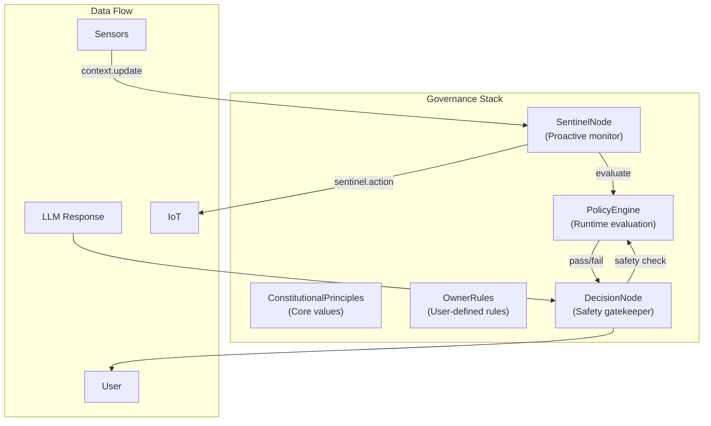
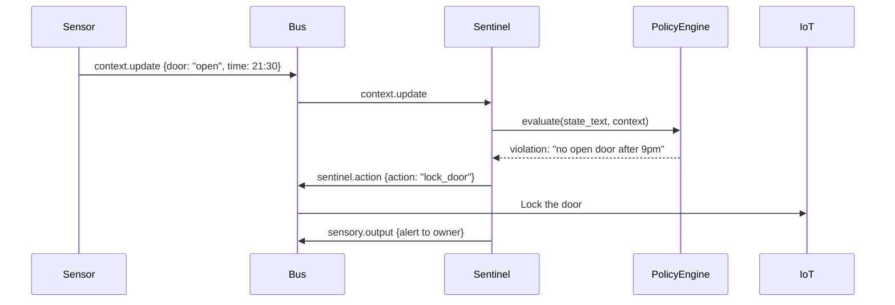

# Governance & Security

HBLLM enforces governance at multiple layers — from constitutional principles
that define the system's values, to runtime policy evaluation on every response,
to proactive monitoring that watches world state and takes corrective action.

---

## Architecture Overview



---

## PolicyEngine

::: hbllm.brain.policy_engine.PolicyEngine

The governance evaluation layer. Every response passes through the PolicyEngine
before delivery to the user.

### Policy Types

| Type | Purpose | Example |
|---|---|---|
| `DENY` | Block responses matching a pattern | Block harmful instructions |
| `REQUIRE` | Ensure responses include required elements | Medical responses must include disclaimers |
| `TRANSFORM` | Modify responses | Append safety warnings |
| `SCOPE` | Restrict domain access per tenant | Tenant X can only access "coding" domain |
| `RATE` | Per-tenant capability limits | Max 10 code executions per hour |

### Policy Actions

| Action | Behavior |
|---|---|
| `BLOCK` | Block the response entirely |
| `WARN` | Allow but log a warning |
| `APPEND` | Append text to the response |
| `PREPEND` | Prepend text to the response |
| `REPLACE` | Replace matched content |
| `RESTRICT` | Restrict access to domains/tools |

### Usage

```python
from hbllm.brain.policy_engine import PolicyEngine, Policy, PolicyType, PolicyAction

engine = PolicyEngine()

# Add a deny policy
engine.add_policy(Policy(
    name="no-harmful-instructions",
    type=PolicyType.DENY,
    action=PolicyAction.BLOCK,
    pattern=r"how to (hack|exploit|attack)",
    description="Block requests for harmful activities",
    severity="critical",
))

# Add a transform policy (auto-append disclaimer)
engine.add_policy(Policy(
    name="medical-disclaimer",
    type=PolicyType.TRANSFORM,
    action=PolicyAction.APPEND,
    content="⚠️ This is not medical advice. Consult a healthcare professional.",
    domains=["health"],
))

# Evaluate a response
result = engine.evaluate(
    text="Here is how to hack a server...",
    tenant_id="user-123",
    domain="security",
)

if not result.passed:
    print(result.violations)  # ["[CRITICAL] no-harmful-instructions: ..."]
else:
    print(result.modified_text)  # May include appended disclaimers
```

### Loading from YAML

```yaml
# config/policies.yaml
policies:
  - name: no-harmful-instructions
    type: deny
    action: block
    pattern: "how to (hack|exploit|attack)"
    description: Block harmful activity guidance
    severity: critical
    tenant_ids: ["*"]

  - name: medical-disclaimer
    type: transform
    action: append
    content: "⚠️ This is not medical advice."
    domains: ["health"]
```

```python
loaded = engine.load_from_yaml("config/policies.yaml")
print(f"Loaded {loaded} policies")
```

### Context-Aware Conditions

Policies can have runtime conditions that check against sensor/state context:

```python
from hbllm.brain.policy_engine import PolicyCondition

# Only activate after 9 PM
policy = Policy(
    name="quiet-hours",
    type=PolicyType.DENY,
    action=PolicyAction.BLOCK,
    pattern=r"play (music|video|audio)",
    conditions=[
        PolicyCondition(key="time_hour", operator="gte", value=21),
        PolicyCondition(key="baby_sleeping", operator="eq", value=True),
    ],
)
```

Supported operators: `eq`, `neq`, `gt`, `lt`, `gte`, `lte`, `in`, `not_in`.

### PolicyResult

```python
@dataclass
class PolicyResult:
    passed: bool              # Did all policies pass?
    original_text: str        # Unmodified response
    modified_text: str        # After transformations
    violations: list[str]     # Blocking violations
    warnings: list[str]       # Non-blocking warnings
    applied_policies: list[str]  # Names of policies that fired
```

---

## SentinelNode

::: hbllm.brain.sentinel_node.SentinelNode

Proactive governance monitor that watches world state and takes corrective action
when owner rules are violated. Unlike `DecisionNode` (which gates responses
reactively), the Sentinel **actively monitors** context changes.

### How It Works



### Bus Topics

| Topic | Direction | Purpose |
|---|---|---|
| `context.update` | Subscribes | State changes from sensors, clock |
| `sentinel.action` | Publishes | Corrective commands (lock door, reduce volume) |
| `sentinel.alert` | Publishes | Warnings for non-critical issues |
| `sensory.output` | Publishes | Owner notifications |

### Message Interceptor

The Sentinel installs a bus **interceptor** that evaluates every message against
the PolicyEngine before delivery. Messages that violate policies are silently
dropped and the sender receives an error response.

### Corrective Actions

The Sentinel maps rule patterns to automatic corrective commands:

| Pattern | Action | Command |
|---|---|---|
| `*door*` | Corrective | `lock_door` |
| `*noise*`, `*volume*` | Corrective | `reduce_volume` |
| `*light*` | Corrective | `adjust_lights` |
| (other) | Alert | `notify_owner` |

### Query Interface

```python
# Get current status
status = await sentinel.handle_message(Message(
    type=MessageType.QUERY,
    payload={"action": "status"},
    ...
))
# {"context": {...}, "alert_count": 3, "triggered_rules": [...]}

# Get alert history
alerts = await sentinel.handle_message(Message(
    type=MessageType.QUERY,
    payload={"action": "alerts", "limit": 10},
    ...
))
```

---

## DecisionNode

::: hbllm.brain.decision_node.DecisionNode

The gatekeeper that separates **generation** from **execution**. After the
Workspace has formed a consensus (selected the best thought), the DecisionNode:

1. Runs **PolicyEngine evaluation** — blocks policy violations
2. Runs **LLM-based safety classification** — flags harmful/dangerous content
3. **Routes to execution** — dispatches to the appropriate execution channel

### Execution Routing

| Intent / Content | Route | Target |
|---|---|---|
| `speak` or `force_audio` | Audio | `sensory.audio.out` |
| Contains ` ```python ` | Code execution | `task.execute.python` |
| `web_search` | Browser | `task.execute.search` |
| `tool_synthesis` | API node | `task.execute.api` |
| `iot_command` | IoT/MQTT | `iot.publish` |
| `mcp_tool` | MCP Client | `mcp.tool_call` |
| (default) | Text output | `sensory.output` |

---

## Owner Rules

::: hbllm.brain.owner_rules

User-defined rules that the system must follow. These are loaded at startup and
converted into `Policy` objects for the PolicyEngine.

Owner rules support natural language definitions that are parsed into structured
policies with conditions, patterns, and actions.

---

## Constitutional Principles

::: hbllm.brain.constitutional_principles

Core values that are always active regardless of tenant or configuration:

- **Truthfulness** — never fabricate information
- **Safety** — refuse harmful requests
- **Privacy** — protect user data
- **Transparency** — acknowledge limitations
- **Helpfulness** — prioritize user's intent

These form the base layer of the governance stack and cannot be overridden by
tenant-specific policies.
