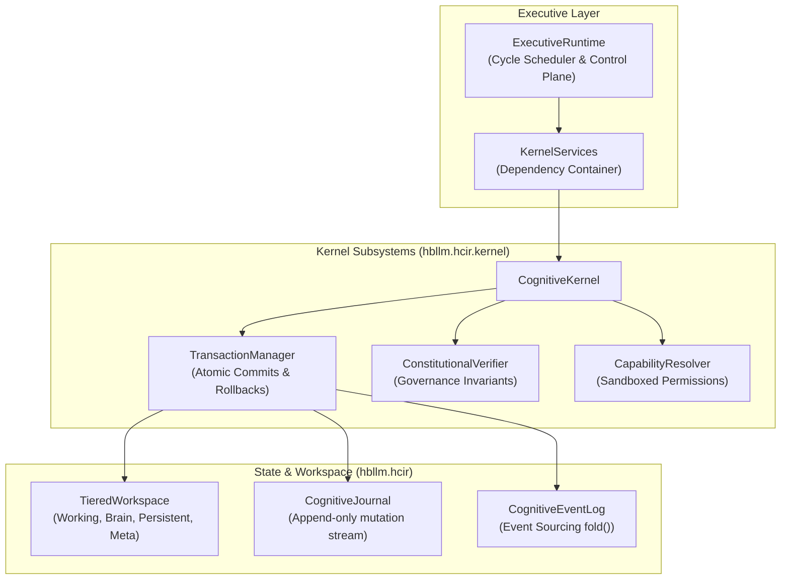

# HCIR Cognitive OS Kernel API

The **Human-Cognitive Intermediate Representation (HCIR)** is the canonical runtime substrate for HBLLM Core.

**Package:** `hbllm.hcir`

---

## Architecture Components



---

## `CognitiveKernel`

**Module:** `hbllm.hcir.kernel.cognitive_kernel.CognitiveKernel`

The core operating system kernel managing cognitive cycles, execution sandboxes, and workspace events.

```python
from hbllm.hcir.kernel.cognitive_kernel import CognitiveKernel
from hbllm.hcir.kernel.services import KernelServices

kernel = CognitiveKernel(services=KernelServices.create_default())
await kernel.initialize()

# Run a cognitive execution cycle
receipt = await kernel.execute_cycle(task_frame=frame)
print(f"Cycle execution receipt: {receipt.status}, Gas used: {receipt.gas_used}")
```

### Methods

| Method | Signature | Description |
|---|---|---|
| `initialize()` | `async () -> None` | Boots event loops, database pools, and verifiers |
| `execute_cycle()` | `async (task_frame: TaskFrame) -> ExecutionReceipt` | Runs a scheduled cognitive task cycle |
| `shutdown()` | `async () -> None` | Drains pending transactions and flushes state |

---

## `ExecutiveRuntime`

**Module:** `hbllm.hcir.kernel.executive_runtime.ExecutiveRuntime`

Controls the main cognitive execution loop, mode switching (Interactive, Background, Sleep), and resource scheduling.

```python
from hbllm.hcir.kernel.executive_runtime import ExecutiveRuntime

runtime = ExecutiveRuntime(kernel=kernel)
await runtime.start()
```

---

## `TieredWorkspace`

**Module:** `hbllm.hcir.workspace_tiers.TieredWorkspace`

Organizes cognitive graph nodes into four distinct lifetime tiers:

```python
from hbllm.hcir.workspace_tiers import TieredWorkspace, WorkspaceTier

workspace = TieredWorkspace()

# Store state in Working tier (task-scoped)
workspace.put_node(tier=WorkspaceTier.WORKING, node=scratchpad_node)

# Promote to Persistent tier (survives restart)
workspace.promote(node_id="concept-101", target_tier=WorkspaceTier.PERSISTENT)

# Query nodes
nodes = workspace.query_by_type("HypothesisNode")
```

### Tiers

| Tier | Enum | Lifetime | Purpose |
|---|---|---|---|
| **Working** | `WorkspaceTier.WORKING` | Active Task Frame | Scratchpad, short-lived reasoning steps |
| **Brain** | `WorkspaceTier.BRAIN` | Active Session | Working hypothesis set, active session context |
| **Persistent** | `WorkspaceTier.PERSISTENT` | Permanent | Distilled semantic beliefs, episodic records |
| **Meta** | `WorkspaceTier.META` | Permanent | Self-model metrics, capability performance logs |

---

## `TransactionManager` & `ConstitutionalVerifier`

**Modules:** `hbllm.hcir.kernel.transaction_manager`, `hbllm.hcir.kernel.governance.constitutional_verifier`

Guarantees transactional consistency for all cognitive mutations:

```python
from hbllm.hcir.kernel.transaction_manager import TransactionManager
from hbllm.hcir.kernel.transaction_envelope import TransactionEnvelope

tx_mgr = TransactionManager(workspace=workspace)

async with tx_mgr.begin_transaction() as tx:
    tx.add_mutation(mutation_1)
    tx.add_mutation(mutation_2)
    # Automatically validated by ConstitutionalVerifier before commit
    await tx.commit()
```
