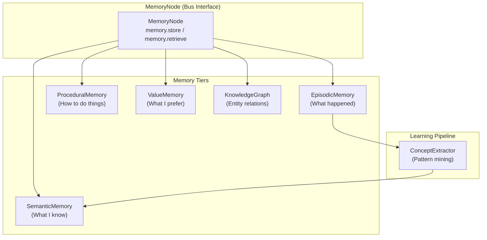
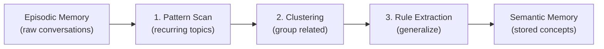

# Memory API Reference

HBLLM implements a **multi-tiered memory system** inspired by human cognitive
architecture. Each tier serves a different purpose, and together they give the
system both short-term recall and long-term learning capabilities.

---

## Architecture Overview



---

## MemoryNode

::: hbllm.memory.memory_node

The bus-connected interface to all memory tiers. Subscribes to memory-related
messages and dispatches to the appropriate tier.

### Bus Topics

| Topic | Direction | Purpose |
|---|---|---|
| `memory.store` | Subscribes | Store a new memory entry |
| `memory.retrieve_recent` | Subscribes | Retrieve recent conversation turns |
| `memory.search` | Subscribes | Semantic search across memory |
| `memory.feedback` | Subscribes | Record reward/preference signal |

### Initialization

The MemoryNode initializes all memory tiers from a single data directory:

```python
from hbllm.memory.memory_node import MemoryNode

memory = MemoryNode(
    node_id="memory",
    data_dir="~/.hbllm/data",  # All SQLite DBs stored here
)
```

---

## EpisodicMemory

::: hbllm.memory.episodic.EpisodicMemory

**What happened** — persists conversation turns across sessions using SQLite.
This is the system's short-to-medium term recall.

```python
from hbllm.memory.episodic import EpisodicMemory

episodic = EpisodicMemory(db_path="working_memory.db")

# Store a conversation turn
episodic.store(
    session_id="sess-123",
    role="user",
    content="What is Python?",
    tenant_id="default",
)

# Retrieve recent history
turns = episodic.retrieve_recent(session_id="sess-123", limit=10)
```

### Key Features

- Per-session conversation history
- Multi-tenant isolation via `tenant_id`
- Automatic pruning of old sessions
- Survives system restarts

---

## SemanticMemory

::: hbllm.memory.semantic.SemanticMemory

**What I know** — vector-based knowledge store for long-term facts that fall
outside the episodic window.

```python
from hbllm.memory.semantic import SemanticMemory

semantic = SemanticMemory()

# Store knowledge
semantic.store("Python is a programming language", {"topic": "coding"})
semantic.store("The weather is sunny today", {"topic": "weather"})

# Semantic search (cosine similarity)
results = semantic.search("programming")
# [{"content": "Python is a programming language", "score": 0.87, ...}]
```

### Embedding Backends

| Backend | When Used | Performance |
|---|---|---|
| **Sentence-Transformers** | `sentence-transformers` installed | Best quality (dense vectors) |
| **TF-IDF** | Fallback (no dependencies) | Good enough for small corpora |
| **Qdrant** | `qdrant-client` installed + `use_qdrant=True` | Production-grade HNSW ANN |

---

## ProceduralMemory

::: hbllm.memory.procedural.ProceduralMemory

**How to do things** — stores reusable skills and multi-step tool sequences.
Unlike episodic (what happened) and semantic (facts), procedural memory stores
executable knowledge.

```python
from hbllm.memory.procedural import ProceduralMemory

procedural = ProceduralMemory(db_path="procedural_memory.db")

# Store a skill
procedural.store_skill(
    name="Deploy to Production",
    trigger="deploy the application",
    steps=[
        "Run test suite with pytest",
        "Build Docker image",
        "Push to registry",
        "Update Kubernetes deployment",
    ],
    tools_used=["shell_exec", "python_exec"],
    tenant_id="default",
)

# Find matching skills
skills = procedural.find_skills("deploy the app to production")
```

### Key Features

- Per-tenant skill isolation
- Trigger-based matching (fuzzy)
- Tracks invocation count and success rate
- Skills can be graduated, orphaned, or forked by plugins

---

## ValueMemory

::: hbllm.memory.value_memory.ValueMemory

**What I prefer** — tracks per-tenant preference signals (positive/negative
feedback) keyed by topic and action. Feeds into the RLHF loop.

```python
from hbllm.memory.value_memory import ValueMemory

values = ValueMemory(db_path="value_memory.db")

# Record positive feedback
values.record_signal(
    tenant_id="user-123",
    topic="code_style",
    action="use_type_hints",
    reward=1.0,
)

# Record negative feedback
values.record_signal(
    tenant_id="user-123",
    topic="code_style",
    action="use_global_vars",
    reward=-1.0,
)

# Query preferences (exponential decay for recency)
prefs = values.get_preferences(tenant_id="user-123", topic="code_style")
# [{"action": "use_type_hints", "score": 0.92}, {"action": "use_global_vars", "score": -0.85}]
```

### Exponential Decay

Older signals carry less weight, so the system adapts to changing preferences
over time. The decay rate ensures recent feedback has the strongest influence.

---

## KnowledgeGraph

::: hbllm.memory.knowledge_graph.KnowledgeGraph

Entity-relation graph for structured knowledge. Stores entities and labeled
relationships, providing neighbor lookups, shortest-path queries, and
subgraph extraction.

```python
from hbllm.memory.knowledge_graph import KnowledgeGraph

kg = KnowledgeGraph()

# Add entities and relations
kg.add_entity("Python", entity_type="language")
kg.add_entity("Django", entity_type="framework")
kg.add_relation("Django", "written_in", "Python")

# Query neighbors
neighbors = kg.get_neighbors("Python")
# [{"entity": "Django", "relation": "written_in", "direction": "incoming"}]

# Shortest path
path = kg.shortest_path("Django", "Python")
# ["Django", "written_in", "Python"]
```

### Key Features

- Entity types and metadata
- Bidirectional relation traversal
- Shortest-path queries (BFS)
- Subgraph extraction for context building
- JSON persistence (`knowledge_graph.json`)

---

## ConceptExtractor

::: hbllm.memory.concept_extractor.ConceptExtractor

Mines patterns from episodic memory to form abstract knowledge. This is the
learning pipeline that turns conversations into reusable concepts.

### Pipeline



### Example

```
Input:  20 questions about "Laravel queue"
Output: Concept "Laravel Queue Management"
        Rule: "Queue workers require supervisor for production reliability"
```

```python
from hbllm.memory.concept_extractor import ConceptExtractor

extractor = ConceptExtractor()

# Extract concepts from episodic memory
concepts = extractor.extract(episodic_entries)
for concept in concepts:
    print(f"{concept.label}: {concept.description}")
    print(f"  Rules: {concept.rules}")
    print(f"  Confidence: {concept.confidence}")
```

---

## Memory Tier Comparison

| Tier | What It Stores | Backend | Retention |
|---|---|---|---|
| **Episodic** | Conversation turns | SQLite | Session-based, pruned |
| **Semantic** | Facts & knowledge | Vectors (ST/TF-IDF/Qdrant) | Permanent |
| **Procedural** | Skills & sequences | SQLite | Permanent |
| **Value** | Preferences & rewards | SQLite | Decayed over time |
| **Knowledge Graph** | Entity relations | In-memory + JSON | Permanent |
