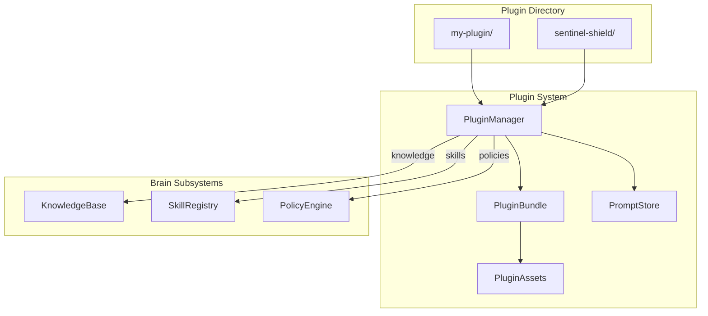
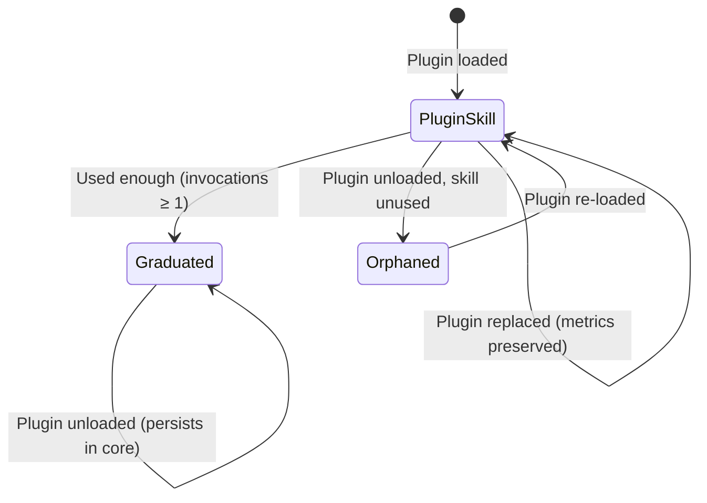

# Plugin API Reference

The plugin system enables runtime extensibility — add knowledge, skills, policies,
and prompt templates to HBLLM without modifying core code or restarting the server.

---

## Architecture Overview



---

## PluginManager

::: hbllm.plugin.manager.PluginManager

The central lifecycle manager for all plugins. Handles discovery, loading,
hot-reloading, and soft-deactivation.

### Initialization

```python
from hbllm.plugin.manager import PluginManager

manager = PluginManager(
    plugin_dirs=["~/.hbllm/plugins", "/opt/hbllm/plugins"],
    skill_registry=brain.skill_registry,
    policy_engine=brain.policy_engine,
    knowledge_base=brain.knowledge_base,
)
```

### Plugin Discovery

Scan configured directories and auto-load new v2 bundles:

```python
# Discover and load all plugins at startup
newly_loaded = await manager.discover_plugins()
# Returns: [LoadedBundle, LoadedBundle, ...]

# Add additional scan directories at runtime
manager.add_plugin_dir("/path/to/more/plugins")
```

### Hot-Loading

Load a specific plugin at runtime without restart:

```python
loaded = await manager.load_bundle(Path("~/.hbllm/plugins/my-plugin"))
print(loaded.name)                    # "my-plugin"
print(loaded.to_dict()["ingested"])   # {"knowledge_sources": 2, "skills": 3, ...}
```

If a plugin with the same name is already loaded, it is **unloaded first** (idempotent).

### Soft Deactivation

When a plugin is unloaded, the brain **never forgets** what it learned:

```python
await manager.unload_bundle("my-plugin")
```

| Asset Type | On Unload |
|---|---|
| **Knowledge** | Retained permanently — once learned, never deleted |
| **Skills** | Graduated (if used) or orphaned (if not) — never deleted |
| **Policies** | Deactivated (not deleted) — records persist |
| **Prompts** | Archived — retrievable but not active |

### Background Watcher

Start a background polling loop that auto-discovers new plugins:

```python
# Poll every 30 seconds (default)
await manager.watch_directories()

# Custom interval
await manager.watch_directories(interval=60)

# Stop watching
await manager.stop_watching()
```

### Querying State

```python
# List all loaded bundles
bundles = manager.list_bundles()

# Get a specific bundle
bundle = manager.get_bundle("sentinel-shield")

# Manager statistics
stats = manager.stats()
# {"bundles_loaded": 3, "prompts": 12, "watcher_active": True, ...}
```

---

## PluginBundle

::: hbllm.plugin.bundle.PluginBundle

Represents a loaded plugin directory. Handles manifest parsing and asset discovery.

```python
from hbllm.plugin.bundle import PluginBundle

bundle = PluginBundle(Path("plugins/sentinel-shield"))
print(bundle.manifest.name)       # "sentinel-shield"
print(bundle.manifest.version)    # "1.0.0"
print(bundle.assets.has_skills)   # True
print(bundle.assets.summary())    # {"knowledge_files": 2, "skills": 5, ...}
```

---

## PluginManifest

::: hbllm.plugin.bundle.PluginManifest

The `plugin.json` file in each plugin directory. v2 manifests enable the full
bundle system; v1 manifests remain backward-compatible (code-only plugins).

### v2 Manifest Example

```json
{
  "name": "sentinel-shield",
  "version": "1.0.0",
  "manifest_version": 2,
  "description": "Active threat protection for HBLLM",
  "author": "HBLLM Team",
  "entry_point": "__init__.py",
  "tags": ["security", "threat-detection"],
  "capabilities": ["threat_detection", "filesystem_monitoring"],
  "permissions": ["network_scan", "process_list"],
  "knowledge_dir": "knowledge",
  "skills_file": "skills/skills.yaml",
  "policies_file": "policies/policies.yaml",
  "prompts_file": "prompts/templates.yaml",
  "config_file": "config/defaults.yaml"
}
```

### Key Properties

| Property | Description |
|---|---|
| `is_v2` | `True` if `manifest_version >= 2` |
| `namespace` | Scoped name (`plugin:my-plugin`) for asset ownership |

---

## Bundle Directory Layout

```
my-plugin/
├── plugin.json              # Manifest (required)
├── __init__.py              # Code entry point
├── knowledge/               # Auto-ingested into KnowledgeBase
│   ├── domain-guide.md
│   └── reference-data.json
├── skills/                  # Auto-registered in SkillRegistry
│   └── skills.yaml
├── policies/                # Auto-loaded into PolicyEngine
│   └── policies.yaml
├── prompts/                 # Named prompt templates
│   └── templates.yaml
├── config/                  # Plugin-specific defaults
│   └── defaults.yaml
└── tests/
    └── test_plugin.py
```

### Supported Knowledge File Types

`.md`, `.txt`, `.json`, `.yaml`, `.yml`, `.csv`

---

## PluginAssets

::: hbllm.plugin.bundle.PluginAssets

Discovered assets from a plugin bundle:

| Property | Type | Description |
|---|---|---|
| `knowledge_files` | `list[Path]` | Knowledge documents to ingest |
| `skills` | `list[dict]` | Pre-built skill definitions |
| `policies` | `list[dict]` | Governance policy definitions |
| `prompts` | `dict[str, str]` | Named prompt templates |
| `config_defaults` | `dict[str, Any]` | Default configuration |
| `is_empty` | `bool` | True if no assets found |

---

## PromptStore

::: hbllm.plugin.manager.PromptStore

Lightweight store for named prompt templates contributed by plugins.
Templates are namespaced by plugin name.

```python
store = manager.prompt_store

# Render a template
result = store.render("sentinel-shield:threat_explanation", threat_type="malware")

# List active templates
templates = store.list_templates()
# [{"key": "sentinel-shield:threat_explanation", "source": "sentinel-shield", "preview": "..."}]
```

---

## Plugin SDK

::: hbllm.plugin.sdk

For writing third-party plugins that integrate with the MessageBus:

```python
from hbllm.plugin.sdk import HBLLMPlugin, subscribe

class MyPlugin(HBLLMPlugin):
    def __init__(self):
        super().__init__(
            node_id="my-plugin",
            capabilities=["custom_detection"],
        )

    @subscribe("perception.vision")
    async def on_image_seen(self, message):
        """Automatically bound to the bus on start."""
        image_data = message.payload.get("image")
        # Process image...

    @subscribe("context.update")
    async def on_context_change(self, message):
        # React to sensor/state changes...
        pass
```

The `@subscribe` decorator automatically binds methods to bus topics when the
plugin starts — no manual subscription code needed.

---

## Skill Lifecycle

When plugins register skills, the following lifecycle applies:



- **Plugin Skill**: Active, owned by the plugin namespace
- **Graduated**: Proven useful, promoted to core — survives plugin removal
- **Orphaned**: Plugin removed, skill unused — tagged but retained
