# Cognitive Execution Runtime — Composable Reasoning Substrate

> **Core Architectural Rule:** *Operators calculate. HCIR decides what becomes reality.*

The **Cognitive Execution Runtime** (`hbllm.brain.reasoning`) is the CPU-like execution layer for HBLLM cognition. It provides the formal execution semantics and pipeline orchestrator for composable reasoning operators to execute over immutable snapshots of canonical cognitive state without owning or directly mutating that state.

```text
                 HCIR (Canonical Cognitive State)
                               │
                       immutable snapshot
                               │
                               ▼
                        CognitiveContext
                               │
                               ▼
                       Operator Selection
                               │
                     ┌─────────┴─────────┐
                     │                   │
                Reasoning Operators   Resource Budget
                     │
                     ▼
               CognitiveResults
                     │
                     ▼
               Provenance / Trace
                     │
                     ▼
              Proposed Transaction
                     │
                     ▼
                 HCIR (Committed)
```

---

## Architectural Principles & Invariants

A12 establishes seven fundamental invariants that decouple reasoning execution from state ownership and large language model inference:

### 1. State Ownership Invariant
> *"No intelligence subsystem owns reality. HCIR owns the canonical cognitive state."*

Reasoning operators never receive mutable references to the live `CognitiveGraph`. Instead, the runtime captures an immutable `FrozenGraphView` snapshot and constructs a `CognitiveContext` containing:
- The read-only view of the graph
- The scoped `ReasoningProblem` definition
- The allocated `ReasoningBudget` (wall-clock ms, token limits, node read caps)
- Focused node IDs and optional scope boundaries

Operators return pure `CognitiveResult` structures. Changes to cognitive state are expressed solely as proposed `TransactionOperation` entries within a proposed `HCIRTransaction`.

### 2. Deterministic Replay & Provable Provenance
Every reasoning cycle records:
- Context state hash (`content_hash`)
- Exact operator invocations and sequence
- Resource consumption deltas (`ResourceCost`)
- Explicit `ProvenanceChain` per conclusion (linking conclusions back to source node IDs and reasoning steps)

This guarantees **cognitive reproducibility**: given the exact same context hash, budget, and problem, the runtime produces an identical reasoning trace.

### 3. Resource Awareness & Strict Budgets
Every operator declares `estimated_cost(problem, context)`. The `UnifiedReasoningRuntime` enforces monotonic budget decrements across wall-clock milliseconds, nodes read, edges traversed, and simulation steps. If a budget expires mid-pipeline, the runtime safely stops further operator dispatches and merges the partial conclusions reached so far.

### 4. Zero LLM Dependency (LLM-Free Cognitive Core)
Every reasoning operator in the cognitive core is **Level 1 (L1) LLM-independent**:
- Formal logic, constraint solving, graph traversal, statistical induction, structure-mapping analogies, and neuromorphic SNN evaluation.
- Static analysis and unit test suites enforce that zero LLM client libraries or models are imported or invoked by the core reasoning operators.

### 5. Decoupled Immutability Semantics
The semantic invariant is that **operators receive an immutable cognitive view**. While the initial implementation uses deep-copy snapshots (`FrozenGraphView`), the architecture is decoupled to allow structural sharing, copy-on-write, content-addressed DAGs, or MVCC snapshots as graph scale increases without altering operator contracts.

### 6. Two-Dimensional Autonomy Matrix
HBLLM distinguishes **LLM independence** from **cognitive autonomy**:

| Dimension | Question | A12 Baseline | Target (A22) |
|---|---|---|---|
| **LLM Independence** | Can the subsystem operate without calling an LLM? | 100% (L1) | 100% (L1) |
| **Cognitive Autonomy** | Can the system discover/learn representations without human hardcoding? | 20% (L2) | 100% (L7) |

A12 establishes complete LLM independence over structured problem classes; subsequent developmental phases (A13–A22) increase cognitive autonomy through grounded world modeling, predictive learning, and concept formation.

---

## The 13 Composable Reasoning Operators

The runtime hosts 13 specialized operators split between new formal inference engines and wrapped legacy brain systems adapted to the A12 contract:

```mermaid
graph TB
    subgraph "Unified Reasoning Runtime"
        RT["UnifiedReasoningRuntime.reason()"]
        REG["OperatorRegistry.select()"]
    end

    subgraph "Phase 7: New Formal Operators"
        DED["⚡ Deduction<br/>(Forward Chaining / Modus Ponens)"]
        IND["📊 Induction<br/>(Statistical Co-occurrence & Rules)"]
        ABD["🔍 Abduction<br/>(Best-Explanation Hypothesis Ranking)"]
        TEMP["⏰ Temporal<br/>(Allen's Interval Algebra)"]
        SPAT["📍 Spatial<br/>(RCC-8 Qualitative Containment)"]
        ANA["🔗 Analogy<br/>(Gentner Structure-Mapping)"]
    end

    subgraph "Phase 8: Wrapped Cognitive Engines"
        PRED["📈 Prediction<br/>(Order-N Markov Predictor)"]
        CONT["⚔️ Contradiction<br/>(Structural & Negation Analysis)"]
        CF["🔄 Counterfactual<br/>('What-If' Graph Traversal)"]
        CAUS["🌿 Causal<br/>(BFS Multi-Hop Chain Discovery)"]
        ACT["🎯 Active Inference<br/>(Utility Action Optimization)"]
        SIM["🛡️ Simulation<br/>(Multi-Layer Risk & Safety Filter)"]
        SNN_OP["⚡ SNN Reasoning<br/>(Spiking Feature Evaluation)"]
    end

    RT --> REG
    REG -.-> DED & IND & ABD & TEMP & SPAT & ANA
    REG -.-> PRED & CONT & CF & CAUS & ACT & SIM & SNN_OP
```



### Phase 7: New Operators

| Operator | Module | Mechanism | Target Problems |
|---|---|---|---|
| **Deduction** | `deduction.py` | Modus ponens forward chaining over rule edges and proposition premises | `ProblemType.EXPLANATION`, `ProblemType.CONSTRAINT` |
| **Induction** | `induction.py` | Property co-occurrence clustering and generalization across entity populations | `ProblemType.GENERALIZATION`, `ProblemType.CLASSIFICATION` |
| **Abduction** | `abduction.py` | Backward explanation search ranking candidate causes for unexplained observations | `ProblemType.EXPLANATION`, `ProblemType.DIAGNOSIS` |
| **Temporal** | `temporal.py` | Allen's 13 interval relations, event ordering, and temporal transitivity | `ProblemType.TEMPORAL`, `ProblemType.CAUSAL` |
| **Spatial** | `spatial.py` | Region Connection Calculus (RCC-8) topological containment and adjacency | `ProblemType.SPATIAL`, `ProblemType.PLANNING` |
| **Analogy** | `analogy.py` | Structure-mapping theory (Gentner) cross-domain relational isomorphism transfer | `ProblemType.ANALOGY`, `ProblemType.GENERALIZATION` |

### Phase 8: Wrapped Cognitive Engines

| Operator | Module | Wrapped Subsystem | Architectural Adaptation |
|---|---|---|---|
| **Prediction** | `prediction.py` | `MarkovPredictor` | Reads event sequences from frozen HCIR, trains transient Markov model, proposes `PredictionNode` |
| **Contradiction** | `contradiction.py` | `ContradictionDetector` | **Replaced LLM** with pure graph analysis: structural `CONTRADICTS` edges, claim negation patterns, and prediction failure magnitudes |
| **Counterfactual** | `counterfactual.py` | `CounterfactualReasoner` | Synchronous graph traversal calculating belief confidence deltas under hypothetical evidence removal |
| **Causal** | `causal.py` | `CausalGraph` / `CausalReasoner` | BFS traversal over `CAUSES` edges with probability decay, cycle guards, and transitive edge proposal |
| **Active Inference** | `active_inference.py` | `ActiveInferenceEngine` | Multi-attribute utility ranking ($Utility = w_1 R + w_2 I + w_3 V - w_4 \text{Risk} - w_5 \text{Cost}$) over candidate `ActionNode` items |
| **Simulation** | `simulation.py` | `LayeredSimulationEngine` | Multi-layer risk evaluation (safety regex filters, resource exhaustion limits, belief contradictions) |
| **SNN Reasoning** | `snn_reasoning.py` | `ReasoningNetwork` | Structural feature extraction evaluated through LIF spiking networks (or calibrated sigmoid fallback) |

---

## Reasoning Lifecycle & Composition

Reasoning occurs through structured multi-cycle loops where each cycle's committed transactions advance the HCIR state for subsequent operators:

```text
Cycle 1: Observation & Error Detection
    ObservationNode (discrepancy)
         │
         ▼
    ContradictionOperator (identifies structural clash)
         │
         ▼
    HCIR Transaction: Propose ContradictionNode

Cycle 2: Explanation & Hypothesis Generation
    HCIR (with ContradictionNode)
         │
         ▼
    AbductionOperator (searches causes for contradiction)
         │
         ▼
    HCIR Transaction: Propose HypothesisNode[]

Cycle 3: Causal Discovery & Projection
    HCIR (with HypothesisNode[])
         │
         ▼
    CausalOperator + PredictionOperator (projects next states)
         │
         ▼
    HCIR Transaction: Propose PredictionNode[]

Cycle 4: Action Selection & Risk Filter
    HCIR (with PredictionNode[])
         │
         ▼
    ActiveInferenceOperator + SimulationOperator (ranks actions & screens risk)
         │
         ▼
    HCIR Transaction: Propose ActionNode (validated)
```

---

## Operator Registry & Dynamic Selection

The `OperatorRegistry` selects candidates based on a multi-dimensional fitness score:

$$\text{SelectionScore} = w_a \cdot \text{Applicability} + w_r \cdot \text{Reliability} - w_c \cdot \text{NormalizedCost} + \text{DomainBonus}$$

Where:
- **Applicability** ($[0, 1]$): Declared suitability of the operator for the given problem type and context graph topology.
- **Reliability** ($[0, 1]$): Running exponential moving average of successful non-empty inferences by the operator.
- **Normalized Cost** ($[0, 1]$): Estimated wall-clock and node exploration overhead relative to budget.
- **Domain Bonus**: Preference boost when focus nodes or scope tags match operator specializations.

---

## Canonical End-to-End Benchmark

The runtime is validated by an end-to-end behavioral test harness (`test_a12_benchmark.py`) confirming that reasoning compounds across transactions without LLM invocation:

```text
============================= test session starts ==============================
collected 6 items

Scenario 1 — Spatial Transitivity:
    Seed: ball inside box, box inside room
    Operators: Spatial (RCC-8)
    Result: Proposes transitive edge (ball inside room) -> Applied to HCIR ✓

Scenario 2 — Temporal -> Causal Chain:
    Seed: push -> roll -> collision -> stop (timed events)
    Cycle 1 (Temporal): Event ordering [push, roll, collision, stop]
    Cycle 2 (Causal): Discovers multi-hop transitive chain (push causes stop, p=0.612) ✓

Scenario 3 — Object Disappearance (proto-A13):
    Seed: ball visible -> predicted visible -> observed not_visible (PredictionError)
    Cycle 1 (Abduction): Generates occlusion/movement hypotheses (HCIR nodes: 7 -> 13)
    Cycle 2 (Prediction): Predicts next state conditioned on advanced hypotheses ✓

Scenario 4 — Contradictory Beliefs:
    Seed: "entity is spherical" (0.9) vs "entity is not spherical" (0.8)
    Cycle 1 (Contradiction): Detects structural negation pattern
    Cycle 2 (Explanation): Advances state (context hash: 763c7b61... -> c3952304...) ✓

Scenario 5 — Multi-Operator Pipeline:
    Cycles: Temporal -> Causal -> Prediction -> Contradiction
    Result: 4 distinct immutable state transitions, full compounding trace ✓

Meta-Test — Zero LLM Calls:
    Static analysis & module inspection: 0 LLM modules loaded ✓

============================== 6 passed in 8.44s ===============================
```

---

## Python Usage Example

```python
from hbllm.hcir.graph import CognitiveGraph, PhysicalEntityNode, HCIREdge, HCIREdgeType
from hbllm.brain.reasoning.operators import (
    OperatorRegistry,
    SpatialOperator,
    ReasoningProblem,
    ProblemType,
    ReasoningBudget,
)
from hbllm.brain.reasoning.unified_runtime import UnifiedReasoningRuntime

# 1. Initialize Graph & Entities
graph = CognitiveGraph()
ball = PhysicalEntityNode(id="ball_1", entity_name="ball")
box = PhysicalEntityNode(id="box_1", entity_name="box")
room = PhysicalEntityNode(id="room_1", entity_name="room")
graph.add_node(ball)
graph.add_node(box)
graph.add_node(room)

# ball is inside box, box is inside room
graph.add_edge(HCIREdge(edge_type=HCIREdgeType.PART_OF, sources=["ball_1"], targets=["box_1"]))
graph.add_edge(HCIREdge(edge_type=HCIREdgeType.PART_OF, sources=["box_1"], targets=["room_1"]))

# 2. Setup Operator Registry & Runtime
registry = OperatorRegistry()
registry.register(SpatialOperator())
runtime = UnifiedReasoningRuntime(registry)

# 3. Formulate Reasoning Problem
problem = ReasoningProblem(
    problem_type=ProblemType.SPATIAL,
    problem_id="prob_spatial_containment",
    description="Determine spatial relationship between ball_1 and room_1",
    focus_node_ids=["ball_1", "room_1"],
)

# 4. Execute Reasoning over Immutable Snapshot
trace = runtime.reason(graph, problem, budget=ReasoningBudget(compute_ms=50.0))

# 5. Inspect Trace & Proposed Mutations
print(f"Context Hash: {trace.context_hash}")
print(f"Final Result Status: {trace.final_result.status}")
if trace.proposed_transaction:
    print(f"Proposed {len(trace.proposed_transaction.operations)} HCIR operations")
    for op in trace.proposed_transaction.operations:
        print(f"  - {op.op}: {op.edge_data.get('edge_type') if op.edge_data else op.node_id}")
```
