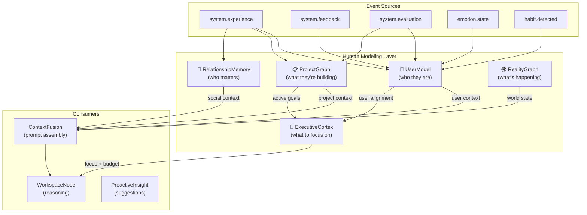
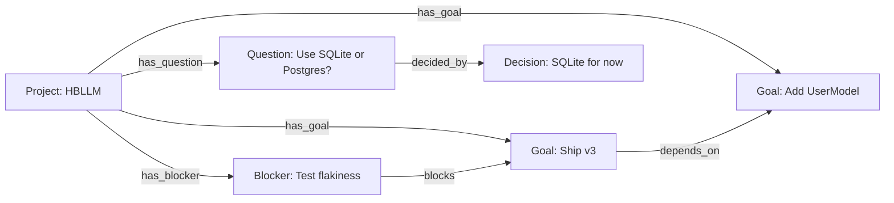
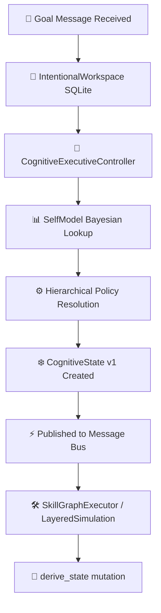
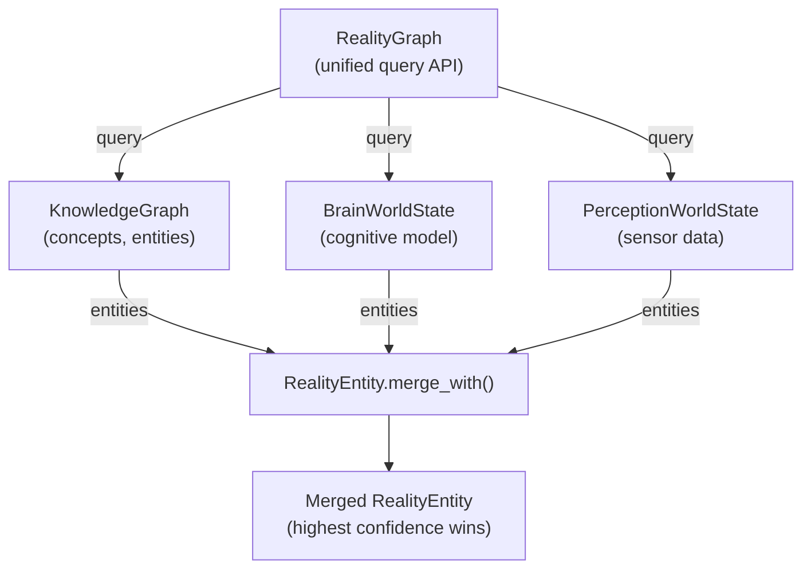

# Cognitive Subsystems — Human Modeling Layer

> **Core thesis**: The difference between a chat assistant and a personal AI is not reasoning — it's **modeling the human**.

These 5 subsystems (+ 3 bus adapter nodes) form HBLLM's human modeling layer. They make the system feel persistent and personal by continuously learning who the user is, what they're working on, who matters to them, how to allocate cognitive resources, and what the world looks like right now.

**Module:** `hbllm.brain`

---

## Architecture



---

## 1. UserModel — Who They Are

**Engine:** `hbllm.brain.social.user_model.UserModelEngine` (989 lines)
**Bus Adapter:** `hbllm.brain.social.user_model_node.UserModelNode` (171 lines)
**Config:** `inject_user_model = True`

The UserModel continuously learns about the human operator from every interaction — their expertise domains, communication preferences, beliefs, trust levels, temporal work patterns, and current cognitive state (stress, engagement).

### Data Model

```python
class UserModel:
    expertise: dict[str, UserExpertise]       # Domain → skill level
    preferences: dict[str, UserPreference]    # Key → value (e.g. verbosity: concise)
    beliefs: list[UserBelief]                 # Stances on topics (capped at 50)
    trust: dict[str, TrustDimension]          # Per-domain delegation/override ratio
    current_focus: LearnedAttribute           # What they're working on right now
    stress_level: float                       # 0.0 (calm) → 1.0 (overwhelmed)
    engagement_level: float                   # 0.0 (disengaged) → 1.0 (flow state)
    likely_next_actions: list[str]            # Predicted from temporal patterns
    active_interests: list[str]              # Recently active topics
    active_hours: dict[int, float]           # Hour → activity weight
    active_days: dict[int, float]            # Weekday → activity weight
```

### How Learning Works

Every interaction flows through `update_from_interaction()`:

1. **Expertise Inference** — Vocabulary analysis detects domain expertise across 9 domains (python, rust, docker, ML, devops, database, frontend, flutter, laravel)
2. **Focus Tracking** — Topic shift detection via keyword extraction
3. **Temporal Patterns** — Builds activity heatmaps per hour and weekday
4. **Interest Tracking** — Maintains a sliding window of active interests (capped at 20)
5. **Confidence Accumulation** — Each learned attribute uses `confidence = 1 - exp(-evidence_count/5)`, with explicit user corrections overriding to 0.95
6. **Ebbinghaus Decay** — All attributes decay over time with configurable half-life (default: 30 days)

### Bus Topics

| Direction | Topic | Purpose |
|-----------|-------|---------|
| Subscribe | `system.experience` | Extract signals from every interaction |
| Subscribe | `system.feedback` | Learn from explicit feedback (e.g. "too verbose") |
| Subscribe | `system.evaluation` | Track trust (did user accept the output?) |
| Subscribe | `emotion.state` | Update stress/engagement proxy |
| Subscribe | `habit.detected` | Incorporate temporal patterns as preferences |
| Publish | `user.model.updated` | Notify when model changes significantly |

### Persistence

SQLite (`data/user_model.db`) with two tables:

- `user_attributes` — JSON blob per tenant for expertise, preferences, trust, focus, interests, temporal
- `user_beliefs` — topic, stance, confidence per tenant (capped at 50)

---

## 2. ProjectGraph — What They're Building

**Engine:** `hbllm.brain.world.project_graph.ProjectGraph` (704 lines)
**Bus Adapter:** `hbllm.brain.world.project_node.ProjectNode` (156 lines)
**Config:** `inject_project_graph = True`

Graph-based project state tracker. When the user mentions "the auth system" or "HBLLM", the ProjectGraph auto-detects which project they're talking about and injects relevant goals, blockers, and open questions into the context.

### Data Model



Entity types: `project`, `goal`, `question`, `blocker`, `decision`, `milestone`
Relation types: `has_goal`, `has_blocker`, `has_question`, `depends_on`, `blocks`, `decided_by`

### Key Capabilities

| Function | Purpose |
|----------|---------|
| `create_project(name, tags)` | Create a new project node |
| `add_entity(project_id, type, name)` | Add goal/blocker/question with auto-relation |
| `record_decision(project_id, text)` | Record a design decision |
| `resolve(entity_id, resolution)` | Mark question/blocker as resolved |
| `auto_detect_project(query)` | Fuzzy-match a query to an existing project |
| `reactivate(project_id)` | Generate context summary when switching back |
| `get_active_goals(project_id)` | All active goals for a project |
| `get_blockers(project_id)` | All unresolved blockers |
| `get_open_questions(project_id)` | All pending questions |

### Bus Topics

| Direction | Topic | Purpose |
|-----------|-------|---------|
| Subscribe | `system.experience` | Auto-detect project from interaction context |
| Subscribe | `system.evaluation` | Track project health from evaluation outcomes |
| Subscribe | `project.query` | Answer project state queries |
| Publish | `project.detected` | Project auto-detected from context |
| Publish | `project.reactivated` | User returned to a project |

### Persistence

SQLite (`data/project_graph.db`) — tables: `entities`, `relations`.

---

## 3. Cognitive Executive Kernel & ExecutiveCortex

**Engine:** `hbllm.brain.control.executive_cortex.CognitiveExecutiveController` (Node) & `ExecutiveCortex` (Compatibility Facade)
**Database:** `data/intentional_workspace.db` (SQLite Goal Agenda)
**State Model:** `hbllm.brain.core.cognitive_state.CognitiveState` (Immutable Snapshot)

The executive layer has transitioned from a reactive, ephemeral state machine to a **State-Centric Cognitive Operating System Kernel**. It enforces persistent agendas, immutable branching context states, and hierarchical policy cascade governance.

### Architecture Topology



### Core Architecture Components

#### 1. CognitiveExecutiveController
The orchestrator service. Rather than directly executing reasoning, it listens to the Message Bus for goals, configures local policies, instantiates the root version of `CognitiveState`, and tracks workspace execution progress.

#### 2. IntentionalWorkspace
Persistent storage layer managing high-priority and deferred tasks, security threats, opportunities, and curiosity targets. Backed by `intentional_workspace.db`.

#### 3. CognitiveState (Blackboard Memory)
A completely immutable, versioned snapshot of working memory. It is derived using:
```python
new_state = state.derive_state(
    active_skills=["db_query"],
    working_memory={"temp_result": 42}
)
# Automatically increments version, sets parent_state_id, and generates unique state_id
```
Contains first-class evidence ledgers:
$$\text{Belief} \longrightarrow \text{Evidence} \longrightarrow \text{Confidence} \longrightarrow \text{Source}$$

#### 4. HierarchicalCognitivePolicy
Resolves priorities, latency budgets, and model choice cascading through:
$$\text{Task Policy} \longrightarrow \text{Goal Policy} \longrightarrow \text{Conversation Policy} \longrightarrow \text{Global Policy} \longrightarrow \text{Defaults}$$
Ensures that critical global safety thresholds are never overridden.

#### 5. SkillGraphExecutor
Virtual executor that runs skills represented as DAGs of `nodes` and `edges`, supporting parallel branch execution, conditional paths, and retry propagation loops.

#### 6. LayeredSimulationEngine
A multi-layered counterfactual forecast module that validates all memory writes, beliefs, actions, and learning commits through domain simulators:
* **SafetySimulator:** Restricts dangerous terminal commands.
* **ReliabilitySimulator:** Evaluates self-model competence.
* **SocialSimulator:** Manages notification interruption.
* **ResourceSimulator:** Tracks latency and token budgets.
* **MemoryBeliefSimulator:** Catches belief contradictions.

---

## 4. RelationshipMemory — Who Matters

**Engine:** `hbllm.brain.social.relationship_memory.RelationshipMemory` (660 lines)
**Bus Adapter:** `hbllm.brain.social.relationship_node.RelationshipNode` (166 lines)
**Config:** `inject_relationship_memory = True`

Social graph that tracks people mentioned in conversations — their roles, sentiment trends, interaction history, and relevance to current topics.

### Data Model

```python
class Person:
    name: str
    role: str              # "colleague", "manager", "friend", etc.
    organization: str
    mention_count: int
    sentiment: float       # -1.0 (negative) → 1.0 (positive)
    importance: float      # 0.0 → 1.0
    topics: list[str]      # What topics they're associated with
    first_seen: float
    last_seen: float

class RelationshipEvent:
    event_type: str        # "mention", "collaboration", "conflict", "feedback"
    context: str
    sentiment_delta: float
    timestamp: float

class RelationshipHistory:
    events: list[RelationshipEvent]
    trend: str             # "improving", "stable", "declining"
```

### Key Functions

| Function | Purpose |
|----------|---------|
| `record_mention(name, context, topic, sentiment)` | Track a person mention (creates if new) |
| `record_event(name, event_type, context, sentiment_delta)` | Log an interaction event |
| `learn_relationship(name_a, name_b, type)` | Establish a relationship (colleague, reports_to, etc.) |
| `get_person(name)` | Fuzzy lookup by name |
| `get_relevant_people(topic)` | Find people relevant to a topic |
| `get_history(name)` | Full event history with computed trend |
| `prioritize_notification(name)` | How urgently to notify about this person (0.0–1.0) |
| `extract_person_mentions(text)` | Regex-based multi-word name extraction |

### Persistence

SQLite (`data/relationship_memory.db`) — tables: `people`, `events`, `relationships`.

---

## 5. RealityGraph — What's Happening

**Engine:** `hbllm.brain.reasoning.reality_graph.RealityGraph` (531 lines)
**Config:** `inject_reality_graph = True`

Unified read-only facade over all existing world state backends. Instead of replacing the KnowledgeGraph, BrainWorldState, or PerceptionWorldState, the RealityGraph queries all three and returns a merged view.

### Design



### Entity Model

```python
class RealityEntity:
    entity_id: str
    entity_type: str     # "concept", "device", "state", "person", "location"
    label: str
    attributes: dict
    confidence: float    # 0.0 → 1.0
    source: str          # Which backend provided this
    ttl: float           # Time-to-live (seconds)
    last_updated: float
```

When the same entity exists in multiple backends, `merge_with()` keeps the higher-confidence version and combines attributes from both.

### Key Functions

| Function | Purpose |
|----------|---------|
| `query_entity(label)` | Query across all backends, merge duplicates |
| `query_by_type(entity_type)` | Filter entities by type across all backends |
| `tick()` | Expire stale entities, return count expired |
| `get_context(query, tenant_id, budget)` | NL summary for ContextFusion |
| `get_user_context(user_id)` | User-specific world state (devices, location) |
| `stats()` | Backend availability and entity counts |

---

## Integration: ContextFusion

All 5 subsystems inject context into the `ContextFusionEngine` via priority-weighted providers:

| Provider | Source | Priority | Budget |
|----------|--------|----------|--------|
| `user_model` | UserModelEngine | 0.85 | Expertise, preferences, beliefs, stress |
| `active_project` | ProjectGraph | 0.85 | Active project goals, blockers, questions |
| `relationships` | RelationshipMemory | 0.55 | Key people in context |
| `reality_graph` | RealityGraph | 0.60 | Unified world state |

These complement the existing providers (memory, world_state, emotion, goals) to give the LLM a complete picture of the user's world in every prompt.

## Integration: BrainFactory

All subsystems are wired by `BrainFactory.create()` via 5 config flags:

```python
config = BrainConfig(
    inject_user_model=True,         # UserModelEngine + UserModelNode
    inject_project_graph=True,      # ProjectGraph + ProjectNode
    inject_executive_cortex=True,   # ExecutiveCortex
    inject_relationship_memory=True, # RelationshipMemory + RelationshipNode
    inject_reality_graph=True,      # RealityGraph
)
```

All default to `True` — disable individually if not needed.

---

## Next Steps

- [Architecture Overview](overview.md) — How these fit into the full HBLLM architecture.
- [Brain Factory API](../api/brain-factory.md) — Configuration reference.
- [Brain Subsystems API](../api/brain-subsystems.md) — Full API reference.
- [Executive Brain Layer](executive-brain-layer.md) — Autonomy and executive control.
