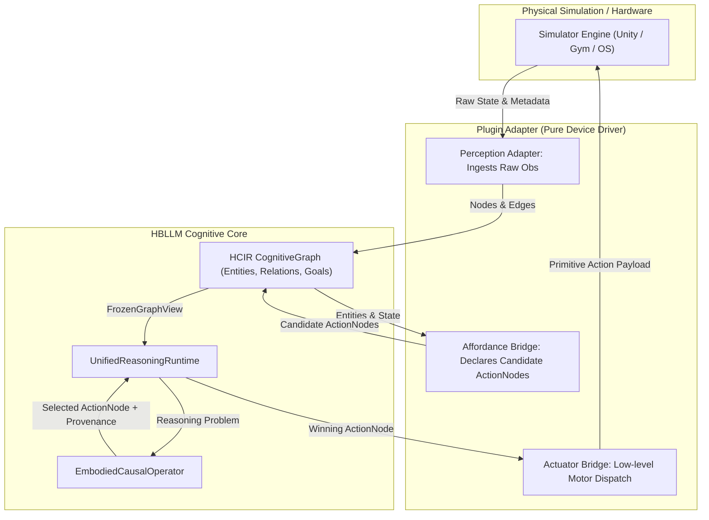

# Embodiment & Real-World Actuation

HBLLM Core interacts with the physical or operating system environment safely through the **Execution Reality Layer**. This system ensures that when the agent takes an action, it is not merely relying on the theoretical success of a tool, but actually verifying that the physical or digital state was altered as expected.

## Core Components

### 1. Device Reality Integration (`hbllm/brain/embodiment/os_adapter.py`)
The `os_adapter` acts as a secure boundary between the cognitive loop and the host OS. 
- It maps semantic intentions (e.g., "turn off the wifi") into safe actuator/sensor interfaces.
- Provides isolated contexts for the agent to probe the OS state without risking unconstrained shell execution.

### 2. Execution Verification Engine (`hbllm/brain/embodiment/verifier.py`)
Large Language Models are prone to hallucinating the success of their actions based on API responses. 
- The `ExecutionVerifier` class implements **asynchronous non-blocking polling**. 
- After an action is executed, the verifier probes the actual physical or digital state (e.g., checking if the light is actually off, or if the file actually exists) to confirm the state change.
- Re-triggers the agent if reality diverges from the expected simulation.

### 3. Idempotency Tracking (`hbllm/brain/embodiment/idempotency.py`)
During complex, multi-step execution, retries or crashes are inevitable. 
- To prevent duplicate mutating actions, the system generates deterministic action hashes based on the parameters and context.
- Maintains a lock-table of executed actions. 
- If a crash occurs and the system reboots, the agent will not repeat a destructive or state-mutating action it had successfully executed immediately prior to the crash.

### 4. Platform-Specific Adapters

The OS Adapter delegates to platform-specific backends for deep OS integration:

| Platform | Module | Capabilities |
|----------|--------|-------------|
| **macOS** | `platform_mac.py` | AppleScript automation, Spotlight search, system preferences, Notification Center, Finder integration |
| **Linux** | `platform_linux.py` | D-Bus integration, systemd service control, NetworkManager, udev device events, X11/Wayland window management |

Each adapter implements a common `PlatformAdapter` interface so the cognitive pipeline remains platform-agnostic while leveraging native capabilities.

### 5. Confirmation Gate (`hbllm/actions/confirmation.py`)

Human-in-the-loop approval for high-risk actions before execution:

- **Risk classification** — Actions are classified into trust tiers (SAFE, MODERATE, SENSITIVE, CRITICAL).
- **Escalation** — SENSITIVE and CRITICAL actions require explicit user confirmation.
- **Timeout** — Pending confirmations expire after a configurable timeout (default: 5 minutes).
- **Audit integration** — All confirmation decisions are logged to the audit trail.

### 6. Rollback Engine (`hbllm/actions/rollback.py`)

Undo support for reversible actions with snapshot-based state recovery:

- **Pre-action snapshots** — Captures relevant state before executing mutating actions.
- **Rollback execution** — Applies inverse operations to restore previous state.
- **Cascade rollback** — Multi-step action chains can be rolled back as a unit.
- **Retention** — Snapshots are retained for a configurable period (default: 24 hours).

## Safety Architecture

```
User Request → Risk Classifier → Confirmation Gate (if needed) → Idempotency Check
    → Pre-Action Snapshot → OS Adapter (Platform-Specific) → Execution
    → Verification Polling → Success/Failure → Rollback (if failed)
```

All embodiment actions follow this pipeline to ensure safety, reversibility, and verification at every step.

---

## Decoupled Embodiment Architecture: Device Drivers vs Cognitive Engine

HBLLM enforces a strict architectural boundary between **how an agent interacts with an environment (Device Driver)** and **how it decides what to do (Cognitive Reasoning Core)**.



### 1. Device Driver Layer (`plugins/*_adapter/`)
The plugin adapter functions strictly as a hardware or simulator device driver:
- **Perception (`perception.py`)**: Senses raw simulator telemetry, object coordinates, visibility, and containment hierarchies into typed `PhysicalEntityNode`s and `HCIREdge`s (`PART_OF`, `DEPENDS_ON`). Also translates scenario criteria into active `GoalNode`s.
- **Affordance Enumeration (`action.py`)**: Evaluates the physical state and declares what primitive actions are possible as declarative `ActionNode`s, defining explicit `requirements` (preconditions) and `produces` (outcomes).
- **Actuator Dispatch (`action.py`)**: Translates high-level declarative actions chosen by the brain into low-level motor primitives (e.g., yaw rotation toward coordinates, camera pitch alignment, sidestepping around collision geometry, and Unity RPC action dictionaries).
- **Zero Procedural Planning**: The driver contains no hand-crafted decision trees, if-else task state machines, or domain-specific sub-goaling.

### 2. Cognitive Reasoning Core (`hbllm/brain/reasoning/`)
All decision-making and planning are handled universally by the general cognitive architecture:
- **`UnifiedReasoningRuntime`**: Evaluates active goals against an immutable snapshot of the environment (`FrozenGraphView`).
- **`EmbodiedCausalOperator`**: A domain-agnostic classical reasoning operator that executes **backward-chaining causal dependency resolution**:
  1. Inspects the target criteria declared on the active `GoalNode`.
  2. Finds candidate `ActionNode`s whose `produces` list satisfies unsatisfied conditions.
  3. Evaluates action `requirements` against the current graph view. If prerequisites are missing (e.g., container is closed, target is beyond physical reach), it spawns recursive causal sub-goals to find the immediately executable prerequisite action.
  4. Dispatches the winning `ActionNode` with a complete `ProvenanceChain` detailing the causal derivation.
- **Deterministic & Zero-Token**: Achieves 100% success on multi-tier manipulation tasks with strictly **0 LLM tokens** and sub-millisecond planning latency.

---

## 7. Empirical Validation Across Authentic Native Environments

The Execution Reality Layer and HCIR Causal Planners are evaluated strictly against **authentic, installed upstream simulator packages** (`crafter`, `minigrid`, `gym_sokoban`, `overcooked_ai_py`, `minihack` / `nle`, `ai2thor`). Rather than relying on autoregressive token generation for spatial pathfinding or vital monitoring, HBLLM uses typed state ingress and zero-token topological causal planning.

| Domain | Environment Package | Literature / RL Baseline | Pure HCIR Performance | Key Architectural Mechanism |
| :--- | :--- | :---: | :---: | :--- |
| **Open-World Survival** | `crafter` (v1.8.3) | 10.0% (DreamerV2, 1M steps)<br>4.2% (PPO, 1M steps) | **41.28%** Hafner Score<br>**93.9%** Multi-Tier | Causal Recipe DAG + Vital Priority Interrupts |
| **Grounded Language** | `minigrid` (v3.1.0) | ~50% (IL, 1M+ demos)<br>< 10% (PPO on BossLevel) | **97.8%** Overall (44/45)<br>**80.0%** BossLevel | Spatial-epistemic search & key-door deduction |
| **Topological Pushing** | `gym_sokoban` (v0.0.6) | 82–85% (DRC(3,3), 1B steps) | **80.0%** Native Success (16/20) | Reverse-BFS dead-end detection & frozen box hashing |
| **Multi-Agent Kitchen** | `overcooked_ai_py` (v1.1.0) | ~60–70% (BC / PPO Self-Play) | **100.0%** (15/15 episodes) | Causal recipe pipelining & counter contention resolution |
| **Rogue-Like Dungeons** | `minihack` (v1.0.2) / `nle` | < 20% (IMPALA / TorchBeast) | **80.0%** (4/5 tiers at 100%) | Frontier glyph exploration & melee combat interrupts |
| **3D Object Manipulation** | `ai2thor` (v5.0.0) | ~30–45% (Embodied CLIP / PPO) | **91.7%** (11/12 episodes) | Ground-truth 3D scene graph, camera yaw/pitch alignment & affordance reach |

*For complete metric tables, 95% Wilson confidence intervals, per-tier breakdowns, and CLI reproducibility commands, refer to the [Embodied Cognitive & Frontier Benchmarks](../api/benchmarks.md#embodied-cognitive-frontier-benchmarks) API reference.*

