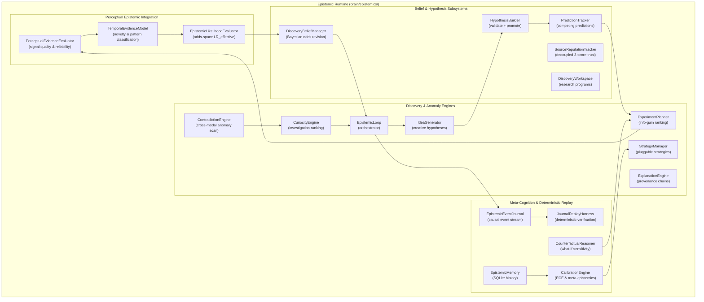
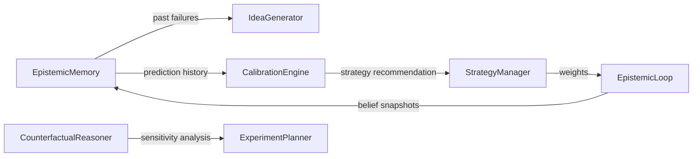

# Epistemic Runtime — Domain-Neutral Discovery Engine

> **Core thesis**: The epistemic runtime should never know what medicine, robotics, chemistry, or finance are. It should only know about observations, evidence, uncertainty, hypotheses, predictions, experiments, and belief revision.
>
> **Architectural Invariant**: Perception produces observations and candidate signals. Epistemics owns interpretation, evidence evaluation, and belief revision. HCIR owns the resulting state and immutable history. Replay reconstructs the same state from the same causal inputs.

The Epistemic Runtime is HBLLM's autonomous discovery and belief lifecycle layer. It gives the system the ability to **evaluate continuous perceptual streams**, **model temporal dependence and novelty**, **form hypotheses**, **design experiments**, **evaluate evidence**, **revise beliefs in odds-space**, **calibrate its own reasoning**, **reconstruct deterministic states via event sourcing**, **perform counterfactual sensitivity analysis**, and **isolate provider reputation from circular internal feedback** — without domain-specific knowledge.

**Module:** `hbllm.brain.epistemics`

---

## Design Philosophy

### Epistemic vs. Domain Knowledge

```
Reality belongs to the World Model.
Perception extracts structured observations.
Epistemics reasons ABOUT reality and forms beliefs.
```

The runtime operates on abstract epistemic primitives:

| Primitive | Description | Not |
|---|---|---|
| Observation | Raw perceptual input with provider provenance | "A person is speaking" |
| Evidence | Evaluated observation with temporal novelty & reliability | "High-quality acoustic evidence (novelty=0.85)" |
| Hypothesis | Testable claim | "Speaker is Alice" |
| Prediction | Falsifiable expectation with deadline | "Alice will appear on camera within 2s" |
| Experiment | Test design ranked by information gain | "Cross-modal sensor probe" |
| Belief | Confidence-weighted claim with transition audit chain | "Alice is in the room (p=0.88, rev=4)" |
| BeliefTransition | Event-sourced, immutable record of belief confidence delta | "prior=0.50 → post=0.82 via LR_eff=4.5" |

The same engines that reason about sensory perception also reason about scientific research, robotics, debugging, and finance — because they only manipulate the graph topology and probability metrics, never domain-specific semantics.

### Epistemic Hierarchy & Continuous Flow

```
Perception (Audio / Vision / Sensor Streams)
   │
   │ observations + provenance
   ▼
HCIR Graph (AudioObservationNode / VisualObservationNode)
   │
   │ evidence extraction + correlation
   ▼
Evidence Quality Evaluation (PerceptualEvidenceEvaluator)
   │
   ├── sensory clarity & signal quality
   ├── model confidence
   └── temporal stability
   │
   ▼
Multidimensional Novelty Modeling (TemporalEvidenceModel)
   │
   ├── temporal half-life decay: n_t = 1 - 2^(-Δt / T_1/2)
   ├── semantic distance (Jaccard token divergence)
   ├── state-change override (LabelStateChangeDetector)
   └── temporal pattern classification (persistent, transition, transient, periodic)
   │
   ▼
Proposition Likelihood Evaluation (EpistemicLikelihoodEvaluator)
   │
   ├── P(E | H) and P(E | ¬H) discrimination
   ├── raw Likelihood Ratio: LR = P(E|H) / P(E|¬H)
   └── effective Likelihood Ratio: LR_effective = LR^novelty
   │
   ▼
Bayesian Belief Revision (DiscoveryBeliefManager)
   │
   ├── (evidence_id, proposition_id) idempotency guard
   ├── odds-space update: O(H|E) = O(H) * LR_effective
   ├── posterior confidence: P(H|E) = O(H|E) / (1 + O(H|E))
   └── BeliefTransitionNode emission + EvidenceNode incorporation mark
   │
   ▼
HCIR Persistent State & Epistemic Event Journal (replay.py)
```

---

## Four Decoupled Epistemic Dimensions

To avoid compounding errors and score collapse in continuous streaming perception, HBLLM explicitly decouples evidence evaluation into four orthogonal dimensions:

```
Evidence
 ├── 1. Identity   → (evidence_id, proposition_id) idempotency key
 ├── 2. Novelty    → TemporalEvidenceModel (temporal, semantic, state-change)
 ├── 3. Validity   → SourceReputation (decoupled: signal, concordance, empirical)
 └── 4. Likelihood → PropositionLikelihood (LR_raw, LR_effective = LR^novelty)
```

### 1. Identity & Idempotency Key
An evidence item can cause **at most one authoritative belief transition per proposition**:
- Key: `(evidence_id, proposition_id)`.
- Re-submitting the same evidence for the same belief produces an immediate no-op transition ($\Delta = 0.0, \text{LR}_{\text{effective}} = 1.0$) without modifying belief revision history.
- The same evidence can legitimately update multiple independent propositions (e.g., "person detected" updates both "room occupied" and "sensor operational").

### 2. Multidimensional Novelty & Temporal Dependence
Continuous perception (e.g., 30 fps video or continuous audio) generates highly correlated observations. Rather than treating each frame as independent:
- **Temporal Novelty**: Modeled via half-life $T_{1/2}$:
  $$n_t = 1 - 2^{-\Delta t / T_{1/2}}$$
- **Semantic Novelty**: Jaccard distance over candidate labels and tags:
  $$n_s = 1 - J(\text{tags}_{\text{current}}, \text{tags}_{\text{prior}})$$
- **State Change Override**: When a physical state transition occurs (e.g., "sitting" $\to$ "standing"), the state detector overrides temporal decay, granting high novelty even at small $\Delta t$.
- **Pattern Classification**: Labels streams as `PERSISTENT`, `TRANSITION`, `TRANSIENT`, `PERIODIC`, or `UNKNOWN`.

### 3. Decoupled Provider Reputation & Anti-Circularity Guard
Provider reputation remains strictly **outside the internal belief feedback loop**:
```
                 PROVIDER / SENSOR
                        │
         ┌──────────────┼──────────────┐
         ▼              ▼              ▼
   signal_quality  concordance  empirical_accuracy
                                       ▲
                                       │
                               external ground truth
```
- **`signal_quality`**: SNR, sensor clarity, raw signal quality.
- **`cross_modal_concordance`**: Agreement with other modalities (e.g., audio $\leftrightarrow$ vision agreement). Does **not** affect empirical accuracy.
- **`empirical_accuracy`**: Updated **only** by external ground truth (`OutcomeType.EXPERIMENT`, `USER_CONFIRMATION`, `TOOL_EXECUTION`, `EXTERNAL_VERIFICATION`). Internal belief convergence cannot self-reinforce provider reputation.

### 4. Proposition Likelihood & Dependence Correction
- The evaluator computes hypothesis discrimination $P(E|H)$ and $P(E|\neg H)$.
- Raw likelihood ratio: $\text{LR} = \frac{P(E|H)}{P(E|\neg H)}$.
- Dependence-corrected effective likelihood ratio:
  $$\text{LR}_{\text{effective}} = \text{LR}^{\text{novelty}}$$
- When novelty approaches 0 (redundant continuous frame), $\text{LR}_{\text{effective}} \to 1.0$, preventing confidence runaway.

---

## Architecture & Subsystems



---

## Module Inventory

### Perceptual Epistemics & Scalability

| Module | Lines | Purpose |
|---|---|---|
| `temporal_evidence_model.py` | 460 | Multidimensional novelty assessment ($T_{1/2}$ half-life, Jaccard distance, state-change override, pattern classification). |
| `likelihood_evaluator.py` | 320 | Proposition-specific likelihood evaluation with dependence correction ($\text{LR}_{\text{eff}} = \text{LR}^n$). |
| `perceptual_evaluator.py` | 180 | General sensory evidence quality and reliability assessment. |
| `replay.py` | 560 | Event-sourced `EpistemicEventJournal` and `JournalReplayHarness` for deterministic state reconstruction. |
| `belief_manager.py` | 530 | Odds-space Bayesian revision, $(E, H)$ idempotency enforcement, `BeliefTransitionNode` creation. |
| `reputation.py` | 370 | Three-dimensional source reputation (`signal_quality`, `concordance`, `empirical_accuracy`) with anti-circularity guard. |

### Closed Discovery Loop & Meta-Cognition

| Module | Lines | Purpose |
|---|---|---|
| `curiosity_engine.py` | 300 | Prioritizes investigation targets based on unknowns and cross-modal contradictions. |
| `idea_generator.py` | 350 | Generates hypotheses from unknowns, contradictions, and anomalies. Memory-filtered. |
| `hypothesis_builder.py` | 280 | Validates, deduplicates, and promotes raw ideas to HCIR `HypothesisNode`s. |
| `prediction_tracker.py` | 320 | Registers competing predictions with deadlines and evaluates outcomes. |
| `experiment_planner.py` | 380 | Designs discriminative experiments ranked by information gain. |
| `evidence_evaluator.py` | 270 | Scores evidence quality via graph topology analysis. |
| `contradiction_engine.py` | 340 | Cross-modal contradiction scanning across belief, evidence, and perceptual nodes. |
| `explanation.py` | 334 | Graph-traversal provenance chains: belief $\to$ transition $\to$ evidence $\to$ observation. |
| `research_strategy.py` | 270 | Pluggable research strategies with dynamic weighting. |
| `epistemic_loop.py` | 510 | Orchestrates autonomous discovery cycles on cognitive ticks. |
| `workspace.py` | 867 | Research program lifecycle: objectives, questions, hypotheses, unknowns, experiments. |
| `epistemic_memory.py` | 600 | SQLite-backed reasoning history (hypotheses, predictions, snapshots, biases). |
| `calibration.py` | 400 | Meta-epistemic self-calibration: ECE curves, bias detection, strategy adjustment. |
| `counterfactual.py` | 450 | "What if..." analysis: hypothesis falsification, evidence removal, sensitivity analysis. |

### Integration Layer

| Module | Lines | Purpose |
|---|---|---|
| `integration.py` | 100 | `wire_epistemics()` helper for AutonomyCore proactive cycle attachment. |
| `interfaces.py` | 815 | Domain-neutral epistemic protocols, data types, and enums. |

---

## The Discovery Cycle

Every cognitive tick, the `EpistemicLoop` runs this complete autonomous discovery pipeline:

```
1. CuriosityEngine.prioritize_investigations()
   → Ranked list of CuriositySignals (scans unknowns, contradictions, untested hypotheses)

2. IdeaGenerator.generate_from_unknown()
   → Raw ideas (filtered against EpistemicMemory past failures)

3. HypothesisBuilder.validate() + deduplicate() + promote()
   → Validated HypothesisNodes committed to the HCIR graph

4. PredictionTracker.register_prediction()
   → Falsifiable predictions with explicit deadlines

5. ExperimentPlanner.design_discriminative_experiment()
   → Ranked ExperimentDesigns by expected information gain

6. ContradictionEngine.scan_for_contradictions()
   → Proactive anomaly and cross-modal tension detection

7. TemporalEvidenceModel.assess() + EpistemicLikelihoodEvaluator.evaluate_likelihood()
   → Multidimensional novelty scoring and dependence-corrected LR_effective

8. DiscoveryBeliefManager.revise()
   → Bayesian odds-space update with (evidence_id, proposition_id) idempotency guard

9. EpistemicMemory.record_*()
   → Snapshots belief confidences and outcomes for calibration
```

Every $N$ cycles (configurable), the loop also triggers self-calibration:

```
10. CalibrationEngine.calibrate()
    → Expected Calibration Error (ECE) calculation + bias detection

11. CalibrationEngine.recommend_strategy_adjustment()
    → Auto-switches research strategy based on empirical calibration
```

---

## Feedback Loops



These feedback loops make the epistemic system **self-correcting**:

- **Memory $\to$ IdeaGenerator**: Ideas matching past falsified hypotheses are filtered out (>50% keyword overlap).
- **Memory $\to$ CalibrationEngine**: Prediction history drives ECE curves and systematic bias detection.
- **CalibrationEngine $\to$ StrategyManager**: Automatically transitions between Exploration, Verification, Synthesis, etc.
- **CounterfactualReasoner $\to$ ExperimentPlanner**: Sensitivity analysis pinpoints the most critical or fragile evidence links to target for experiment design.

---

## Research Strategies

The `ResearchStrategyManager` supports 5 pluggable research strategies:

| Strategy | Focus | When Used |
|---|---|---|
| **Exploration** | Maximum idea generation, high novelty tolerance | Early research, few hypotheses |
| **Verification** | Maximum hypothesis testing and falsification | Many untested hypotheses |
| **Synthesis** | Cross-modal evidence integration | Conflicting evidence or high uncertainty |
| **Counterexample Search** | Aggressive falsification | Overconfident beliefs |
| **Consolidation** | Explanation building and pruning | Mature research programs |

Each strategy configures weights and activation thresholds for all epistemic engines.

---

## EpistemicMemory Schema

SQLite-backed universal reasoning history with 6 tables:

| Table | Records |
|---|---|
| `hypothesis_outcomes` | Hypothesis ID, outcome (supported/falsified/abandoned), confidence at resolution |
| `prediction_results` | Prediction ID, predicted vs observed, correct/incorrect, confidence delta |
| `confidence_snapshots` | Belief ID, confidence value at timestamp |
| `discovered_biases` | Bias type, severity, domain, description |
| `research_notes` | Free-form reasoning journal entries |
| `calibration_reports` | ECE score, accuracy, total predictions at timestamp |

---

## Meta-Epistemics (Calibration)

HBLLM asks: **"How good am I at knowing things?"**

The `EpistemicCalibrationEngine` provides:

- **Expected Calibration Error (ECE)**: When I claim 80% confidence, am I correct 80% of the time?
- **Bias Detection**: Do I overestimate sensory observations? Underestimate counter-evidence?
- **Strategy Recommendation**: Based on calibration trends, should the system shift focus?

```python
report = await calibrator.calibrate()
print(f"ECE: {report.ece:.3f}")
print(f"Accuracy: {report.prediction_accuracy:.1%}")
print(f"Biases: {report.detected_biases}")
```

---

## Counterfactual Reasoning

Five "what if..." methods for epistemic graph analysis:

| Method | Question |
|---|---|
| `what_if_hypothesis_wrong()` | What beliefs change if this hypothesis is falsified? |
| `what_if_evidence_removed()` | What happens to belief confidence without this evidence? |
| `what_if_evidence_quality()` | How does changing evidence quality affect beliefs? |
| `what_if_new_evidence()` | What would supporting/contradicting evidence do? |
| `sensitivity_analysis()` | Which evidence has the most impact on this belief? |

---

## Integration with AutonomyCore

A single function call wires the entire epistemic runtime:

```python
from hbllm.brain.epistemics import wire_epistemics

loop = wire_epistemics(
    autonomy_core=core,
    graph=graph,
    data_dir="/path/to/data",
    llm=llm,  # Optional
    calibration_interval=10,  # Run calibration every 10 cycles
)
# The epistemic loop now runs on every cognitive tick automatically
```

`wire_epistemics` creates Memory, Calibrator, CounterfactualReasoner, Workspace, and all 15 engines, then registers an `"epistemic"` proactive handler on AutonomyCore.

---

## Event Sourcing & Deterministic Replay

Replay correctness invariant:
$$\text{REPLAY}(\text{EVENT\_JOURNAL}) \equiv \text{LIVE\_STATE} \quad (\epsilon \le 10^{-5})$$

1. **`SESSION_CONFIG`**: First entry in the journal. Captures full `EpistemicRuntimeConfig`, `config_hash`, and `algorithm_version`. Replay aborts on hash mismatch.
2. **Monotonic Sequence Numbers**: Event ordering is governed authoritatively by integer `sequence_number`, never floating-point timestamps. Gaps or duplicates trigger `SequenceIntegrityError`.
3. **Causal Event Capture**: Only causal decisions (evidence committed, belief revised, contradictions detected) are journaled. Sliding windows and mutable caches are deterministically reconstructed during replay.

```python
from hbllm.brain.epistemics.replay import EpistemicEventJournal, JournalReplayHarness

# Recording during live session
journal = EpistemicEventJournal(config=runtime_config)
journal.record(EpistemicEventType.PERCEPTION_RECEIVED, {"observation_id": "obs_1"})
journal.record(EpistemicEventType.EVIDENCE_COMMITTED, {"evidence_id": "ev_1"})
journal.record(EpistemicEventType.BELIEF_REVISED, {"belief_id": "b1", "posterior_confidence": 0.82})

# Deterministic replay and verification
harness = JournalReplayHarness()
replayed_graph = harness.replay(journal.to_list(), expected_config=runtime_config)
harness.assert_graphs_equivalent(live_graph, replayed_graph, epsilon=1e-5)
```

---

## Test Verification

| Subsystem / Suite | Test Count | Status |
|---|---|---|
| `tests/unit/epistemics/` | 163 | All passing |
| `tests/integration/epistemics/` | 12 | All passing |
| `tests/unit/perception/` | 163 | All passing |
| `tests/unit/hcir/` | 479 | All passing |
| **Combined Epistemics & HCIR Suite** | **1,099** | **100% passing** |
| **Full Core Repository (`make test`)** | **5,854** | **100% passing** |
