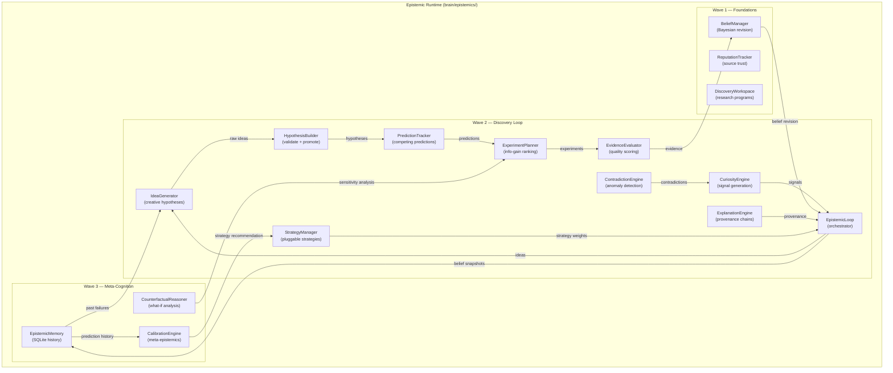
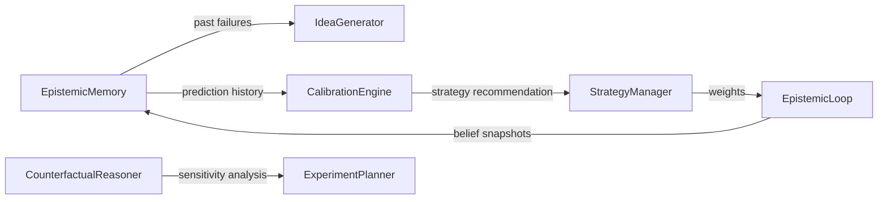

# Epistemic Runtime — Domain-Neutral Discovery Engine

> **Core thesis**: The epistemic runtime should never know what medicine, robotics, chemistry, or finance are. It should only know about observations, evidence, uncertainty, hypotheses, predictions, experiments, and belief revision.

The Epistemic Runtime is HBLLM's autonomous discovery layer. It gives the system the ability to **form hypotheses**, **design experiments**, **evaluate evidence**, **revise beliefs**, **calibrate its own reasoning**, and **remember what worked and what failed** — without any domain-specific knowledge.

**Module:** `hbllm.brain.epistemics`

---

## Design Philosophy

### Epistemic vs. Domain Knowledge

```
Reality belongs to World Model.
Epistemics reasons ABOUT reality.
```

The runtime operates on abstract epistemic primitives:

| Primitive | Description | Not |
|---|---|---|
| Observation | Raw sensory input | "A patient has a fever" |
| Evidence | Evaluated observation | "Strong clinical evidence" |
| Hypothesis | Testable claim | "Drug X treats disease Y" |
| Prediction | Falsifiable expectation | "Drug X will lower CRP by 30%" |
| Experiment | Test design | "Double-blind RCT" |
| Belief | Confidence-weighted claim | "X causes Y (p=0.82)" |

The same engines that reason about chemistry also reason about debugging, robotics, and finance — because they only manipulate the graph structure, never the content semantics.

### Epistemic Hierarchy

```
Reality
  ↓
Observation
  ↓
Evidence
  ↓
Belief
```

A belief isn't reality. A fact isn't reality. Evidence isn't reality. The epistemic runtime maintains this distinction at every layer.

---

## Architecture



---

## Module Inventory

### Wave 1 — Epistemic Foundations

| Module | Lines | Purpose |
|---|---|---|
| `belief_manager.py` | 392 | Bayesian confidence updates from evidence and predictions. Falsification tracking. |
| `reputation.py` | 363 | Source trust scoring with Bayesian smoothing. SQLite-backed persistence. |
| `workspace.py` | 867 | Research program lifecycle: objectives, questions, hypotheses, unknowns, experiments. |

### Wave 2 — Closed Discovery Loop

| Module | Lines | Purpose |
|---|---|---|
| `curiosity_engine.py` | 290 | Self-directed investigation prioritization. Scans unknowns and untested hypotheses. |
| `idea_generator.py` | 350 | Generates ideas from unknowns, contradictions, and anomalies. Memory-filtered. |
| `hypothesis_builder.py` | 280 | Validates, deduplicates, and promotes raw ideas to HCIR HypothesisNodes. |
| `prediction_tracker.py` | 320 | Registers competing predictions with deadlines. Checks outcomes. |
| `experiment_planner.py` | 380 | Designs discriminative experiments ranked by information gain. |
| `evidence_evaluator.py` | 270 | Scores evidence quality via graph topology analysis. |
| `contradiction_engine.py` | 330 | Proactive contradiction scanning across belief and evidence edges. |
| `explanation.py` | 334 | Graph-traversal provenance chains: belief → evidence → observations. |
| `research_strategy.py` | 270 | Pluggable research strategies with configurable weights. |
| `epistemic_loop.py` | 500 | Orchestrator running the full discovery cycle on every cognitive tick. |

### Wave 3 — Meta-Epistemic Cognition

| Module | Lines | Purpose |
|---|---|---|
| `epistemic_memory.py` | 600 | SQLite-backed long-term reasoning history: hypotheses, predictions, confidence, biases. |
| `calibration.py` | 400 | Meta-epistemic self-calibration: ECE curves, bias detection, strategy recommendation. |
| `counterfactual.py` | 450 | "What if..." analysis: hypothesis falsification, evidence removal, sensitivity analysis. |

### Wave 4 — Integration

| Module | Lines | Purpose |
|---|---|---|
| `integration.py` | 100 | `wire_epistemics()` one-function helper for AutonomyCore attachment. |
| `interfaces.py` | 815 | All protocols, data types, and enums. |

---

## The Discovery Cycle

Every cognitive tick, the `EpistemicLoop` runs this pipeline:

```
1. CuriosityEngine.prioritize_investigations()
   → Ranked list of CuriositySignals

2. IdeaGenerator.generate_from_unknown()
   → Raw ideas (filtered against EpistemicMemory failures)

3. HypothesisBuilder.validate() + deduplicate() + promote()
   → New HypothesisNodes in the HCIR graph

4. PredictionTracker.register_prediction()
   → Falsifiable predictions with deadlines

5. ExperimentPlanner.design_discriminative_experiment()
   → Ranked ExperimentDesigns by information gain

6. ContradictionEngine.scan_for_contradictions()
   → Proactive anomaly detection

7. BeliefManager.revise_belief()
   → Bayesian confidence updates

8. EpistemicMemory.record_*()
   → Snapshot all belief confidences for calibration
```

Every N cycles (configurable), the loop also runs:

```
9.  CalibrationEngine.calibrate()
    → ECE report + bias detection

10. CalibrationEngine.recommend_strategy_adjustment()
    → Auto-switch strategy if calibration suggests it
```

---

## Feedback Loops (Wave 4)



These feedback loops make the system **self-improving**:

- **Memory → IdeaGenerator**: Ideas matching past falsified hypotheses are filtered out (>50% keyword overlap)
- **Memory → CalibrationEngine**: Prediction history drives ECE curves and bias detection
- **CalibrationEngine → StrategyManager**: Auto-switches between Exploration, Verification, Synthesis, etc.
- **CounterfactualReasoner → ExperimentPlanner**: Sensitivity analysis targets the weakest evidence link

---

## Research Strategies

The `ResearchStrategyManager` supports 5 pluggable strategies:

| Strategy | Focus | When Used |
|---|---|---|
| **Exploration** | Max idea generation, high novelty | Early research, few hypotheses |
| **Verification** | Max hypothesis testing | Many untested hypotheses |
| **Synthesis** | Evidence integration | Conflicting evidence |
| **Counterexample Search** | Aggressive falsification | Overconfident beliefs |
| **Consolidation** | Explanation building | Mature research programs |

Each strategy configures weights for all 10 epistemic engines.

---

## EpistemicMemory Schema

SQLite-backed universal reasoning history with 6 tables:

| Table | Records |
|---|---|
| `hypothesis_outcomes` | Hypothesis ID, outcome (supported/falsified/abandoned), confidence at resolution |
| `prediction_results` | Prediction ID, predicted vs observed, correct/incorrect, confidence delta |
| `confidence_snapshots` | Belief ID, confidence value at timestamp |
| `discovered_biases` | Bias type, severity, domain, description |
| `research_notes` | Free-form reasoning journal entries |
| `calibration_reports` | ECE score, accuracy, total predictions at timestamp |

---

## Meta-Epistemics (Calibration)

This is something almost no AI system has. HBLLM asks: **"How good am I at knowing things?"**

The `EpistemicCalibrationEngine` answers:

- **Expected Calibration Error (ECE)**: When I say 80% confident, am I right 80% of the time?
- **Bias Detection**: Do I overestimate medical evidence? Underestimate simulation?
- **Strategy Recommendation**: Based on my calibration, should I switch from Exploration to Verification?

```python
report = await calibrator.calibrate()
print(f"ECE: {report.ece:.3f}")
print(f"Accuracy: {report.prediction_accuracy:.1%}")
print(f"Biases: {report.detected_biases}")
```

---

## Counterfactual Reasoning

Five "what if..." methods for epistemic graph analysis:

| Method | Question |
|---|---|
| `what_if_hypothesis_wrong()` | What beliefs change if this hypothesis is falsified? |
| `what_if_evidence_removed()` | What happens to belief confidence without this evidence? |
| `what_if_evidence_quality()` | How does changing evidence quality affect beliefs? |
| `what_if_new_evidence()` | What would supporting/contradicting evidence do? |
| `sensitivity_analysis()` | Which evidence has the most impact on this belief? |

---

## Integration with AutonomyCore

One function call wires the entire epistemic runtime:

```python
from hbllm.brain.epistemics import wire_epistemics

loop = wire_epistemics(
    autonomy_core=core,
    graph=graph,
    data_dir="/path/to/data",
    llm=llm,  # Optional
    calibration_interval=10,  # Run calibration every 10 cycles
)
# The epistemic loop now runs on every cognitive tick automatically
```

`wire_epistemics` creates Memory + Calibrator + CounterfactualReasoner + Workspace + all 10 engines, then registers an `"epistemic"` proactive handler on AutonomyCore.

---

## Test Coverage

| Test Level | Tests | Coverage |
|---|---|---|
| Unit tests | 126 | All 15 engines |
| E2E integration | 3 | Full discovery cycle, memory trajectory, falsification |
| Cross-component | 5 | AutonomyCore wiring, idempotency, persistence |
| **Total** | **134** | **All passing** |
