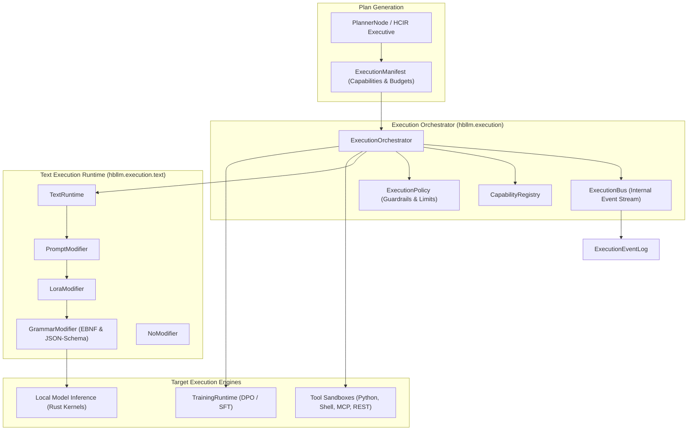

# Execution Engine — Declarative Orchestration & Runtime Modifiers

> **Core Thesis:** Execution pipelines should be declarative, verifiable, sandboxed, and auditable. Cognitive nodes produce execution plans; the execution engine guarantees atomic scheduling, modifier composition, and capability policy compliance.

The **Execution Subsystem** (`hbllm.execution`) provides the unified runtime for executing reasoning graphs, tool chains, text modifier pipelines, and online training cycles.

---

## Architecture Overview



---

## Key Components

### 1. Execution Orchestrator (`orchestrator.py`)

The central conductor for plan execution:
- **Topological Step Dispatch:** Executes DAG-structured `ExecutionPlan` steps while respecting prerequisite data dependencies.
- **Fail-Safe Rollbacks:** Tracks compensation steps if intermediate actions fail.
- **Resource Metering:** Enforces millisecond timeouts, token budgets, and memory thresholds.

### 2. Execution Bus (`bus.py`)

Dedicated high-throughput event bus for execution lifecycle events (`EXECUTION_STARTED`, `STEP_COMPLETED`, `STEP_FAILED`, `COMPENSATION_TRIGGERED`).

### 3. Text Runtime & Modifiers (`text/modifiers/`)

Before passing prompts to the underlying model, the `TextRuntime` chains composable modifiers:

| Modifier | Class | Role |
|---|---|---|
| **Prompt Modifier** | `PromptModifier` | Injects dynamic role instructions, few-shot examples, and episodic context |
| **LoRA Modifier** | `LoraModifier` | Hot-swaps domain-specific LoRA weights into transformer layers for the query |
| **Grammar Modifier**| `GrammarModifier` | Enforces structured output decoding (JSON Schema, EBNF grammar constraints) |
| **No Modifier** | `NoModifier` | Direct passthrough for low-latency raw completions |

### 4. Sandboxing & Capability Policies (`policy.py`, `capability.py`)

Every tool or action must declare required capabilities (`FilesystemRead`, `NetworkEgress`, `ProcessExecution`). The `ExecutionPolicy` matches these against tenant and node permissions before execution begins.

---

## Python SDK Example

```python
import asyncio
from hbllm.execution.manifest import ExecutionManifest
from hbllm.execution.orchestrator import ExecutionOrchestrator
from hbllm.execution.plan import ExecutionPlan, PlanStep
from hbllm.execution.text.modifiers.grammar_modifier import GrammarModifier
from hbllm.execution.text.modifiers.prompt_modifier import PromptModifier
from hbllm.execution.text.text_runtime import TextRuntime


async def main():
    # 1. Initialize text execution runtime with modifiers
    runtime = TextRuntime()
    runtime.add_modifier(
        PromptModifier(prefix="[System: Respond with strict JSON]\n")
    )
    runtime.add_modifier(GrammarModifier(schema={"type": "object"}))

    # 2. Build declarative execution plan
    plan = ExecutionPlan(
        plan_id="plan-cluster-audit",
        steps=[
            PlanStep(
                step_id="step-1",
                action="inspect_nodes",
                parameters={"namespace": "prod"},
            ),
            PlanStep(
                step_id="step-2",
                action="synthesize_report",
                parameters={},
                depends_on=["step-1"],
            ),
        ],
    )

    # 3. Execute via Orchestrator
    orchestrator = ExecutionOrchestrator()
    result = await orchestrator.execute_plan(plan, tenant_id="tenant-prod")
    print(f"Plan status: {result.status}, Completed steps: {result.step_count}")


asyncio.run(main())
```
