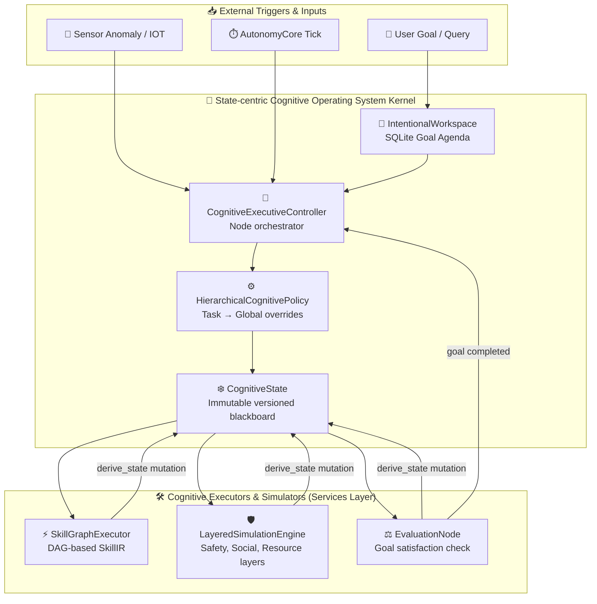

# Executive Brain Layer Architecture

## Overview

The Executive Brain Layer transforms HBLLM from a reactive request→response system
into a **continuously operating cognitive organism**. It provides:

- **Continuous cognition** via a hybrid event + tick loop
- **Attentional control** via multi-factor event scoring
- **Adaptive resource management** via hierarchical state machine
- **Persistent goal tracking** via DAG-backed task graphs

## Architecture Diagram



## Component Reference

### 1. CognitiveStateMachine (`state_machine.py`)

Controls the system's operating mode with a hierarchical state model.

#### State Hierarchy

| Category       | States                                           | Tick Rate   |
|----------------|--------------------------------------------------|-------------|
| **ACTIVE**     | `OBSERVING`, `FOCUSED`, `PLANNING`, `EXECUTING`  | 0.5–5s      |
| **PASSIVE**    | `IDLE`, `REFLECTING`, `LOW_POWER`                | 10–30s      |
| **TRANSITIONAL** | `INTERRUPTED`, `RECOVERING`, `SLEEPING`        | 1–60s       |

#### Adaptive Tick Profiles

Each state has a `TickProfile` that controls:
- `tick_interval_s` — how often the slow path runs
- `allow_heavy_llm` — whether Tier 3 reasoning is permitted
- `allow_fast_router` — whether Tier 2 routing is permitted
- `max_concurrent_thoughts` — parallel processing cap
- `interruption_threshold` — how hard it is to interrupt (0.0 = easy, 1.0 = impossible)

#### Interruption Flow

```
User Input → AttentionSystem.score_event() → priority_score
  → CognitiveStateMachine.should_allow_interruption(priority_score)
    → if True: save current state, transition to INTERRUPTED
    → on resolution: resume_from_interruption()
```

---

### 2. AttentionSystem (`attention.py`)

Multi-factor event prioritization and cognitive resource control.

#### Scoring Model

```
priority_score =
    0.30 × urgency
  + 0.20 × user_focus_weight
  + 0.10 × emotional_weight
  + 0.15 × temporal_relevance
  + 0.15 × goal_alignment
  - 0.05 × interruption_cost
  - 0.05 × cognitive_load_penalty
  - event_decay
```

#### Safety Mechanisms

| Mechanism              | Purpose                               | Default        |
|------------------------|---------------------------------------|----------------|
| **Event Decay**        | Debounce repeated similar events      | 30s window     |
| **Thought Budget**     | Cap thoughts per minute               | 30/min         |
| **Cooldown**           | Pause after budget burst              | 5s             |

#### Incremental Context Window

Maintains a rolling, salience-weighted view of active entities (people, topics,
devices) without expensive full-context rebuilds. Entities decay over time and
are pruned when salience drops below threshold.

---

### 3. AutonomyCore (`loop.py`)

The cognitive heartbeat — a hybrid event + tick daemon.

#### Dual-Path Architecture

| Path       | Trigger             | Latency  | Use Case                      |
|------------|---------------------|----------|-------------------------------|
| **Fast**   | MessageBus event    | Instant  | User input, sensor anomaly    |
| **Slow**   | Periodic tick       | Adaptive | Reflection, planning, pruning |

#### Tiered LLM Invocation

| Tier | Name            | Cost     | When Used                          |
|------|-----------------|----------|------------------------------------|
| 1    | Reflex          | Zero     | Deterministic rules, heuristics    |
| 2    | Fast Router     | Low      | Intent classification, urgency     |
| 3    | Heavy Reasoning | High     | Complex planning, synthesis        |

---

### 4. TaskGraphRuntime (`task_graph.py`)

Persistent, resumable goal execution engine.

#### Goal Lifecycle

```
PENDING → ACTIVE → COMPLETED
                 → FAILED
         → PAUSED → ACTIVE (resume)
         → CANCELLED
```

#### Task DAG Execution

- Root tasks (no dependencies) auto-promote to `READY`
- Completing a task cascades readiness to dependent tasks
- Failed tasks (after retries exhausted) `BLOCK` all dependents
- Goal auto-completes when all tasks reach terminal state

#### Boot Recovery

Tasks left in `RUNNING` state (from a crash/reboot) are automatically
reset to `READY` on startup via `recover_on_boot()`.

### 5. GoalDecompositionEngine (`goal_decomposition.py`)

Breaks high-level user goals into executable sub-task DAGs. Uses LLM reasoning to identify dependencies and optimal execution order.

- **Recursive decomposition** — Complex goals are decomposed into progressively smaller tasks.
- **Dependency inference** — Automatically identifies prerequisites between sub-tasks.
- **Feasibility check** — Validates each sub-task against available tools and capabilities.

---

### 6. ReflexLibrary (`reflexes/`)

Zero-cost deterministic reflexes organized into 4 domains:

| Domain | Module | Examples |
|--------|--------|----------|
| **System** | `reflexes/system.py` | High CPU alert, disk space warning, memory pressure |
| **Security** | `reflexes/security.py` | Failed auth attempt, suspicious IP, policy violation |
| **Environment** | `reflexes/environment.py` | Temperature anomaly, device offline, sensor drift |
| **Routine** | `reflexes/routine.py` | Morning briefing, schedule reminder, daily summary |

---

### 7. ReflexLearner (`reflex_learner.py`)

Promotes frequently-triggered LLM reasoning patterns into compiled reflexes:

1. **Pattern detection** — Monitors LLM invocations for repeated triggers.
2. **Confidence threshold** — Only promotes patterns with >95% consistency.
3. **Compilation** — Converts natural language rules into deterministic Python functions.
4. **Validation** — Tests compiled reflexes against historical events before activation.

---

### 8. RestraintEngine (`restraint.py`)

Prevents excessive resource consumption and action loops:

| Budget | Default | Behavior when exceeded |
|--------|---------|----------------------|
| **Actions per minute** | 30 | Queue and defer |
| **API calls per hour** | 100 | Fall back to local processing |
| **Notifications per hour** | 10 | Batch and summarize |
| **Concurrent tool executions** | 5 | Queue with priority |

---

### 9. InterruptDetector (`interrupt_detector.py`)

Classifies incoming events against the current cognitive state to determine if an interruption is warranted.

- **Context preservation** — Saves current execution state before interrupting.
- **Priority override** — Safety-critical events always interrupt regardless of state.
- **Deferral queue** — Low-priority events are queued for the next idle window.

---

### 10. NotificationSuppressor (`notification_suppressor.py`)

Batches and deduplicates notifications during focus states to prevent information overload:

- **Focus mode** — Suppresses all non-critical notifications during FOCUSED/EXECUTING states.
- **Deduplication** — Merges repeated notifications into a single summary.
- **Digest delivery** — Delivers batched notifications when transitioning to IDLE.

---

### 11. ProactiveInsightEngine (`proactive_insight.py`)

Generates background insights during idle time by analyzing patterns in memory, events, and goals:

- **Anomaly detection** — Identifies unusual patterns in system metrics and user behavior.
- **Goal suggestions** — Proposes new goals based on incomplete tasks and observed opportunities.
- **Knowledge gaps** — Identifies areas where the system lacks knowledge and suggests learning targets.

---

### 12. CognitiveLoadEstimator (`cognitive_load_estimator.py`)

Tracks working memory utilization to prevent cognitive overload:

- **Multi-factor load** — Weighs active tasks, pending events, context window usage, and concurrent tools.
- **Overload protection** — Automatically transitions to REFLECTING state when load exceeds threshold.
- **Load shedding** — Deprioritizes non-essential processing during high-load periods.

## Test Coverage

| Module                     | Tests | Status |
|----------------------------|-------|--------|
| CognitiveStateMachine      | 20    | ✅     |
| IncrementalContextWindow   | 8     | ✅     |
| AttentionSystem            | 8     | ✅     |
| AutonomyCore               | 11    | ✅     |
| TaskGraphRuntime           | 25    | ✅     |
| GoalDecomposition          | 6     | ✅     |
| ReflexLibrary              | 12    | ✅     |
| RestraintEngine            | 8     | ✅     |
| AutonomyComponents         | 10    | ✅     |
| **Total**                  | **108**| ✅    |

## Cross-References

- [Adaptive Network Architecture](./adaptive-network.md) — the transport layer below this
- [Memory Systems](./memory-systems.md) — importance scoring integrates with autonomy
- `hbllm/brain/attention_manager.py` — memory-focused attention (complementary)
