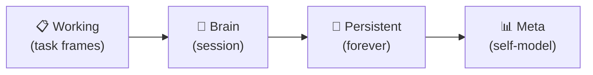
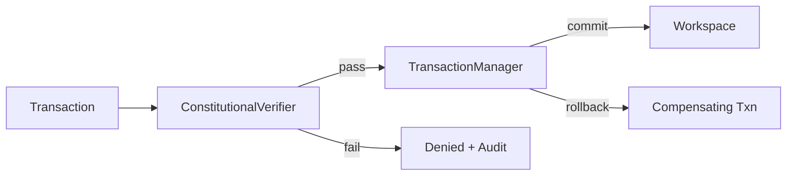

# HCIR Cognitive OS Kernel & Executive Runtime

> **Human-Cognitive Intermediate Representation (HCIR) & Kernel Architecture**
>
> The HCIR is the **canonical execution substrate** for HBLLM Core. All cognitive state — memory, goals, beliefs, capabilities, governance — lives in the HCIR workspace as typed graph nodes managed through event sourcing and transactional commits.
>
> **Architectural Invariant:** Nodes emit intent. HCIR owns state.

---

## Architecture

```
  ┌───────────────────────────────────────────────────────────────────┐
  │                      ExecutiveRuntime                             │
  │        (Lifecycle Owner, Cycle Scheduler & Execution Mode)        │
  └────────────────────────────────┬──────────────────────────────────┘
                                   │
  ┌────────────────────────────────▼──────────────────────────────────┐
  │                       KernelServices                              │
  │       (Dependency Container for Cognitive OS ABI Execution)       │
  ├──────────────┬──────────────┬──────────────┬─────────────────────┤
  │ Workspace    │ TxManager    │ Resolver     │ Scheduler           │
  │ State        │ (Transactions│ (Capability  │ (Instruction        │
  │ (HCIR Graph) │ & Rollbacks) │ Sandboxing)  │ Scheduler)          │
  ├──────────────┼──────────────┼──────────────┼─────────────────────┤
  │ Executor     │ Persistence  │ Telemetry    │ EventBus            │
  │ (CPU / I/O   │ (Managed DB  │ (Sliding     │ (Kernel Pub/        │
  │ Pools)       │ Pools)       │ Latencies)   │ Sub Trie)           │
  └──────────────┴──────────────┴──────────────┴─────────────────────┘
                                   │
  ┌────────────────────────────────▼──────────────────────────────────┐
  │                    HCIR Cognitive OS                               │
  ├──────────────┬──────────────┬──────────────┬─────────────────────┤
  │ Tiered       │ Cognitive    │ Constitutional│ Memory              │
  │ Workspace    │ Journal +    │ Governance    │ Backend +           │
  │ (4 tiers)    │ Event Log    │ + Transaction │ Migration Proxy     │
  ├──────────────┼──────────────┼──────────────┼─────────────────────┤
  │ Declarative  │ Bus Bridge   │ Federation   │ Semantic            │
  │ Capabilities │ (HCIR↔Bus)   │ Sync Proto   │ Normalizer          │
  └──────────────┴──────────────┴──────────────┴─────────────────────┘
```

---

## Key Subsystems

### 1. Tiered Workspace

The workspace organizes cognitive state into four tiers with different lifetimes:



| Tier | Lifetime | Contents |
|------|----------|----------|
| **Working** | Task | TaskFrames, scratchpad nodes |
| **Brain** | Session | Promoted reasoning results |
| **Persistent** | Forever | All memory types, knowledge graph |
| **Meta** | Forever | Performance stats, capability metrics |

**Code:** `hbllm.hcir.workspace_tiers.TieredWorkspace`

### 2. Event Sourcing (CognitiveJournal + EventLog)

Every state mutation is captured as an immutable event:


- **CognitiveJournal**: Append-only journal of workspace mutations
- **CognitiveEventLog**: Structured event stream with causality tracking
- **Semantic Events**: Normalized via `SemanticNormalizer` before journaling

**Code:** `hbllm.hcir.journal.CognitiveJournal`, `hbllm.hcir.events.CognitiveEventLog`

### 3. Constitutional Governance

All workspace modifications pass through constitutional verification:



- **ConstitutionalVerifier**: Validates transactions against governance rules
- **TransactionManager**: Atomic commits with compensating rollbacks
- **Governance Constraints**: Budget limits, capability checks, tenant isolation

**Code:** `hbllm.hcir.governance.ConstitutionalVerifier`, `hbllm.hcir.governance.TransactionManager`

### 4. Declarative Capabilities

Nodes declare their capabilities and resource budgets via a typed system:

| Component | Role |
|-----------|------|
| `CognitiveBudget` | Resource limits (compute, memory, time) |
| `NodeAdapter` | Adapts arbitrary nodes to the HCIR ABI |
| `CapabilityResolver` | Resolves and sandboxes capability requests |
| `GoalDecomposer` | Breaks goals into capability-aligned sub-tasks |

**Code:** `hbllm.hcir.capabilities`

### 5. HCIR Memory Backend

The `HCIRMemoryBackend` is the **sole memory storage backend** (Phase 5: LEGACY_REMOVED). All memory types are stored as typed graph nodes:

| Memory Type | Node Type | Store Method | Recall Method |
|-------------|-----------|-------------|---------------|
| Episodic | `EpisodeNode` | `store_episode()` | `recall_episodes()` |
| Semantic | `ConceptNode` | `store_concept()` | `recall_concepts()` |
| Procedural | `SkillNode` | `store_skill()` | `recall_skills()` |
| Value | `ValueNode` | `store_value()` | `recall_values()` |
| Knowledge Graph | `BeliefNode` | `store_belief()` | `recall_beliefs()` |

**Cross-memory search**: `search_across_memory_types()` queries all types with a single call.

**Code:** `hbllm.hcir.adapters.hcir_memory_backend.HCIRMemoryBackend`

### 6. Memory Migration Proxy

The `MemoryMigrationProxy` managed the 5-phase transition from legacy SQLite stores to HCIR:

| Phase | Mode | Behavior |
|-------|------|----------|
| 1 | READ_THROUGH | Legacy authoritative, HCIR warmed |
| 2 | DUAL_WRITE | Both written, legacy reads |
| 3 | SHADOW_READ | Both read, divergence tracked |
| 4 | HCIR_PRIMARY | HCIR authoritative, legacy rollback |
| **5** | **LEGACY_REMOVED** | **HCIR only (current default)** |

**Code:** `hbllm.hcir.adapters.memory_migration_proxy.MemoryMigrationProxy`

### 7. Bus Bridge (HCIRBusBridge)

Bridges the HCIR workspace with the MessageBus, converting bus events into workspace mutations:

- **Inbound**: Bus messages → `SemanticNormalizer` → workspace nodes
- **Outbound**: Workspace mutations → bus notifications

**Code:** `hbllm.hcir.bridge.HCIRBusBridge`

### 8. Federation Sync Protocol

Synchronizes workspace state across distributed brain instances:

- **TransactionSyncProtocol**: Coordinates commits across peers
- **Vector Clocks**: Causal ordering of distributed events
- **Conflict Resolution**: Last-writer-wins with compensating transactions

**Code:** `hbllm.hcir.federation.TransactionSyncProtocol`

---

## `KernelServices` Dependency Container

Every cognitive node receives `KernelServices` via the ABI `execute()` contract:

| Service | Description |
|---------|-------------|
| `workspace` | Active `HCIRWorkspaceState` (graph nodes, edges, goals) |
| `transaction_manager` | Atomic state modifications with rollbacks |
| `capability_resolver` | Permission enforcement (filesystem, network, subprocess, db) |
| `scheduler` | Attention-driven instruction dispatcher (`CognitiveScheduler`) |
| `executor` | Priority thread pools for CPU- and I/O-bound tasks |
| `persistence` | Managed database connection pools |
| `telemetry` | Micro-second latency and throughput metrics |

---

## `KernelExecutor` Thread Pools

Offloads heavy synchronous operations off the main `asyncio` event loop:
- **`run_cpu_bound()`**: Embedding calculations, matrix operations, tokenization
- **`run_io_bound()`**: File I/O, workspace serialization, disk reads

---

## `PersistenceService` & Workload-Specific SQLite Profiles

Managed persistence layer providing workload-tuned SQLite connection PRAGMAs:

| Profile | mmap | Cache | Mode |
|---------|------|-------|------|
| `semantic_memory` | 512MB | 64MB | WAL |
| `knowledge_graph` | 1GB | 64MB | WAL |
| `event_log` | 32MB | 4MB | WAL |
| `scheduler` | — | 2MB | NORMAL |

---

## Brain Lifecycle Integration

The HCIR Cognitive OS is wired into the Brain lifecycle via `BrainFactory`:

```python
# Brain.process() — runs HCIR cognitive cycle after pipeline
result = await brain.process(user_input)

# Brain.shutdown() — archives workspace to persistent tier
await brain.shutdown()

# Brain.cognitive_stats() — exports HCIR metrics
stats = brain.cognitive_stats()
```

---

## Diagnostics CLI

Inspect system runtime health, event loop engine (`uvloop`), SQLite version, and native Rust acceleration crates:

```bash
python -m hbllm.cli.diagnostics
```
