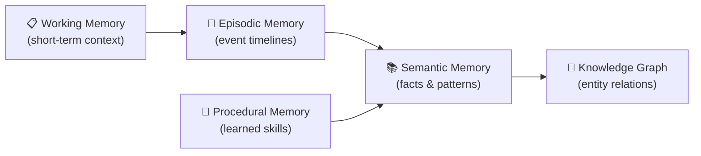

# Memory Systems

HBLLM implements **5 distinct memory types** mirroring human cognitive psychology. Each memory system operates independently with its own storage backend and query interface.

## Overview



## 1. Working Memory

**Purpose:** Maintains the active conversation context with adaptive windowing.

**Key Feature:** Middle-out truncation — when context exceeds the window size, HBLLM preserves the first N and last M tokens while summarizing the middle. This prevents OOM errors while retaining critical conversation boundaries.

```python
from hbllm.memory.working import WorkingMemory

wm = WorkingMemory(max_tokens=8192)
wm.add_turn("user", "What is machine learning?")
wm.add_turn("assistant", "Machine learning is...")

context = wm.get_context()  # Truncated if needed
```

## 2. Episodic Memory

**Purpose:** Event-based timelines mapping user interactions per session.

**Storage:** SQLite with per-tenant isolation.

```python
from hbllm.memory.episodic import EpisodicMemory

em = EpisodicMemory(db_path="memory.db", tenant_id="user-01")
await em.store_turn(
    role="user",
    content="Tell me about quantum computing",
    metadata={"topic": "physics"}
)

recent = await em.get_recent_turns(limit=10)
```

## 3. Semantic Memory

**Purpose:** Fact and pattern extraction powered by hybrid dense/sparse vector search.

**Features:**
- Dense embeddings via SentenceTransformer (when available)
- Sparse TF-IDF fallback for edge deployments
- Deterministic UUID stability for consistent retrieval
- Cosine similarity search with configurable thresholds

```python
from hbllm.memory.semantic import SemanticMemory

sm = SemanticMemory(tenant_id="user-01")
sm.store("quantum_01", "Quantum computers use qubits instead of bits")

results = sm.search("How do quantum computers work?", top_k=5)
```

## 4. Procedural Memory

**Purpose:** Learned tool patterns and skill execution registries. Skills are automatically extracted from successful multi-step interactions.

```python
from hbllm.memory.procedural import ProceduralMemory

pm = ProceduralMemory(db_path="skills.db", tenant_id="user-01")
await pm.store_skill(
    name="deploy-docker",
    steps=["docker build", "docker push", "kubectl apply"],
    domain="devops"
)

skill = await pm.find_skill("how to deploy a container")
```

## 5. Knowledge Graph

**Purpose:** LRU-bounded entity-relation graphs connecting concepts organically. Built on NetworkX for lightweight, in-memory graph operations.

```python
from hbllm.memory.knowledge_graph import KnowledgeGraphMemory

kg = KnowledgeGraphMemory(max_nodes=10000)
kg.add_relation("Python", "is_a", "Programming Language")
kg.add_relation("PyTorch", "built_with", "Python")

related = kg.get_related("Python", depth=2)
```

## Memory Consolidation (Sleep Cycle)

During idle periods, the `SleepCycleNode` runs a 3-phase consolidation:

1. **Replay** — High-salience episodic memories are replayed.
2. **Prune** — Low-value entries are removed to prevent unbounded growth.
3. **Strengthen** — Frequently accessed patterns are promoted to semantic memory.

This mirrors the biological process of memory consolidation during sleep.
