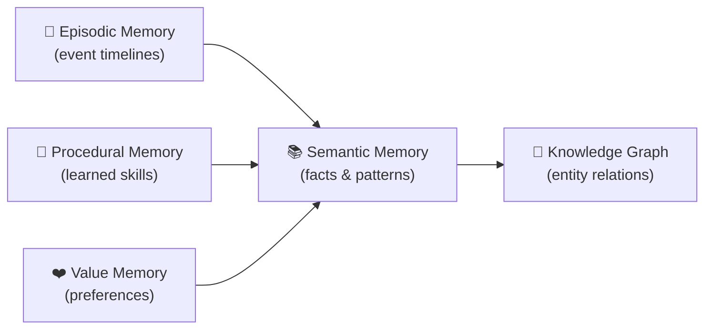

# Memory Systems

HBLLM implements **multiple distinct memory types** mirroring human cognitive psychology. Each memory system operates independently with its own storage backend and query interface.

## Overview



## Memory Module Structure

All memory classes live in `hbllm/memory/`:

| File | Class | Purpose |
|---|---|---|
| `episodic.py` | `EpisodicMemory` | Event-based timelines per session |
| `semantic.py` | `SemanticMemory` | Hybrid dense/sparse vector search |
| `procedural.py` | `ProceduralMemory` | Learned tool patterns and skills |
| `value_memory.py` | `ValueMemory` | Per-tenant preference/reward signals |
| `knowledge_graph.py` | `KnowledgeGraph` | LRU-bounded entity-relation graphs |
| `memory_node.py` | `MemoryNode` | Bus-connected node wrapping all systems |
| `concept_extractor.py` | — | Concept extraction utilities |

---

## 1. Episodic Memory

**Class:** `hbllm.memory.episodic.EpisodicMemory`  
**Storage:** SQLite with per-tenant isolation.

```python
from hbllm.memory.episodic import EpisodicMemory

em = EpisodicMemory(db_path="memory.db", tenant_id="user-01")
await em.store_turn(
    role="user",
    content="Tell me about quantum computing",
    metadata={"topic": "physics"}
)

recent = await em.get_recent_turns(limit=10)
```

---

## 2. Semantic Memory

**Class:** `hbllm.memory.semantic.SemanticMemory`  
**Features:**

- Dense embeddings via SentenceTransformer (when available)
- Sparse TF-IDF fallback for edge deployments
- Deterministic UUID stability for consistent retrieval
- Cosine similarity search with configurable thresholds

```python
from hbllm.memory.semantic import SemanticMemory

sm = SemanticMemory(tenant_id="user-01")
sm.store("quantum_01", "Quantum computers use qubits instead of bits")

results = sm.search("How do quantum computers work?", top_k=5)
```

---

## 3. Procedural Memory

**Class:** `hbllm.memory.procedural.ProceduralMemory`  
**Storage:** SQLite-backed skill registry.

Skills are automatically extracted from successful multi-step interactions.

```python
from hbllm.memory.procedural import ProceduralMemory

pm = ProceduralMemory(db_path="skills.db", tenant_id="user-01")
await pm.store_skill(
    name="deploy-docker",
    steps=["docker build", "docker push", "kubectl apply"],
    domain="devops"
)

skill = await pm.find_skill("how to deploy a container")
```

---

## 4. Value Memory

**Class:** `hbllm.memory.value_memory.ValueMemory`  
**Storage:** SQLite-backed preference/reward signals with exponential decay.

Tracks per-tenant reward signals keyed by topic and action, using exponential decay so recent preferences carry more weight.

```python
from hbllm.memory.value_memory import ValueMemory

vm = ValueMemory(db_path="value_memory.db")

# Record a preference signal
vm.record_reward(
    tenant_id="user-01",
    topic="response_style",
    action="formal_tone",
    reward=0.8,
)

# Get aggregated preferences (weighted by recency)
prefs = vm.get_preference("user-01", "response_style")
# {"formal_tone": 0.72, "casual_tone": 0.3}

# Get top preferences across all topics
top = vm.get_top_preferences("user-01", top_k=5)
```

---

## 5. Knowledge Graph

**Class:** `hbllm.memory.knowledge_graph.KnowledgeGraph`  
**Storage:** In-memory graph with `Entity` and `Relation` dataclasses. LRU-bounded to prevent unbounded growth.

```python
from hbllm.memory.knowledge_graph import KnowledgeGraph

kg = KnowledgeGraph(max_nodes=10000)
kg.add_entity("python", label="Python", entity_type="language")
kg.add_entity("pytorch", label="PyTorch", entity_type="framework")
kg.add_relation("pytorch", "python", "built_with")

neighbors = kg.get_neighbors("python")
```

---

## Working Memory (Context Windows)

Working memory is managed at the pipeline level rather than as a standalone class. The cognitive pipeline implements adaptive context windows with **middle-out truncation** — preserving the first N and last M tokens while summarizing the middle to prevent OOM errors.

---

## Memory Consolidation (Sleep Cycle)

During idle periods, the `SleepCycleNode` runs a 3-phase consolidation:

1. **Replay** — High-salience episodic memories are replayed.
2. **Prune** — Low-value entries are removed to prevent unbounded growth.
3. **Strengthen** — Frequently accessed patterns are promoted to semantic memory.

This mirrors the biological process of memory consolidation during sleep.

---

## MemoryNode

The `MemoryNode` (`hbllm.memory.memory_node.MemoryNode`) is the bus-connected wrapper that subscribes to memory-related topics (`MEMORY_STORE`, `MEMORY_SEARCH`) and dispatches operations to the appropriate underlying memory system.
