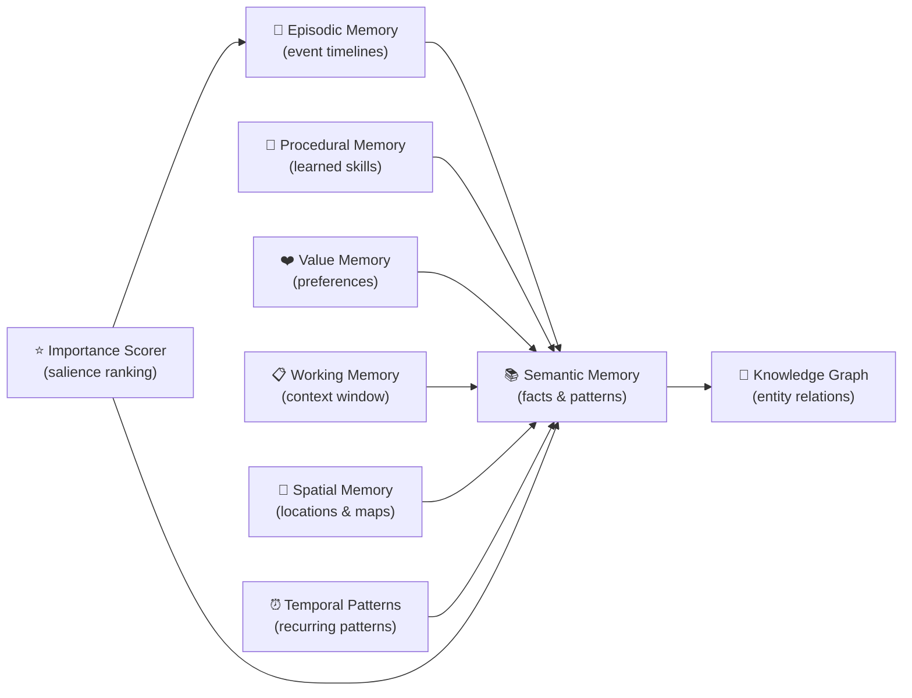
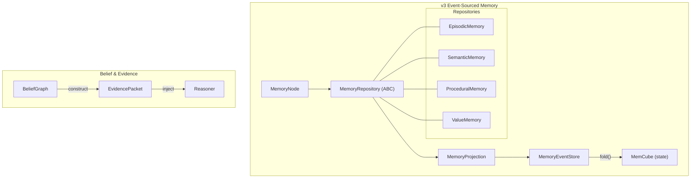

# Memory Systems

HBLLM implements **9 distinct memory subsystems** mirroring human cognitive psychology. Each memory system operates independently with its own storage backend and query interface.

## Overview



## Memory Module Structure

All memory classes live in `hbllm/memory/`:

| File | Class | Purpose |
|---|---|---|
| `episodic.py` | `EpisodicMemory` | Event-based timelines per session |
| `semantic.py` | `SemanticMemory` | Hybrid dense/sparse vector search |
| `procedural.py` | `ProceduralMemory` | Learned tool patterns and skills |
| `value_memory.py` | `ValueMemory` | Per-tenant preference/reward signals |
| `knowledge_graph.py` | `KnowledgeGraph` | LRU-bounded entity-relation graphs |
| `spatial_memory.py` | `SpatialMemory` | Location-aware memory with proximity search |
| `temporal_patterns.py` | `TemporalPatternTracker` | Recurring pattern detection across time |
| `importance_scorer.py` | `ImportanceScorer` | Multi-factor salience scoring for prioritization |
| `memory_node.py` | `MemoryNode` | Bus-connected node wrapping all systems |
| `concept_extractor.py` | — | Concept extraction utilities |

### v3: Event-Sourced Architecture

| File | Class | Purpose |
|---|---|---|
| `memcube.py` | `MemoryEventStore` | Append-only event log; state = `fold(events)` |
| `memcube.py` | `MemCube` | Immutable memory state (version, content, source) |
| `repository.py` | `MemoryRepository` | Abstract base for all memory repositories |
| `repository.py` | `MemoryProjection` | Folds event streams into `MemCube` state |
| `belief_graph.py` | `BeliefGraph` | Provenance graph: who believed what, why, contradictions |
| `goal_memory.py` | `GoalMemory` | Goal lifecycle: pending → active → completed/failed |
| `predictive_loader.py` | `PredictiveMemoryLoader` | Markov-based prefetch of anticipated memories |



**Key Design Decisions:**

- **State = fold(events)**: Memory state is never stored directly. The current state of any memory is computed by folding its event stream (`create → reinforce → correct → decay`).
- **Repository Pattern**: `EpisodicMemory`, `SemanticMemory`, etc. are thin semantic wrappers. They handle domain-specific logic (search ranking, skill matching) while delegating persistence to `MemoryEventStore` via `MemoryProjection`.
- **Projection Layer**: `MemoryProjection` owns the `fold()` operation. Neither `MemoryNode` nor individual repositories expose fold directly.
- **EvidencePacket**: Reasoners never import `BeliefGraph` directly — they receive `EvidencePacket` instances with confidence, support, contradictions, and lineage.

---

## 1. Episodic Memory

**Class:** `hbllm.memory.episodic.EpisodicMemory`  
**Storage:** SQLite with per-tenant isolation.

```python
from hbllm.memory.episodic import EpisodicMemory

em = EpisodicMemory(db_path="memory.db", tenant_id="user-01")
await em.init_db()

await em.store_turn(
    role="user",
    content="Tell me about quantum computing",
    metadata={"topic": "physics"}
)

recent = await em.get_recent_turns(limit=10)
```

---

## 2. Semantic Memory

**Class:** `hbllm.memory.semantic.SemanticMemory`  
**Features:**

- Dense embeddings via SentenceTransformer (when available)
- Sparse TF-IDF fallback for edge deployments
- Deterministic UUID stability for consistent retrieval
- Cosine similarity search with configurable thresholds

```python
from hbllm.memory.semantic import SemanticMemory

sm = SemanticMemory(tenant_id="user-01")
sm.store("quantum_01", "Quantum computers use qubits instead of bits")

results = sm.search("How do quantum computers work?", top_k=5)
```

---

## 3. Procedural Memory

**Class:** `hbllm.memory.procedural.ProceduralMemory`  
**Storage:** SQLite-backed skill registry.

Skills are automatically extracted from successful multi-step interactions.

```python
from hbllm.memory.procedural import ProceduralMemory

pm = ProceduralMemory(db_path="skills.db", tenant_id="user-01")
await pm.init_db()

await pm.store_skill(
    name="deploy-docker",
    steps=["docker build", "docker push", "kubectl apply"],
    domain="devops"
)

skill = await pm.find_skill("how to deploy a container")
```

---

## 4. Value Memory

**Class:** `hbllm.memory.value_memory.ValueMemory`  
**Storage:** SQLite-backed preference/reward signals with exponential decay.

Tracks per-tenant reward signals keyed by topic and action, using exponential decay so recent preferences carry more weight.

```python
from hbllm.memory.value_memory import ValueMemory

vm = ValueMemory(db_path="value_memory.db")
await vm.init_db()

# Record a preference signal
await vm.record_reward(
    tenant_id="user-01",
    topic="response_style",
    action="formal_tone",
    reward=0.8,
)

# Get aggregated preferences (weighted by recency)
prefs = await vm.get_preference("user-01", "response_style")
# {"formal_tone": 0.72, "casual_tone": 0.3}

# Get top preferences across all topics
top = await vm.get_top_preferences("user-01", top_k=5)
```

---

## 5. Knowledge Graph

**Class:** `hbllm.memory.knowledge_graph.KnowledgeGraph`  
**Storage:** In-memory graph with `Entity` and `Relation` dataclasses. LRU-bounded to prevent unbounded growth.

```python
from hbllm.memory.knowledge_graph import KnowledgeGraph

kg = KnowledgeGraph(max_nodes=10000)
kg.add_entity("python", label="Python", entity_type="language")
kg.add_entity("pytorch", label="PyTorch", entity_type="framework")
kg.add_relation("pytorch", "python", "built_with")

neighbors = kg.get_neighbors("python")
```

---

## 6. Spatial Memory

**Class:** `hbllm.memory.spatial_memory.SpatialMemory`  
**Storage:** In-memory spatial index with optional SQLite persistence.

Maintains a mental map of locations, rooms, devices, and spatial relationships. Supports proximity-based queries and spatial reasoning.

```python
from hbllm.memory.spatial_memory import SpatialMemory

sm = SpatialMemory()
sm.register_location("living_room", x=0.0, y=0.0, floor=1)
sm.register_location("kitchen", x=5.0, y=0.0, floor=1)
sm.register_device("speaker_01", location="living_room")

nearby = sm.find_nearby("living_room", radius=10.0)
```

---

## 7. Temporal Patterns

**Class:** `hbllm.memory.temporal_patterns.TemporalPatternTracker`  
**Storage:** SQLite-backed pattern database.

Detects recurring patterns across time windows (hourly, daily, weekly, seasonal). Used by the autonomy system for proactive scheduling and anticipatory actions.

```python
from hbllm.memory.temporal_patterns import TemporalPatternTracker

tp = TemporalPatternTracker(db_path="patterns.db")
tp.record_event("user_wakes", hour=7, day_of_week=1)
tp.record_event("user_wakes", hour=7, day_of_week=2)

patterns = tp.detect_patterns("user_wakes", min_occurrences=5)
# [{"pattern": "daily", "time": "07:00", "confidence": 0.85}]
```

---

## 8. Importance Scorer

**Class:** `hbllm.memory.importance_scorer.ImportanceScorer`  
**Role:** Multi-factor salience scoring for memory prioritization.

Scores memories across multiple dimensions to determine which should be retained, consolidated, or pruned during sleep cycles.

**Scoring factors:**

| Factor | Weight | Description |
|--------|--------|-------------|
| Recency | 0.25 | How recently the memory was accessed |
| Frequency | 0.20 | How often the memory has been retrieved |
| Emotional valence | 0.15 | Strength of associated reward/penalty signals |
| Goal relevance | 0.20 | Alignment with active goals and tasks |
| Uniqueness | 0.10 | Information entropy relative to existing knowledge |
| User reference | 0.10 | Whether the user explicitly referenced this information |

```python
from hbllm.memory.importance_scorer import ImportanceScorer

scorer = ImportanceScorer()
score = scorer.score(
    recency_hours=2.0,
    access_count=5,
    emotional_valence=0.8,
    goal_alignment=0.6,
)
# score: 0.72 (retain during consolidation)
```

---

## Working Memory (Context Windows)

Working memory is managed at the pipeline level rather than as a standalone class. The cognitive pipeline implements adaptive context windows with **middle-out truncation** — preserving the first N and last M tokens while summarizing the middle to prevent OOM errors.

---

## Memory Consolidation (Sleep Cycle)

During idle periods, the `SleepCycleNode` runs a 3-stage consolidation:

1. **Replay** — High-salience episodic memories are replayed.
2. **Prune** — Low-value entries are removed to prevent unbounded growth.
3. **Strengthen** — Frequently accessed patterns are promoted to semantic memory.

This mirrors the biological process of memory consolidation during sleep.

---

## Memory Topology (Scopes)

To prevent synchronization chaos and protect sensitive data in distributed environments, HBLLM enforces a 4-tier memory topology:

| Scope | Persistence | Sync Level | Description |
| :--- | :--- | :--- | :--- |
| **WORKING** | Transient | Local-only | Per-node ephemeral state, never synced. |
| **EPISODIC** | Persistent | Swarm-wide | User interaction history, synced across trusted devices. |
| **SEMANTIC** | Persistent | Global/Tenant | Shared domain knowledge and facts. |
| **SENSITIVE** | Encrypted | Local-only | PII, credentials, and restricted data. Strictly blocked from sync. |

Access to these scopes is enforced via **CapBAC** (Capability-Based Access Control) at the node registration level.

---

## MemoryNode

The `MemoryNode` (`hbllm.memory.memory_node.MemoryNode`) is the bus-connected wrapper that subscribes to memory-related topics (`MEMORY_STORE`, `MEMORY_SEARCH`) and dispatches operations to the appropriate underlying memory system.
