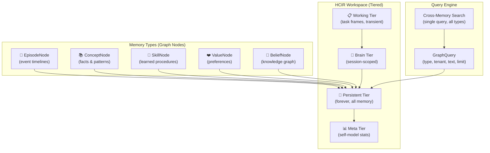

# Memory Systems

HBLLM implements a **unified HCIR-native memory architecture** where all memory types are stored as typed graph nodes in a tiered workspace. This replaces the previous system of independent SQLite and vector stores with a single graph-based backend.

> **Architectural Invariant:** Nodes emit intent. HCIR owns state.

## Architecture Overview


```mermaid
graph TB
    subgraph "Memory Types (Graph Nodes)"
        EP["📖 EpisodeNode<br/>(event timelines)"]
        CN["📚 ConceptNode<br/>(facts & patterns)"]
        SK["🔧 SkillNode<br/>(learned procedures)"]
        VN["❤️ ValueNode<br/>(preferences)"]
        BN["🔗 BeliefNode<br/>(knowledge graph)"]
    end

    subgraph "HCIR Workspace (Tiered)"
        WORKING["📋 Working Tier<br/>(task frames, transient)"]
        BRAIN["🧠 Brain Tier<br/>(session-scoped)"]
        PERSISTENT["💾 Persistent Tier<br/>(forever, all memory)"]
        META["📊 Meta Tier<br/>(self-model stats)"]
    end

    subgraph "Query Engine"
        GQ["GraphQuery<br/>(type, tenant, text, limit)"]
        XS["Cross-Memory Search<br/>(single query, all types)"]
    end

    EP --> PERSISTENT
    CN --> PERSISTENT
    SK --> PERSISTENT
    VN --> PERSISTENT
    BN --> PERSISTENT
    WORKING --> BRAIN --> PERSISTENT
    PERSISTENT --> META
    GQ --> PERSISTENT
    XS --> GQ
```

## Memory Node Types

All memory is stored as typed HCIR graph nodes in the persistent workspace tier. Each node carries `Scope` (tenant isolation) and `Provenance` (creation metadata).

| Node Type | Class | Replaces | Key Fields |
|-----------|-------|----------|------------|
| `EPISODE` | `EpisodeNode` | `EpisodicMemory` (SQLite) | `summary`, `outcome`, `reward` |
| `CONCEPT` | `ConceptNode` | `SemanticMemory` (vectors) | `label`, `definition`, `domain` |
| `SKILL` | `SkillNode` | `ProceduralMemory` (SQLite) | `skill_name`, `description`, `success_rate` |
| `VALUE` | `ValueNode` | `ValueMemory` (SQLite) | `dimension`, `weight` |
| `BELIEF` | `BeliefNode` | `KnowledgeGraph` (JSON) | `claim`, `belief_type`, `evidence_sources` |

### Storage Example

```python
from hbllm.hcir.adapters.hcir_memory_backend import HCIRMemoryBackend

backend = HCIRMemoryBackend(tiered_workspace)

# Store an episode
episode_id = await backend.store_episode(
    summary="User asked about quantum computing",
    outcome="Provided overview of qubits and superposition",
    reward=0.85,
    tenant_id="user-01",
    session_id="sess_42",
)

# Store a concept
concept_id = await backend.store_concept(
    label="Quantum Computing",
    definition="Computing using quantum-mechanical phenomena",
    domain="physics",
    tenant_id="user-01",
)

# Store a skill
skill_id = await backend.store_skill(
    skill_name="web_search",
    description="Search the web for information",
    success_rate=0.92,
    tenant_id="user-01",
)
```

---

## Tiered Workspace

Memory is organized into four tiers with different lifetimes and scopes:

| Tier | Lifetime | Purpose | Contents |
|------|----------|---------|----------|
| **Working** | Task duration | Active reasoning frames | Task-specific nodes, scratchpad |
| **Brain** | Session duration | Session context | Promoted working nodes, session state |
| **Persistent** | Forever | Long-term memory | All memory types, knowledge graph |
| **Meta** | Forever | Self-model | Performance stats, capability metrics |

### Promotion Flow

Nodes flow upward through tiers based on salience and consolidation:

```
Working (transient) → Brain (session) → Persistent (permanent) → Meta (self-reflection)
```

The `TieredWorkspace` provides `promote_to_brain()` and `archive_to_persistent()` methods for explicit promotion. The `SleepCycleNode` handles automatic consolidation during idle periods.

---

## Cross-Memory Search

One of the primary advantages of HCIR-native memory is **unified cross-memory search**. A single `GraphQuery` can search across all memory types simultaneously:

```python
# Search across all memory types
results = await backend.search_across_memory_types(
    query="weather",
    tenant_id="user-01",
    limit=20,
)

# Returns results from episodes, concepts, skills, beliefs, values
for result in results:
    print(f"{result['memory_type']}: {result['content']}")
```

This replaces the previous approach of querying each memory subsystem independently and merging results.

---

## MemorySystem Composite

The `MemorySystem` composite node manages the memory lifecycle:

```python
from hbllm.brain.composites.memory_system import MemorySystem

memory = MemorySystem(
    node_id="memory_system",
    llm=llm_provider,
    registry=service_registry,
)
```

### Components

| Component | Role | Status |
|-----------|------|--------|
| `HCIRMemoryBackend` | All memory storage/recall | **Active** (sole backend) |
| `MemoryMigrationProxy` | Phase-aware routing | **Active** (Phase 5: LEGACY_REMOVED) |
| `ExperienceNode` | Interaction recording, salience detection | **Active** |
| `SleepCycleNode` | Offline memory consolidation | **Active** |
| `MemoryNode` (legacy) | SQLite/vector stores | **Retired** (fallback only) |

---

## Multi-Tenant Isolation

All HCIR nodes carry a `Scope` with `tenant_id`. Queries filter by tenant automatically:

```python
# Tenant A's data is isolated from Tenant B
alice_episodes = await backend.recall_episodes(
    query="secret", tenant_id="alice"
)
bob_episodes = await backend.recall_episodes(
    query="secret", tenant_id="bob"
)
# alice_episodes and bob_episodes are completely separate
```

---

## Memory Consolidation (Sleep Cycle)

During idle periods, the `SleepCycleNode` runs consolidation:

1. **Replay** — High-salience episodic memories are replayed from the working tier
2. **Promote** — Salient nodes are promoted from working → brain → persistent
3. **Prune** — Low-value entries are removed to prevent unbounded growth
4. **Strengthen** — Frequently accessed patterns are linked via `HCIREdge`

---

## Memory Topology (Scopes)

| Scope | Tier | Sync Level | Description |
|-------|------|------------|-------------|
| **WORKING** | Working | Local-only | Per-task ephemeral state, never synced |
| **EPISODIC** | Persistent | Swarm-wide | User interaction history |
| **SEMANTIC** | Persistent | Global/Tenant | Shared domain knowledge |
| **SENSITIVE** | Persistent | Local-only | PII, credentials (encrypted) |

Access is enforced via Constitutional Governance (`ConstitutionalVerifier`) at the transaction level.

---

## Migration History

The transition from legacy stores to HCIR was executed via a 5-phase migration:

| Phase | Mode | Description |
|-------|------|-------------|
| 1 | READ_THROUGH | Legacy authoritative, HCIR warmed from legacy recalls |
| 2 | DUAL_WRITE | Both written, legacy authoritative for reads |
| 3 | SHADOW_READ | Both read in parallel, divergence tracked |
| 4 | HCIR_PRIMARY | HCIR authoritative, legacy for rollback |
| **5** | **LEGACY_REMOVED** | **HCIR only (current default)** |

The `MemoryMigrationProxy` class manages phase transitions and can be rolled back if needed.

---

## Appendix: Legacy Memory Module Structure

> [!NOTE]
> These files remain in the codebase for reference but are no longer instantiated by `MemorySystem`. They are only used as a fallback if HCIR initialization fails.

| File | Class | Storage | Status |
|------|-------|---------|--------|
| `episodic.py` | `EpisodicMemory` | SQLite | Retired |
| `semantic.py` | `SemanticMemory` | In-memory vectors | Retired |
| `procedural.py` | `ProceduralMemory` | SQLite | Retired |
| `value_memory.py` | `ValueMemory` | SQLite | Retired |
| `knowledge_graph.py` | `KnowledgeGraph` | JSON | Retired |
| `spatial_memory.py` | `SpatialMemory` | In-memory | Retired |
| `temporal_patterns.py` | `TemporalPatternTracker` | SQLite | Retired |
| `importance_scorer.py` | `ImportanceScorer` | In-memory | Retired |
| `memory_node.py` | `MemoryNode` | Composite wrapper | Retired (fallback) |
