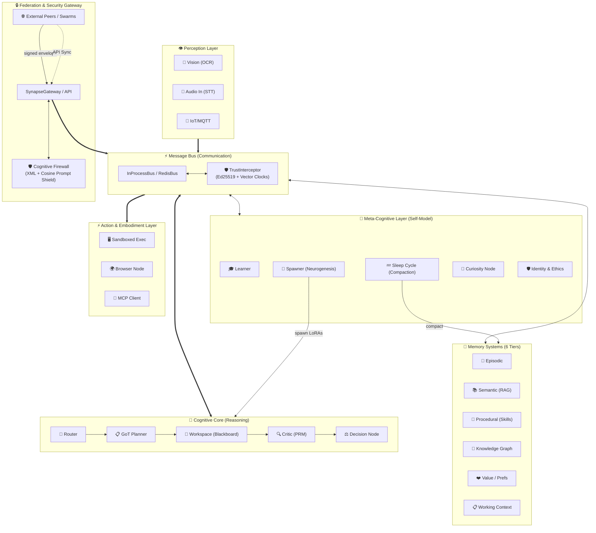
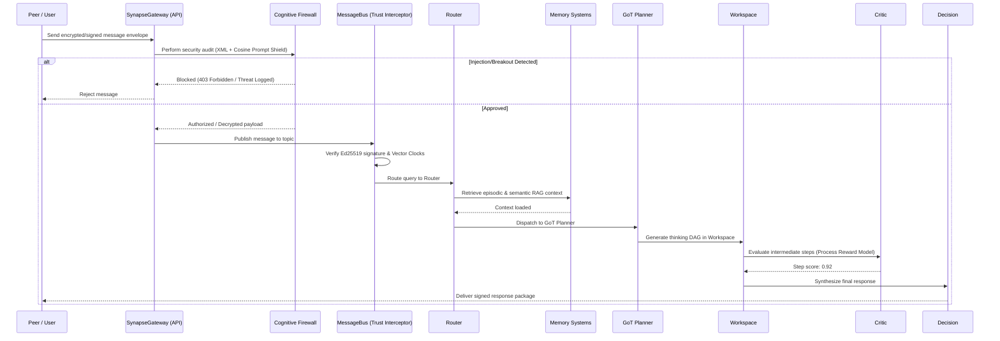

# Architecture Overview

HBLLM Core is built on four foundational principles:

1.  **Local-First Autonomy** — The system is designed to provide full cognitive utility on a single device without cloud dependencies.
2.  **Sovereign Distributed Cognition** — Optional scaling to a swarm of personal devices via cryptographic trust chaining.
3.  **Causal Consistency** — Maintains a unified chronological memory state across all distributed nodes.
4.  **Hardware Efficiency** — Decouples intelligence from model inference, enabling complex reasoning on CPU-only devices.

!!! info "Why This Matters for Hardware"
    Traditional LLMs require 80GB+ VRAM for a 70B model. HBLLM's cognitive nodes are **zero-parameter pure logic** — they add no GPU load. Only the base model (125M–1.5B) requires compute, and it runs efficiently on CPU via Rust SIMD kernels with INT4 quantization.

## Layered Design

### Layer 1: Perception

Input nodes that transform raw signals into structured messages:

| Node | Input | Output |
|---|---|---|
| `VisionNode` | Images, video frames | Captions, OCR text, object labels |
| `AudioInputNode` | Microphone stream | Transcribed text (STT) |
| `IoTMQTTNode` | MQTT sensor topics | Structured sensor events |
| `ROS2Node` | ROS2 topic subscriptions | Robot state, LIDAR, joint data |

### Layer 2: Cognitive Core

The reasoning pipeline that processes every query:

1. **Router** — Classifies intent and selects the appropriate domain expert(s).
2. **Planner** — Generates a Graph-of-Thoughts (GoT) DAG for multi-step reasoning.
3. **Workspace** — Blackboard consensus node where thoughts are refined.
4. **Critic** — Self-evaluation using Process Reward Models (PRM).
5. **Decision** — Final output synthesis with confidence scoring.

### Layer 3: Meta-Cognitive

Nodes that monitor, improve, and expand the brain itself:

- **LearnerNode** — Continuous DPO training from feedback.
- **CuriosityNode** — Generates exploratory goals for unknown domains.
- **SpawnerNode** — Creates new domain LoRA adapters at runtime.
- **SleepCycleNode** — 3-stage memory consolidation (Replay → Prune → Strengthen).
- **IdentityNode** — Ethical constraints and personality persistence.
- **WorldModelNode** — Sandboxed AST simulation for "what-if" reasoning.

## Communication & Security

All nodes communicate via the **MessageBus**, which has been hardened for distributed swarms:

- **Trust Model**: Every node has an **Ed25519** cryptographic identity. All messages are signed and verified via the `TrustInterceptor`.
- **Authority Hierarchy**: Uses **Vector Clocks** for causal ordering and **Authority Scores** (0-100) to resolve state conflicts between devices.
- **Bus Implementations**:
    - **InProcessBus** — single-process async (local dev) with interceptor support.
    - **SynapseGateway** — production edge gateway with JWT/HMAC auth.
    - **DurableBus** — SQLite-backed persistence wrapper for reliable delivery.

### Layer 4: Memory Systems

See [Memory Systems](memory-systems.md) for the full deep-dive.

### Layer 5: Action & Embodiment

Execution nodes that interact with the external world safely through the [Embodiment](embodiment.md) adapter:

- **ExecutionNode** — Sandboxed Python evaluation with resource limits.
- **OS Adapter** — Interacts safely with host operating systems via idempotency hashing.
- **Execution Verifier** — Async polling to verify actual physical/digital state changes.
- **MCPClientNode** — Model Context Protocol tool calls.
- **UplinkNode** — WebSocket bridge to central/cloud servers for Hierarchical Swarms.
- **BrowserNode** — Web page interaction and scraping.
- **Z3LogicNode** — Formal verification and constraint solving.
- **FuzzyLogicNode** — Approximate reasoning with scikit-fuzzy.

### Layer 6: Human Control & Safety

The [Human Control](human-control.md) layer ensures the user remains in command:
- **Trust Boundaries** — Scoped tokens mapping actions to specific trust zones (SAFE vs SENSITIVE).
- **Security Guard** — Triggers explanation-first intents for sensitive actions.
- **Intervention** — Semantic pause, stop, and reverse functionalities.

---

## Optional: Hierarchical Swarm Architecture

HBLLM supports a decentralized multi-homed architecture. Edge devices (like laptops, mobile phones, or desktop workstations) can run their own local `MessageBus` and connect to a Central Core via WebSockets using the `UplinkNode`.

1. **Auto-Discovery** — Edge devices advertise their local tools (`register_capabilities`) up to the central server.
2. **Transparent Execution** — The central server sends `tool_call` commands down the WebSocket, the Edge device executes them locally, and pipes the `tool_result` back up.
3. **Sovereign Sync** — Edge devices append their offline episodic memories and semantic knowledge to the central brain via secure REST APIs (`/v1/sync/*`).

This allows the central brain to command a swarm of edge limbs dynamically, while edge devices maintain autonomous local execution.

---

## Data Flow

A typical query flows through the system as follows:

## Next Steps

- [Cognitive Nodes](cognitive-nodes.md) — Detailed reference for each node.
- [Message Bus](message-bus.md) — How Pub/Sub routing works.
- [Memory Systems](memory-systems.md) — The 6 memory types explained.
- [Embodiment](embodiment.md) — Actuator safety and verification.
- [Human Control](human-control.md) — Safety boundaries and intent integrity.
- [Causality & Compaction](causality-and-compaction.md) — Decision trace graphs and memory folding.
