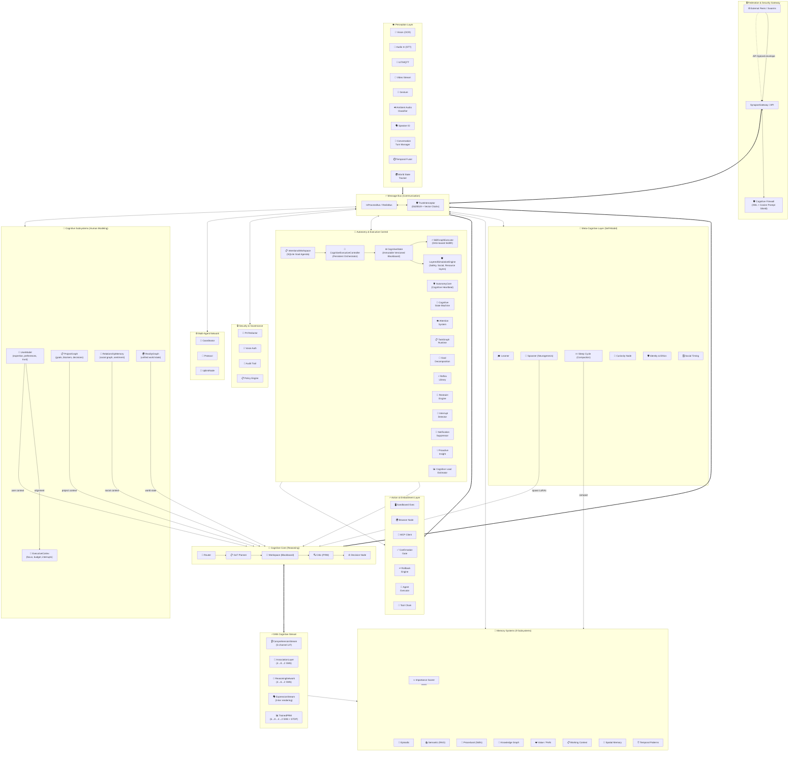
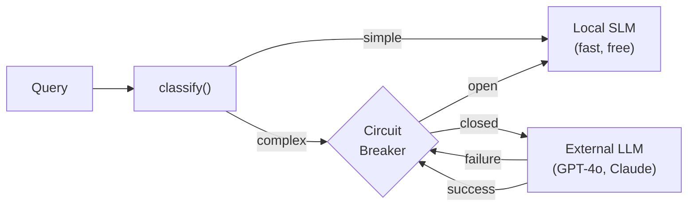
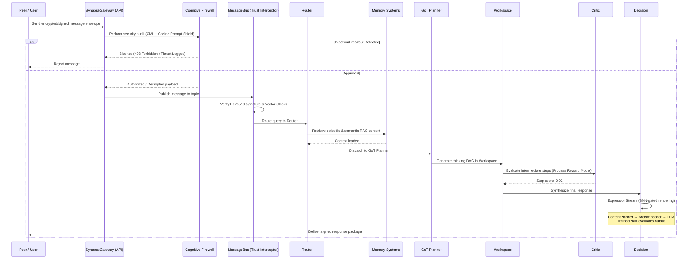

# Architecture Overview

HBLLM Core is built on four foundational principles:

1.  **Local-First Autonomy** — The system is designed to provide full cognitive utility on a single device without cloud dependencies.
2.  **Sovereign Distributed Cognition** — Optional scaling to a swarm of personal devices via cryptographic trust chaining.
3.  **Causal Consistency** — Maintains a unified chronological memory state across all distributed nodes.
4.  **Hardware Efficiency** — Decouples intelligence from model inference, enabling complex reasoning on CPU-only devices.

## Core Architectural Rules & Layer Separation

To maintain cognitive predictability, transparency, and prevent black-box decision collapse, HBLLM enforces a strict separation of concerns across its cognitive layers:

*   **SNN Layer (Dynamics: Time + Intensity + Content Planning)**:
    *   *Role:* Temporal integration, decay dynamics, spiking events, and content planning.
    *   *Rule:* **SNN layers drive both soft biases and hard content decisions.**
      - In **comprehension/gating**, SNNs act as continuous-time integrators that bias retrieval weights and trigger reflexes.
      - In **expression** (v4 Broca mode), the ContentPlanNetwork SNN makes hard content decisions: what content type, what key points, what order.
      - In **reward evaluation**, the TrainedPRM SNN evaluates output quality with STDP-based online learning.
*   **Memory Layer (Storage: Facts + Embeddings + Graph)**:
    *   *Role:* Data storage of factual information, embeddings, procedural skills, and relational graphs.
*   **Retrieval Layer (Ranking: Blending Signals)**:
    *   *Role:* Blends dense, sparse, knowledge graph, and SNN priming/boost signals into unified ranked lists.
*   **LLM Layer (Reasoning: Final Synthesis)**:
    *   *Role:* Performs final synthesis and reasoning over retrieved memories, workspace thoughts, and planning DAGs.
*   **Telemetry Layer (Observation: No Influence)**:
    *   *Role:* Observability, metrics collection, and logging.
    *   *Rule:* **Telemetry must remain strictly observational and have no influence** on the system's cognitive states or decisions.

!!! info "Why This Matters for Hardware"
    Traditional LLMs require 80GB+ VRAM for a 70B model. HBLLM's cognitive nodes are **zero-parameter pure logic** — they add no GPU load. Only the base model (125M–1.5B) requires compute, and it runs efficiently on CPU via Rust SIMD kernels with INT4 quantization.

## Layered Design

### Layer 1: Perception

Input nodes that transform raw signals into structured messages:

| Node | Input | Output |
|---|---|---|
| `VisionNode` | Images, video frames | Captions, OCR text, object labels |
| `AudioInputNode` | Microphone stream | Transcribed text (STT) |
| `VideoStreamNode` | Camera / RTSP feeds | Frame events, motion detection |
| `GestureNode` | Body/hand landmarks | Gesture classification events |
| `AmbientAudioClassifier` | Background audio | Scene classification (speech, music, silence, noise) |
| `SpeakerIdNode` | Audio embeddings | Speaker identification and diarization |
| `ConversationTurnManager` | STT + TTS events | Turn state management (IDLE → LISTENING → PROCESSING → SPEAKING) |
| `TemporalFuser` | Multi-sensor streams | Fused perception snapshots with temporal alignment |
| `WorldStateTracker` | All perception events | Unified world state model (entities, locations, activities) |
| `IoTMQTTNode` | MQTT sensor topics | Structured sensor events |
| `ROS2Node` | ROS2 topic subscriptions | Robot state, LIDAR, joint data |

### Layer 2: Cognitive Core

The reasoning pipeline that processes every query:

1. **Router** — Classifies intent and selects the appropriate domain expert(s). Feeds query through ComprehensionStream for structured concept extraction.
2. **Planner** — Generates a Graph-of-Thoughts (GoT) DAG for multi-step reasoning.
3. **Workspace** — Blackboard consensus node where thoughts are refined.
4. **Critic** — Self-evaluation using Process Reward Models (PRM).
5. **Decision** — Final output synthesis with confidence scoring. Delegates to ExpressionStream for SNN-gated, thought-by-thought text generation.

#### SNN Cognitive Stream

The SNN layer runs alongside the cognitive core:

- **ComprehensionStream** — 5-channel LIF ensemble extracts concepts from input, triggers ONNX embeddings only on spikes (3× faster than per-token).
- **AssociationLayer** — 4→8→2 SNN discovers concept relationships.
- **ReasoningNetwork** — 4→6→2 SNN scores causal reasoning chains.
- **ExpressionStream** — 3-tier rendering: Broca (v4, ~80 tokens) → Shallow (v3, ~300 tokens) → Deep (v1-v2, ~600 tokens).
- **TrainedPRM** — 6→8→4→2 SNN evaluates response quality with STDP learning.
- **ContentPlanner** — 8→12→6→3 SNN for content type selection (v4).
- **BrocaEncoder** — Ultra-minimal prompt builder for pure text production (v4).

#### DualLLMRouter & Circuit Breaker

The `DualLLMRouter` adds intelligent routing between local and external LLM providers:

- **Classify** — Fast heuristic (word count, question complexity) routes simple queries to local SLM
- **Circuit Breaker** — Protects against external provider failures:
    - **Closed** → Normal operation, requests go to external LLM
    - **Open** → After N failures, all requests automatically fall back to local SLM
    - **Half-Open** → After recovery timeout, allows one probe request to test recovery

#### Production Resilience

| Feature | Module | Behavior |
|---------|--------|----------|
| **Graceful Shutdown** | `api.py` | Drains in-flight requests before exit (configurable timeout) |
| **Rate Limiting** | `middleware/rate_limit.py` | Per-tenant token bucket (429 when exceeded) |
| **Prometheus Metrics** | `middleware/prometheus.py` | Request count, latency histogram, error counters |
| **API Versioning** | `middleware/api_version.py` | `Accept-Version` validation, `X-API-Version` header |
| **DB Quotas** | `episodic.py` | Per-tenant turn limits with automatic eviction |

### Layer 3: Autonomy & Executive Control

The executive control system that enables continuous, goal-directed behavior. See [Executive Brain Layer](executive-brain-layer.md) for the full deep-dive.

- **AutonomyCore** — Cognitive heartbeat with hybrid event + tick loop architecture.
- **CognitiveStateMachine** — Hierarchical state model (IDLE → FOCUSED → PLANNING → EXECUTING) with adaptive tick rates.
- **AttentionSystem** — Multi-factor event scoring with decay, budgets, and salience tracking.
- **TaskGraphRuntime** — Persistent DAG-based goal execution with retry, failure cascade, and boot recovery.
- **GoalDecompositionEngine** — Breaks high-level goals into executable sub-task DAGs using LLM planning.
- **ReflexLibrary** — Zero-cost deterministic reflexes for system health, security, environment, and routine events.
- **ReflexLearner** — Promotes frequently-triggered patterns from LLM reasoning into compiled reflexes.
- **RestraintEngine** — Prevents excessive action, API calls, and resource consumption with configurable budgets.
- **InterruptDetector** — Classifies incoming events as interruptible vs. deferrable based on cognitive state.
- **NotificationSuppressor** — Batches and deduplicates notifications during focus states.
- **ProactiveInsightEngine** — Generates background insights and recommendations from idle-time analysis.
- **CognitiveLoadEstimator** — Tracks working memory load to prevent cognitive overload.

### Layer 4: Meta-Cognitive

Nodes that monitor, improve, and expand the brain itself:

- **LearnerNode** — Continuous DPO training from feedback.
- **CuriosityNode** — Generates exploratory goals for unknown domains.
- **SpawnerNode** — Creates new domain LoRA adapters at runtime.
- **SleepCycleNode** — 3-stage memory consolidation (Replay → Prune → Strengthen).
- **IdentityNode** — Ethical constraints and personality persistence.
- **WorldModelNode** — Sandboxed AST simulation for "what-if" reasoning.
- **SocialTimingNode** — Context-aware timing for proactive communication (avoids interrupting during meetings, late at night, etc.).

### Layer 4b: Cognitive Subsystems (Human Modeling)

The human modeling layer that makes HBLLM feel persistent and personal. See [Cognitive Subsystems](cognitive-subsystems.md) for the full deep-dive.

- **UserModel** — Continuously learns expertise, preferences, beliefs, trust, stress, engagement, and temporal work patterns from every interaction. SQLite-backed.
- **ProjectGraph** — Graph-based project state tracker with goals, blockers, open questions, decisions, and milestones. Auto-detects which project the user is talking about.
- **CognitiveExecutiveController / ExecutiveCortex** — Unified cognitive control operating over a state-centric, versioned-immutable kernel. Goal agendas are maintained in the persistent `IntentionalWorkspace` SQLite database, and policies cascade via a hierarchical priority system (Task → Global) managed in the Bayesian `SelfModel`.
- **RelationshipMemory** — Social graph of people mentioned in conversations with roles, sentiment trends, interaction history, and notification prioritization.
- **RealityGraph** — Read-only unified facade over KnowledgeGraph, BrainWorldState, and PerceptionWorldState. Merges entities by confidence.

## Communication & Security

All nodes communicate via the **MessageBus**, which has been hardened for distributed swarms:

- **Trust Model**: Every node has an **Ed25519** cryptographic identity. All messages are signed and verified via the `TrustInterceptor`.
- **Authority Hierarchy**: Uses **Vector Clocks** for causal ordering and **Authority Scores** (0-100) to resolve state conflicts between devices.
- **Bus Implementations**:
    - **InProcessBus** — single-process async (local dev) with interceptor support.
    - **SynapseGateway** — production edge gateway with JWT/HMAC auth.
    - **DurableBus** — SQLite-backed persistence wrapper for reliable delivery.

### Layer 5: Memory Systems

See [Memory Systems](memory-systems.md) for the full deep-dive. Now includes 9 subsystems: Working, Episodic, Semantic, Procedural, Knowledge Graph, Value, **Spatial Memory**, **Temporal Patterns**, and **Importance Scorer**.

### Layer 6: Action & Embodiment

Execution nodes that interact with the external world safely through the [Embodiment](embodiment.md) adapter:

- **ExecutionNode** — Sandboxed Python evaluation with resource limits.
- **OS Adapter** — Interacts safely with host operating systems via idempotency hashing. Platform-specific backends for **Linux** and **macOS**.
- **Execution Verifier** — Async polling to verify actual physical/digital state changes.
- **ConfirmationGate** — Human-in-the-loop approval for high-risk actions before execution.
- **RollbackEngine** — Undo support for reversible actions with snapshot-based state recovery.
- **AgentExecutor** — Multi-step agent loop with tool routing and result aggregation.
- **ToolChain** — Sequential tool execution pipelines with intermediate result passing.
- **MCPClientNode** — Model Context Protocol tool calls (stdio and SSE transports).
- **UplinkNode** — WebSocket bridge to central/cloud servers for Hierarchical Swarms.
- **BrowserNode** — Web page interaction and scraping.
- **Z3LogicNode** — Formal verification and constraint solving.
- **FuzzyLogicNode** — Approximate reasoning with scikit-fuzzy.

### Layer 7: Security & Governance

- **PII Redactor** — Automatic detection and redaction of personally identifiable information in inputs and outputs.
- **Voice Authentication** — Speaker verification for voice-activated commands using embedding similarity.
- **Audit Trail** — Append-only, SOC2/GDPR-compliant logging of all security-sensitive operations.
- **Policy Engine** — Constitutional AI layer with per-tenant YAML governance rules.

The [Human Control](human-control.md) layer ensures the user remains in command:
- **Trust Boundaries** — Scoped tokens mapping actions to specific trust zones (SAFE vs SENSITIVE).
- **Security Guard** — Triggers explanation-first intents for sensitive actions.
- **Intervention** — Semantic pause, stop, and reverse functionalities.

---

## Optional: Hierarchical Swarm & Multi-Agent Architecture

HBLLM supports a decentralized multi-homed architecture. Edge devices (like laptops, mobile phones, or desktop workstations) can run their own local `MessageBus` and connect to a Central Core via WebSockets using the `UplinkNode`.

1. **Auto-Discovery** — Edge devices advertise their local tools (`register_capabilities`) up to the central server.
2. **Transparent Execution** — The central server sends `tool_call` commands down the WebSocket, the Edge device executes them locally, and pipes the `tool_result` back up.
3. **Sovereign Sync** — Edge devices append their offline episodic memories and semantic knowledge to the central brain via secure REST APIs (`/v1/sync/*`).
4. **Multi-Agent Coordination** — The `MultiAgentCoordinator` manages task delegation across agent instances using the `MultiAgentProtocol` for structured message exchange, capability negotiation, and result aggregation.

This allows the central brain to command a swarm of edge limbs dynamically, while edge devices maintain autonomous local execution.

---

## Data Flow

A typical query flows through the system as follows:

## Next Steps

- [Cognitive Nodes](cognitive-nodes.md) — Detailed reference for each node.
- [Cognitive Subsystems](cognitive-subsystems.md) — UserModel, ProjectGraph, ExecutiveCortex, RelationshipMemory, RealityGraph.
- [Message Bus](message-bus.md) — How Pub/Sub routing works.
- [Memory Systems](memory-systems.md) — The 6 memory types explained.
- [Embodiment](embodiment.md) — Actuator safety and verification.
- [Human Control](human-control.md) — Safety boundaries and intent integrity.
- [Causality & Compaction](causality-and-compaction.md) — Decision trace graphs and memory folding.
