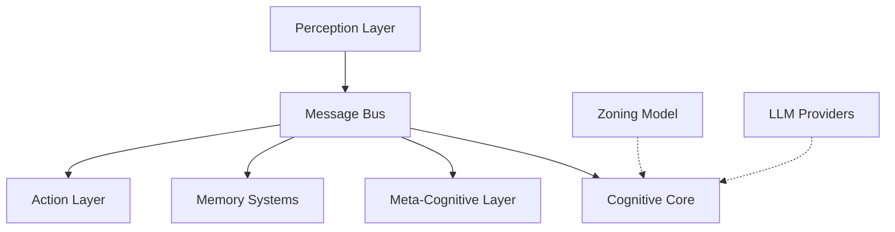
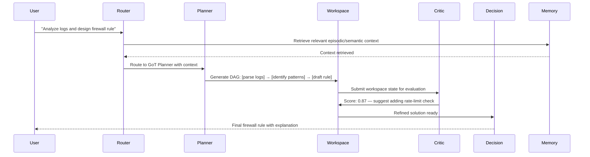

# Architecture Overview

HBLLM Core is built on four foundational principles:

1. **Modularity** — Every cognitive function is an isolated, stateless node.
2. **Asynchronous Communication** — Nodes exchange messages via Pub/Sub, never calling each other directly.
3. **Emergent Intelligence** — Complex behavior arises from simple node interactions, not monolithic code.
4. **Hardware Efficiency** — The architecture separates intelligence (nodes, memory, planning) from model inference, enabling full cognitive capability on CPU-only devices with as little as 1GB RAM.

!!! info "Why This Matters for Hardware"
    Traditional LLMs require 80GB+ VRAM for a 70B model. HBLLM's cognitive nodes are **zero-parameter pure logic** — they add no GPU load. Only the base model (125M–1.5B) requires compute, and it runs efficiently on CPU via Rust SIMD kernels with INT4 quantization.

## Layered Design

### Layer 1: Perception

Input nodes that transform raw signals into structured messages:

| Node | Input | Output |
|---|---|---|
| `VisionNode` | Images, video frames | Captions, OCR text, object labels |
| `AudioInputNode` | Microphone stream | Transcribed text (STT) |
| `IoTMQTTNode` | MQTT sensor topics | Structured sensor events |
| `ROS2Node` | ROS2 topic subscriptions | Robot state, LIDAR, joint data |

### Layer 2: Cognitive Core

The reasoning pipeline that processes every query:

1. **Router** — Classifies intent and selects the appropriate domain expert(s).
2. **Planner** — Generates a Graph-of-Thoughts (GoT) DAG for multi-step reasoning.
3. **Workspace** — Blackboard consensus node where thoughts are refined.
4. **Critic** — Self-evaluation using Process Reward Models (PRM).
5. **Decision** — Final output synthesis with confidence scoring.

### Layer 3: Meta-Cognitive

Nodes that monitor, improve, and expand the brain itself:

- **LearnerNode** — Continuous DPO training from feedback.
- **CuriosityNode** — Generates exploratory goals for unknown domains.
- **SpawnerNode** — Creates new domain LoRA adapters at runtime.
- **SleepCycleNode** — 3-phase memory consolidation (Replay → Prune → Strengthen).
- **IdentityNode** — Ethical constraints and personality persistence.
- **WorldModelNode** — Sandboxed AST simulation for "what-if" reasoning.

### Layer 4: Memory Systems

See [Memory Systems](memory-systems.md) for the full deep-dive.

### Layer 5: Action

Execution nodes that interact with the external world:

- **ExecutionNode** — Sandboxed Python evaluation with resource limits.
- **MCPClientNode** — Model Context Protocol tool calls.
- **BrowserNode** — Web page interaction and scraping.
- **Z3LogicNode** — Formal verification and constraint solving.
- **FuzzyLogicNode** — Approximate reasoning with scikit-fuzzy.

---

## Data Flow

A typical query flows through the system as follows:

## Next Steps

- [Cognitive Nodes](cognitive-nodes.md) — Detailed reference for each node.
- [Message Bus](message-bus.md) — How Pub/Sub routing works.
- [Memory Systems](memory-systems.md) — The 6 memory types explained.
