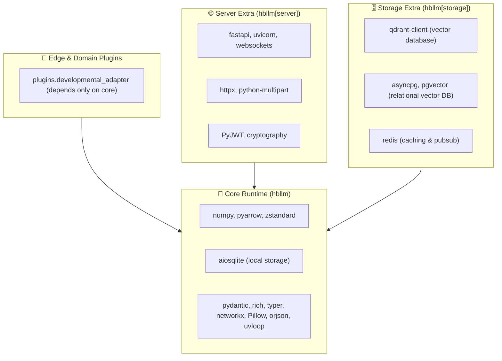

# Packaging & Dependency Boundaries Architecture

## 1. Overview

HBLLM is designed to run across diverse operational footprints: from lightweight robotics and edge devices (e.g. Raspberry Pi, Jetson Orin) with minimal resources to enterprise multi-tenant server deployments backed by distributed vector stores and message buses.

To prevent dependency creep and monolithic import overhead, the repository enforces a strict packaging and architectural boundary hierarchy between **core-runtime** dependencies and optional enterprise server/database extras.

---

## 2. Dependency Hierarchy



---

## 3. PEP 562 Lazy Loading Architecture

In monolithic Python packages, top-level imports in `__init__.py` trigger eager execution across child modules. Historically, importing an edge plugin like `plugins.developmental_adapter` transitively pulled in `RouterNode` and `MemoryNode`, which imported `fastapi`, `redis`, `qdrant-client`, `asyncpg`, and `cryptography` (148 heavy modules).

### Resolution
HBLLM core resolves this via **PEP 562 Lazy Module Exports**:
- `hbllm/brain/__init__.py`: All 26 public symbols (`BrainFactory`, `RouterNode`, `GoalManager`, etc.) are mapped to lazy import tuples.
- `hbllm/memory/__init__.py`: Memory backend nodes (`MemoryNode`, `ConceptExtractor`) are mapped to lazy import tuples.
- The top-level packages export `__getattr__` and `__dir__`:

```python
def __getattr__(name: str) -> Any:
    if name in _EXPORTS:
        mod_path, attr = _EXPORTS[name]
        mod = importlib.import_module(mod_path)
        val = getattr(mod, attr)
        globals()[name] = val
        return val
    raise AttributeError(f"module {__name__!r} has no attribute {name!r}")
```

### Result
- Directly importing `plugins.developmental_adapter` or `hbllm.brain.continual.store` now loads **0** heavy server or vector database modules.
- The edge footprint memory overhead drops by $> 90\%$.
- Accessing `from hbllm.brain import BrainFactory` continues to resolve on demand with 100% backward compatibility.

---

## 4. Automated Architectural Boundary Enforcement

To ensure boundaries are never violated by accidental imports in PRs, automated isolation tests run in fresh subprocesses (`tests/unit/core/test_dependency_boundaries.py`):

1. **`test_developmental_adapter_import_cleanliness`**: Asserts that `import plugins.developmental_adapter` loads 0 blacklisted modules (`fastapi`, `uvicorn`, `redis`, `qdrant_client`, `asyncpg`, `pgvector`, `cryptography`).
2. **`test_continual_store_import_cleanliness`**: Asserts that `import hbllm.brain.continual.store` loads 0 blacklisted modules.
3. **`test_brain_lazy_loading_and_resolution`**: Verifies `__dir__` completeness and dynamic on-demand resolution.
4. **`test_memory_lazy_loading_and_resolution`**: Verifies dynamic resolution of memory nodes.
5. **`test_pyproject_dependency_discipline`**: Asserts that core base `dependencies` in `pyproject.toml` contain zero server/storage dependencies.
