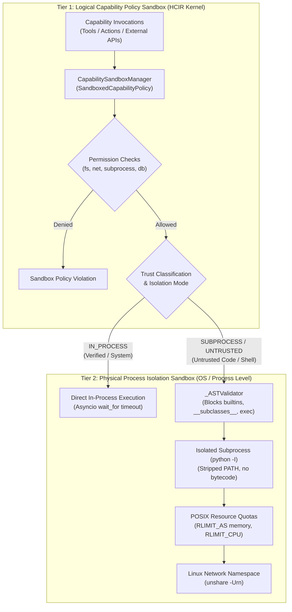

# Sandboxing Architecture & Capability Isolation

HBLLM implements a formal **two-tier defense-in-depth sandboxing architecture** to execute autonomous tools, capabilities, and dynamic code while preventing system compromise, privilege escalation, and unintended side-effects.

---

## The Two Sandboxing Tiers

### Tier 1: Logical Capability Policy Sandbox (HCIR Kernel Level)

The Logical Policy Sandbox operates inside the HCIR kernel (`hbllm.hcir.kernel.capability_sandboxing`) before capability dispatch. It validates declarative permissions against runtime parameter tokens and assigns execution limits.

1. **Permission Tokens**:
   - `allow_filesystem`: Reading or writing to local disk paths.
   - `allow_network`: Outbound HTTP/TCP sockets and DNS lookups.
   - `allow_subprocess`: Spawning external binaries or shell utilities.
   - `allow_db_write`: Mutating persistent databases.
2. **Trust Level Classification**:
   - `TrustLevel.SYSTEM`: Built-in, audited core components.
   - `TrustLevel.VERIFIED`: Audited provider implementations.
   - `TrustLevel.UNTRUSTED`: External, third-party, or dynamically induced plugins.
3. **Dynamic Parameter & AST Inference**:
   - Inferred via `infer_capability_permissions()`, matching parameter tokens (e.g. `filepath`, `url`, `cmd`, `sql`) against capability requests to prevent permission bypass via generic wrappers.

### Tier 2: Physical Process Isolation Sandbox (OS / Process Level)

The Physical Isolation Sandbox (`hbllm.actions.sandbox.run_sandboxed_python`) operates at the operating system process boundary. Any capability running with `IsolationMode.SUBPROCESS` or executing untrusted Python code is dispatched through this layer:

1. **AST Pre-Validation**:
   - Parses the abstract syntax tree before execution.
   - Blocks dangerous builtins (`eval`, `exec`, `globals`, `locals`, `__import__`).
   - Blocks dunder introspection (`__subclasses__`, `__class__`, `__bases__`, `__builtins__`).
   - Blocks disallowed modules (`os`, `sys`, `socket`, `subprocess`, `ctypes`, `shutil`).
2. **Hard Hardware Quotas (POSIX `rlimits`)**:
   - `RLIMIT_AS`: Virtual address space cap (default: 256MB–512MB). The process is killed immediately if memory consumption exceeds this quota.
   - `RLIMIT_CPU`: Total CPU time cap (default: 5.0s–10.0s).
3. **Clean Process Isolation**:
   - Executed via `sys.executable -I` (isolated Python mode: ignores environment variables, user site-packages, and system paths).
   - Minimal stripped `PATH` (`/usr/bin:/bin:/usr/sbin:/sbin`).
4. **OS-Level Network Isolation**:
   - On Linux hosts with user namespace support, executed inside `unshare -Urn` (creating a new network namespace with no network interfaces except a disabled loopback).

---

## Capability-to-Tier Mapping

| Capability Type | Required Trust Level | Assigned Isolation Mode | Enforced Sandbox Tier |
|---|---|---|---|
| **Core Read-Only Logic** (Knowledge query, calculator) | `TrustLevel.SYSTEM` | `IsolationMode.IN_PROCESS` | **Tier 1** (Permission check + wall-clock timeout) |
| **Local System I/O** (File readers, SQLite queries) | `TrustLevel.VERIFIED` | `IsolationMode.IN_PROCESS` | **Tier 1** (Explicit permission grant required) |
| **Dynamic Python Execution** (`ExecutionNode`, `tool_python_exec`) | `TrustLevel.UNTRUSTED` | `IsolationMode.SUBPROCESS` | **Tier 1 + Tier 2** (AST validation, POSIX quotas, network unshare) |
| **External Plugins / Untrusted Code** | `TrustLevel.UNTRUSTED` | `IsolationMode.SUBPROCESS` | **Tier 1 + Tier 2** (Strict hardware & process isolation) |

---

## Architectural Guarantees

1. **No False Confidence**: Capabilities requiring process isolation cannot bypass Tier 2. `CapabilityResolver` routes all `IsolationMode.SUBPROCESS` tasks into `run_sandboxed_python`.
2. **Zero In-Process Code Execution**: Untrusted model-generated Python code is never evaluated inside the core process space.
3. **Audit Trail Accountability**: Every sandbox policy evaluation, permission check, denial, and execution result is cryptographically recorded in `AuditTrail`.
