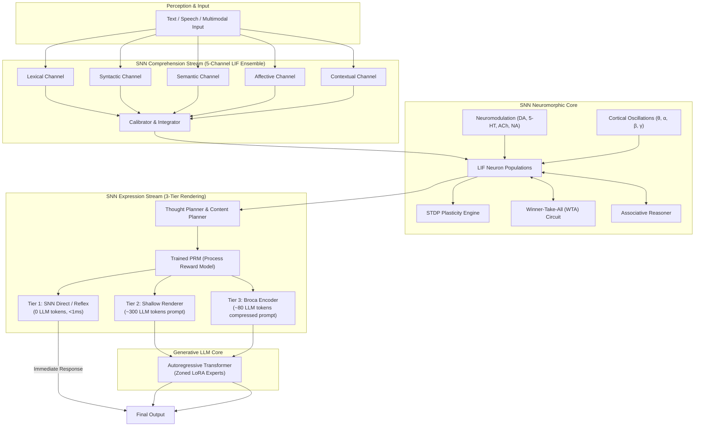

# SNN Cognitive Engine — Neuromorphic Dual-Stream Intelligence

> **Core Thesis:** Language reasoning should not require activating a billion-parameter transformer for every token. SNNs provide sub-millisecond, low-power continuous perception, thought planning, and reward evaluation, dispatching to dense transformer autoregression only when high-capacity generative articulation is strictly required.

The **SNN Cognitive Engine** (`hbllm.brain.snn`) bridges neuromorphic computing with large language models. It provides continuous spike-rate perception, associative memory traversal, thought planning, and token-saving prompt compilation.

---

## Architecture Overview



---

## Dual-Stream Processing Pipeline

The SNN subsystem operates across two complementary streams:

### 1. Comprehension Stream (`hbllm.brain.snn.comprehension`)

Converts continuous token streams and perceptual signals into multi-channel spike trains via a 5-channel ensemble:

| Channel | Module | Role | Firing Rate Metric |
|---|---|---|---|
| **Lexical** | `lexical.py` | Term novelty, keyword saliency, and morphology | $r_{\text{lex}} \in [0, 1]$ |
| **Syntactic** | `ensemble.py` | Structural complexity, dependency depth, clause count | $r_{\text{syn}} \in [0, 1]$ |
| **Semantic** | `ensemble.py` | Conceptual density and embedding alignment | $r_{\text{sem}} \in [0, 1]$ |
| **Affective** | `ensemble.py` | Emotional valence, urgency, and sentiment tension | $r_{\text{aff}} \in [0, 1]$ |
| **Contextual**| `stream.py` | Cross-turn coherence and state continuity | $r_{\text{ctx}} \in [0, 1]$ |

Spikes from all 5 channels are normalized by `StreamCalibrator` to produce calibrated spike-rate tensors for downstream cognitive processing.

### 2. Expression Stream (`hbllm.brain.snn.expression`)

The expression stream controls how thoughts are articulated into language, using a 3-tier adaptive rendering strategy that dramatically saves token and compute costs:

| Tier | Renderer | Mechanism | Cost | Latency |
|---|---|---|---|---|
| **Tier 1** | **Direct Reflex** | Pre-compiled response templates triggered directly by attractor states | 0 tokens | < 1 ms |
| **Tier 2** | **Shallow Renderer** (`shallow_renderer.py`) | Synthesizes an intermediate context prompt (~300 tokens) for focused generation | Low | ~50 ms |
| **Tier 3** | **Broca Encoder** (`broca_encoder.py`) | Ultra-compressed prompt builder (~80 tokens) encoding syntactic structure and intent | Minimal | ~30 ms |

---

## Process Reward Model (TrainedPRM)

**Module:** `hbllm.brain.snn.expression.trained_prm.TrainedPRM`

The Process Reward Model is an SNN-based step evaluator structured as a 4-layer spiking network:

$$\text{Architecture: } 6 \xrightarrow{} 8 \xrightarrow{} 4 \xrightarrow{} 2 \text{ neurons}$$

- **Inputs (6 features):** Goal alignment, novelty, logical consistency, emotional appropriateness, brevity, and safety.
- **Hidden Layers (8 & 4 neurons):** Non-linear temporal spike integration with leaky thresholds.
- **Outputs (2 neurons):** Accept / Reject firing differential.
- **Online Learning:** Uses reward-modulated STDP to adjust synaptic weights dynamically based on user feedback.

---

## Biological Dynamics & Plasticity

### Leaky Integrate-and-Fire (`LIFNeuron`)

Membrane potential $V_m(t)$ dynamics follow:

$$\tau_m \frac{dV_m}{dt} = -(V_m - V_{\text{rest}}) + R \cdot I(t)$$

When $V_m \ge V_{\text{thresh}}$, a spike is emitted, and $V_m$ is reset to $V_{\text{reset}}$ with an absolute refractory period $\tau_{\text{ref}}$.

### Spike-Timing-Dependent Plasticity (`STDP`)

**Module:** `hbllm.brain.snn.plasticity.STDP`

Synaptic weights $w_{ij}$ update based on the millisecond timing difference $\Delta t = t_{\text{post}} - t_{\text{pre}}$:

$$\Delta w = \begin{cases} A_+ \exp(-\Delta t / \tau_+), & \Delta t > 0 \text{ (LTP — Potentiation)} \\ -A_- \exp(\Delta t / \tau_-), & \Delta t < 0 \text{ (LTD — Depression)} \end{cases}$$

### Winner-Take-All (WTA) Circuit

**Module:** `hbllm.brain.snn.wta.WTACircuit`

Enforces sparse neural representations and categorical decision-making via lateral inhibitory connections. High-activity clusters suppress neighbor populations, selecting the dominant intent.

### Neuromodulation Engine

**Module:** `hbllm.brain.snn.neuromodulation.NeuromodulationEngine`

Dynamically shifts global neural excitability and plasticity rates via 4 neuromodulators:

| Neurotransmitter | Cognitive State Influenced | High State Effect | Low State Effect |
|---|---|---|---|
| **Dopamine (DA)** | Reward expectation & novelty | Increases learning rate & exploration | Triggers conservative exploitation |
| **Serotonin (5-HT)** | Risk aversion & patience | Suppresses impulsive tool actions | Allows higher-risk speculative execution |
| **Acetylcholine (ACh)** | Attention focus & memory encoding | Enhances sensory input weight | Prioritizes internal simulation recall |
| **Noradrenaline (NA)** | Arousal & urgency threshold | Lowers spike threshold for rapid reflex | Elevates deliberation depth |

### Cortical Oscillations

**Module:** `hbllm.brain.snn.oscillations.OscillationManager`

Maintains oscillatory rhythm coordination across cognitive nodes:
- **$\theta$ Theta (4–8 Hz):** Memory retrieval and sequential planning rhythm.
- **$\alpha$ Alpha (8–12 Hz):** Idle state gating and sensory suppression.
- **$\beta$ Beta (13–30 Hz):** Active task execution and motor control state.
- **$\gamma$ Gamma (30–80 Hz):** Feature binding and conscious workspace integration.

---

## Integration Example

```python
import asyncio
from hbllm.brain.snn.comprehension.stream import ComprehensionStream
from hbllm.brain.snn.expression.thought_controller import ThoughtController


async def main():
    # 1. Initialize SNN Comprehension Stream
    comprehension = ComprehensionStream()

    # 2. Process incoming user query
    stream_state = await comprehension.process(
        "Urgent: Check the database backup integrity immediately."
    )
    print(f"Urgency Spike Rate: {stream_state.affective_spike_rate:.2f}")
    print(f"Dominant Concept Firing: {stream_state.dominant_concept}")

    # 3. Plan response via SNN Thought Controller
    controller = ThoughtController()
    plan = await controller.plan_thought(stream_state)
    print(f"Selected Rendering Tier: {plan.recommended_tier}")


asyncio.run(main())
```
