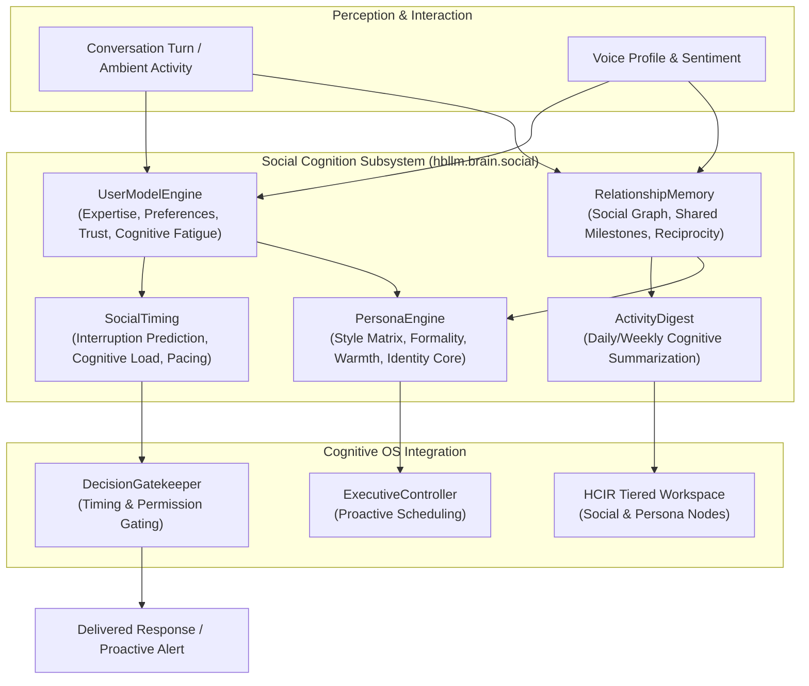
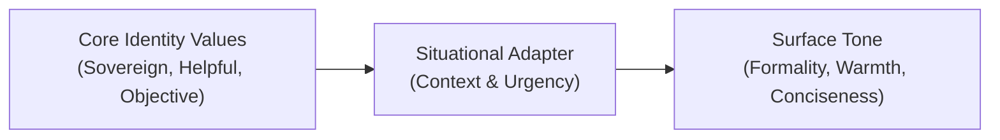

# Social Cognition — UserModel, Persona & Relationship Dynamics

> **Core Thesis:** An autonomous intelligence must not treat humans as stateless prompt submitters. A sovereign companion must maintain long-term relationship memory, model human cognitive load, adapt its persona dynamically, and respect social timing boundaries.

The **Social Cognition Subsystem** (`hbllm.brain.social`) provides predictive human modeling, multi-party relationship graphs, persona consistency, and attention-preserving interaction pacing.

---

## Architecture Overview



---

## Key Subsystems

### 1. UserModel Engine (`user_model.py`)

Maintains a rich, probabilistic model of the human operator:

| Dimension | Attribute | Update Trigger | Purpose |
|---|---|---|---|
| **Domain Expertise** | `expertise_levels: dict[str, float]` | Technical query depth & corrections | Avoids over-explaining basics or using jargon inappropriately |
| **Cognitive Fatigue** | `fatigue_score: float` (0.0–1.0) | Turn frequency, response delays, typo rates | Triggers concise answers and postpones complex decisions |
| **Trust Calibration** | `trust_score: float` (0.0–1.0) | Overrides, approval frequency, feedback | Regulates autonomous execution permissions |
| **Communication Style**| `brevity_preference: float` | Direct user feedback & message lengths | Tunes detail depth dynamically |

### 2. Relationship Memory (`relationship_memory.py`)

Models the evolving social graph across tenants, users, and external collaborators:

- **Entity & Bond Graph:** Records user relations, roles, and collaborative projects.
- **Shared History & Milestones:** Preserves memorable joint achievements and key turning points.
- **Reciprocity Index:** Tracks balance between proactive system suggestions and user directives.

### 3. Persona Engine (`persona_engine.py`)

Maintains behavioral and stylistic consistency while allowing situational adaptation:



- **Identity Invariants:** Constitutional safety rules and foundational values cannot be modulated.
- **Dynamic Traits:** Formality, humor index, directness, and empathy levels adjust according to user preferences and situational gravity.

### 4. Social Timing & Interruption Management (`social_timing.py`)

Prevents system intrusiveness and cognitive overload:

- **Interruption Risk Score ($R_{\text{int}}$):**
  $$R_{\text{int}} = w_1 \cdot \text{UserBusyState} + w_2 \cdot \text{Fatigue} - w_3 \cdot \text{AlertUrgency}$$
- **Proactive Suppression:** If $R_{\text{int}} > \theta_{\text{threshold}}$, proactive suggestions are batched into `ActivityDigest` rather than triggering real-time notifications.
- **Cool-down Dynamics:** Implements exponential back-off on repeated proactive inquiries.

### 5. Activity Digest (`activity_digest.py`)

Rolls up background autonomous tasks, epistemic hypothesis discoveries, and system maintenance events into an executive daily briefing.

---

## Python SDK Example

```python
import asyncio
from hbllm.brain.social.persona_engine import PersonaEngine
from hbllm.brain.social.social_timing import SocialTiming
from hbllm.brain.social.user_model import UserModelEngine


async def main():
    # 1. Initialize UserModel and SocialTiming
    user_model = UserModelEngine(tenant_id="tenant-alpha")
    timing = SocialTiming()

    # 2. Update user state from interaction
    await user_model.record_turn(
        user_id="user-01",
        query="Quickly check the Kubernetes cluster pod health",
        latency_seconds=1.2,
    )

    # 3. Check if proactive alert should interrupt now
    can_interrupt = timing.should_interrupt(
        user_id="user-01",
        urgency=0.4,  # Moderate urgency
        user_model=user_model,
    )
    print(f"Permitted to interrupt immediately: {can_interrupt}")

    # 4. Adapt Persona for current context
    persona = PersonaEngine()
    tone = persona.get_render_style(
        user_id="user-01", context="production_incident"
    )
    print(f"Adapted Tone: {tone.formality_level}, Brevity: {tone.brevity}")


asyncio.run(main())
```
