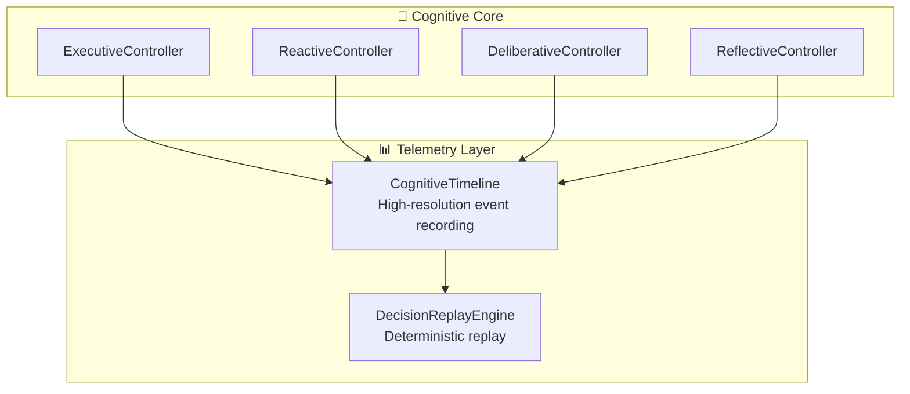

# Telemetry & Observability Architecture

> [!NOTE]
> For the formal design decisions, see **[ADR 002: Operational Architecture](../adr/0002-operational-architecture-and-governance.md)**.

## Overview

HBLLM implements a first-class observability subsystem that captures the full decision context of every cognitive event — not just *what* happened, but *why*.

The telemetry layer is **strictly observational**: it has no influence on cognitive states or decisions.

## Architecture



## Components

### 1. CognitiveTimeline (`telemetry/timeline.py`)

A high-resolution ring buffer of chronological `TimelineEntry` objects.

| Property | Details |
|---|---|
| **Max entries** | 10,000 (configurable) |
| **Entry fields** | `entry_id`, `subsystem`, `event_name`, `data`, `provenance`, `timestamp` |
| **Queries** | By recency, by subsystem, by time range |
| **Export** | Time-range export to serializable dicts |

Each entry carries full causal `ProvenanceMetadata`, enabling post-hoc reconstruction of the exact event sequence for any turn.

### 2. DecisionReplayEngine (`telemetry/replay.py`)

Captures the **complete decision context** — not just the event, but everything the system knew at the time:

| Context Item | Purpose |
|---|---|
| **Input context** | The state that triggered the decision |
| **Retrieved memories** | Memory snapshots that were available |
| **Selected capabilities** | Tools and skills that were considered |
| **Planner choices** | Strategy, depth, and parameters |
| **Simulation outcomes** | Results from mental rehearsal |
| **Execution result** | What actually happened |

#### Replay Capabilities

- **Time-range queries**: Retrieve all decisions within a window
- **Correlation filtering**: Find all decisions in a session
- **Causal chain tracing**: Follow `parent_event_id` links backward to root cause
- **JSONL export/import**: Offline replay and debugging

### 3. Universal Causal Provenance (`brain/core/provenance.py`)

Every cognitive event carries standardized `ProvenanceMetadata`:

```
event_id            → Globally unique UUID4
parent_event_id     → Causal parent for lineage tracing
correlation_id      → Session/conversation grouping
source              → Subsystem that produced this data
timestamp           → POSIX creation time
confidence          → [0.0, 1.0] confidence score
expiry              → Absolute timestamp after which data is stale
verification_state  → VERIFIED | UNVERIFIED | HYPOTHETICAL | STALE
```

This enables:

- **Belief revision**: Stale or unverified facts are deprioritized
- **Conflict resolution**: Overlapping sources are ranked by confidence
- **Deterministic replay**: Parent/correlation chains reconstruct causality
- **Distributed sync**: Event IDs prevent duplication

## Design Invariants

1. **Telemetry must remain strictly observational** — no influence on cognitive states or decisions.
2. **All cognitive events carry provenance** — no untracked decisions.
3. **Decision replay is deterministic** — same records → same behavior.
4. **JSONL export** is always available for offline analysis.

## Cross-References

- [Executive Brain Layer](./executive-brain-layer.md) — the primary producer of telemetry events
- [Self-Model](./self-model.md) — persistent identity (complementary to DigitalTwin)
- [ADR 002: Operational Architecture](../adr/0002-operational-architecture-and-governance.md) — design decisions
