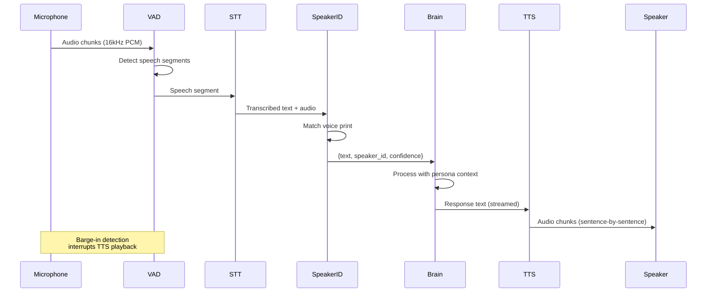

# Voice Pipeline

HBLLM's voice pipeline provides end-to-end audio processing for natural
spoken interaction. It runs entirely on-device — no cloud STT/TTS required.

## Architecture


## Components

### AudioInputNode (`perception/audio_in_node.py`)

Handles real-time audio capture, Voice Activity Detection (VAD), and
Speech-to-Text (STT) transcription.

| Feature | Description |
|---------|-------------|
| **VAD** | Silero VAD for energy-efficient speech detection |
| **STT Engines** | Whisper (local), Moonshine (ultra-fast), NVIDIA Riva |
| **Barge-in** | Interrupts TTS playback when user starts speaking |
| **Streaming** | Real-time streaming transcription for low latency |
| **Audio Format** | 16kHz mono PCM, configurable buffer sizes |

### SpeakerIDNode (`perception/speaker_id_node.py`)

Identifies who is speaking using voice embeddings, enabling
multi-user households and personalized responses.

| Feature | Description |
|---------|-------------|
| **Enrollment** | One-shot voice print enrollment from short sample |
| **Verification** | Cosine similarity matching against stored profiles |
| **Storage** | Voice profiles persisted via `VoiceProfileStore` |
| **Privacy** | Embeddings only — raw audio is never stored |

### AudioOutputNode (`perception/audio_out_node.py`)

Text-to-Speech synthesis and audio playback with support for
multiple TTS backends.

| Feature | Description |
|---------|-------------|
| **TTS Engines** | Coqui TTS (local), NVIDIA Riva, system TTS |
| **Streaming** | Sentence-level streaming — starts speaking before full response |
| **Voice Cloning** | Custom voice profiles via Coqui speaker embeddings |
| **Interruption** | Graceful stop when barge-in is detected |

### VoiceConfig (`perception/voice_config.py`)

Centralized configuration for all voice pipeline settings:
STT model selection, VAD thresholds, TTS voice, audio device
selection, and streaming parameters.

### VoiceProfileStore (`perception/voice_profile_store.py`)

Persistent storage for speaker voice prints with per-tenant isolation.

## Data Flow



## Configuration

```yaml
voice:
  stt:
    engine: whisper      # whisper | moonshine | riva
    model: base          # tiny | base | small | medium
    language: en
  tts:
    engine: coqui        # coqui | riva | system
    voice: default
    speed: 1.0
  vad:
    threshold: 0.5
    min_speech_ms: 250
    min_silence_ms: 300
  speaker_id:
    enabled: true
    min_confidence: 0.7
```

## Bus Topics

| Topic | Publisher | Description |
|-------|----------|-------------|
| `audio.transcription` | AudioInputNode | Transcribed speech text |
| `audio.speaker` | SpeakerIDNode | Speaker identification result |
| `audio.speak` | Brain/Decision | Text to synthesize and speak |
| `audio.bargein` | AudioInputNode | Barge-in event (user interrupted) |
| `audio.vad` | AudioInputNode | Voice activity start/stop |
