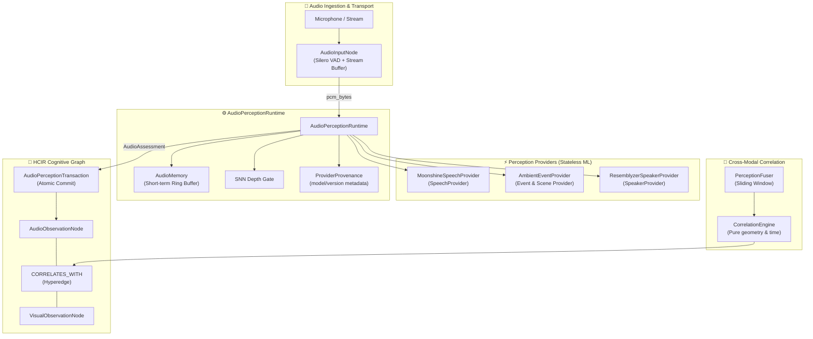
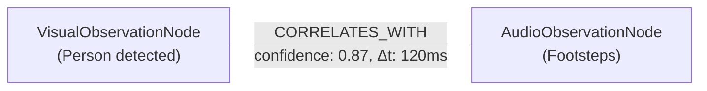

# Audio & Voice Pipeline

HBLLM treats audio as an **evidence-producing perception modality**. Audio perception produces structured evidence, while the Human-Cognitive Intermediate Representation (HCIR) transaction layer commits observations to the cognitive graph for epistemic interpretation.

> **Core Architectural Invariant:**
>
> ```text
> Providers produce raw/typed perception results
>         ↓
> AudioPerceptionRuntime normalizes them into Evidence + ProviderProvenance
>         ↓
> SNN decides processing depth
>         ↓
> AudioPerceptionTransaction commits observations to HCIR
>         ↓
> Cognitive systems interpret them (Epistemics / Router / Dialogue)
> ```
>
> *The provider itself never knows about HCIR or the cognitive core.*

---

## High-Level Architecture


```mermaid
graph TB
    subgraph INGESTION["🎤 Audio Ingestion & Transport"]
        MIC["Microphone / Stream"] --> AIN["AudioInputNode<br/>(Silero VAD + Stream Buffer)"]
    end

    subgraph PROVIDERS["⚡ Perception Providers (Stateless ML)"]
        MSP["MoonshineSpeechProvider<br/>(SpeechProvider)"]
        AEP["AmbientEventProvider<br/>(Event & Scene Provider)"]
        RSP["ResemblyzerSpeakerProvider<br/>(SpeakerProvider)"]
    end

    subgraph RUNTIME["⚙️ AudioPerceptionRuntime"]
        APR["AudioPerceptionRuntime"]
        AMEM["AudioMemory<br/>(Short-term Ring Buffer)"]
        SNN_G["SNN Depth Gate"]
        PROV["ProviderProvenance<br/>(model/version metadata)"]
    end

    subgraph CORRELATION["🔗 Cross-Modal Correlation"]
        CE["CorrelationEngine<br/>(Pure geometry & time)"]
        FUSER["PerceptionFuser<br/>(Sliding Window)"]
    end

    subgraph HCIR["🧠 HCIR Cognitive Graph"]
        TX["AudioPerceptionTransaction<br/>(Atomic Commit)"]
        A_OBS["AudioObservationNode"]
        V_OBS["VisualObservationNode"]
        EDGE["CORRELATES_WITH<br/>(Hyperedge)"]
    end

    AIN -->|pcm_bytes| APR
    APR --> MSP
    APR --> AEP
    APR --> RSP
    APR --> AMEM
    APR --> SNN_G
    APR --> PROV

    APR -->|AudioAssessment| TX
    TX --> A_OBS

    A_OBS --- EDGE --- V_OBS
    CE --> EDGE
    FUSER --> CE
```

---

## Core Components

### 1. Perception Providers (`perception/providers/`)

Providers implement typed protocols from `hbllm.perception.providers.audio_base`. They encapsulate machine-learning models, sample-rate conversion, and normalization, returning typed results without HCIR awareness.

| Provider | Protocol | Models / Backends | Output |
|:---|:---|:---|:---|
| **`MoonshineSpeechProvider`** | `SpeechProvider` | Moonshine ONNX (primary, ~50MB, <100ms), Whisper (local fallback), NVIDIA Cloud ASR | `SpeechResult` (transcript, language, confidence, temporal) |
| **`AmbientEventProvider`** | `AcousticEventProvider`, `AcousticSceneProvider` | YAMNet ONNX + Energy heuristics | `list[SoundEventResult]`, `AcousticSceneResult` |
| **`ResemblyzerSpeakerProvider`** | `SpeakerProvider` | Resemblyzer GE2E VoiceEncoder (256-dim embedding) | `SpeakerIdentification`, `AudioEmbedding` |

#### Multi-Candidate Preservation (No Early Factual Collapse)
When an acoustic classifier detects multiple possibilities (e.g., `doorbell: 0.82` vs `knock: 0.76`), providers preserve all candidates in `top_classes`. The runtime and epistemic layer evaluate competing hypotheses rather than forcing a premature single winner.

---

### 2. AudioPerceptionRuntime (`perception/audio_perception_runtime.py`)

The runtime coordinates provider execution, attaches provenance, manages short-term memory, and constructs normalized evidence.

```python
assessment = await runtime.perceive(audio_bytes)
# assessment.speech -> SpeechEvidence (transcript, confidence, provenance)
# assessment.events -> list[SoundEventEvidence] (ranked candidate events)
# assessment.scene  -> AcousticSceneEvidence (indoor/outdoor, noise level)
# assessment.epistemic_profile -> PerceptualEpistemicProfile (confidence dimensions)
```

#### Provider Provenance
Every piece of evidence carries a `ProviderProvenance` record:
```python
@dataclass(frozen=True)
class ProviderProvenance:
    provider: str  # e.g., "moonshine", "ambient", "resemblyzer"
    model: str  # e.g., "base", "yamnet", "ge2e"
    version: str  # e.g., "1.2"
    device: str  # e.g., "cpu", "cuda"
```

---

### 3. AudioInputNode as Transport Adapter (`perception/audio_in_node.py`)

`AudioInputNode` acts as a pure I/O transport adapter:
- **Microphone / Stream I/O:** Captures 16kHz PCM audio from streaming bus topics or local soundcards.
- **Voice Activity Detection (VAD):** Uses Silero VAD to detect utterance boundaries.
- **Session Lifecycle:** Manages `_StreamBuffer` per session and latency thresholds.
- **Delegation:** Delegates ASR execution to injected `SpeechProvider` (`MoonshineSpeechProvider`).

---

### 4. CorrelationEngine & PerceptionFuser (`perception/correlation_engine.py`)

The `CorrelationEngine` performs stateless geometry and temporal alignment across modalities:
- **Measurable Relationships Only:** Computes temporal overlap, delta time ($ms$), and angular spatial proximity.
- **No Semantic Leap:** It does **not** assert "the person made the footsteps" (which is a cognitive belief). It only asserts "visual observation $V$ and acoustic observation $A$ occurred within $\Delta t = 120\text{ms}$ at $\theta \approx 32^\circ$".
- **HCIR Commitment:** Commits `CORRELATES_WITH` hyperedges to HCIR via `CorrelationTransaction`.


```mermaid
graph LR
    V["VisualObservationNode<br/>(Person detected)"] ---|CORRELATES_WITH<br/>confidence: 0.87, Δt: 120ms| A["AudioObservationNode<br/>(Footsteps)"]
```

---

### 5. Output Synthesis (`perception/audio_out_node.py`)

Text-to-Speech synthesis for agent verbal responses:
- **Engines:** Kokoro TTS (default local neural TTS), NVIDIA Riva TTS (gRPC), SpeechT5 (local fallback).
- **Streaming:** Sentence-level streaming starts audio playback before complete LLM generation finishes.
- **Barge-in Protection:** Audio playback instantly pauses when `AudioInputNode` detects incoming speech.

---

## Bus Topics

| Topic | Publisher | Payload Description |
|:---|:---|:---|
| `sensory.audio.stream` | Client / Device Bridge | Raw PCM streaming chunks (`{chunk: hex, is_final: bool}`) |
| `sensory.audio.in` | Client / Test | Audio file path for file-based perception |
| `perception.fused` | PerceptionFuser | Fused multimodal context with correlation candidates |
| `sensory.audio.out` | Cognitive Core | Text / SSML payload for speech synthesis |
| `speaker.identify` | Speaker Provider | Speaker voice print query |
