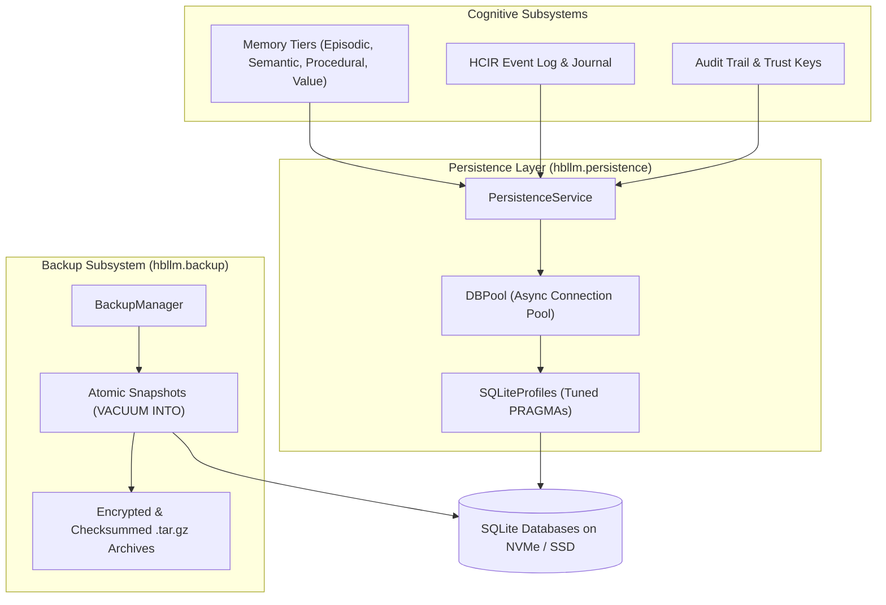

# Persistence & Backup System

HBLLM implements a zero-cloud-dependency, hardware-optimized persistence layer powered by workload-specific SQLite connection profiles, connection pooling, and an automated backup and disaster recovery engine.

---

## Architecture Overview



---

## Workload-Specific SQLite Profiles

SQLite performance varies drastically depending on read/write patterns. `PersistenceService` dynamically applies tuned PRAGMAs based on the database profile:

| Profile | Target Database | Journal Mode | Cache Size | `mmap_size` | Synchronous |
|---|---|---|---|---|---|
| `semantic_memory` | `semantic.db` | `WAL` | 64 MB | 512 MB | `NORMAL` |
| `knowledge_graph` | `knowledge.db` | `WAL` | 64 MB | 1024 MB | `NORMAL` |
| `event_log` | `cognitive_events.db` | `WAL` | 4 MB | 32 MB | `NORMAL` |
| `audit_trail` | `audit.db` | `WAL` | 2 MB | 0 | `FULL` (Crash safety) |
| `scheduler` | `scheduler.db` | `WAL` | 2 MB | 0 | `NORMAL` |

### Profile Tuning Details

- **Memory-Mapped I/O (`mmap_size`):** For read-heavy stores (knowledge graph and vector index), direct kernel page caching bypasses user-space buffer copies, yielding up to 10× faster traversals.
- **Write-Ahead Logging (`WAL`):** Enables non-blocking concurrent readers during background write transactions.
- **`synchronous = NORMAL`:** Provides optimal throughput while maintaining consistency across unexpected power failures in WAL mode.

---

## Connection Pooling (`DBPool`)

**Module:** `hbllm.persistence.db_pool.DBPool`

Avoids SQLite lock contention in high-concurrency async workloads:

```python
from hbllm.persistence.db_pool import DBPool

# Initialize pool with max 10 concurrent connections and WAL profile
pool = DBPool(
    db_path="data/working_memory.db",
    max_connections=10,
    profile="semantic_memory",
)

async with pool.acquire() as conn:
    cursor = await conn.execute(
        "SELECT turn_id, content FROM turns WHERE tenant_id = ?",
        ("tenant-01",),
    )
    rows = await cursor.fetchall()
```

---

## Automated Backup & Disaster Recovery

**Module:** `hbllm.backup.BackupManager`

The backup engine creates zero-downtime, point-in-time snapshots using SQLite's native `VACUUM INTO` mechanism, ensuring clean data consistency even during active writes.

### Creating a Snapshot

```python
import asyncio
from hbllm.backup import BackupConfig, BackupManager


async def create_backup():
    manager = BackupManager(
        config=BackupConfig(
            data_dir="./data",
            backup_dir="./backups",
            retention_count=7,  # Keep last 7 backups
            compress=True,  # Produce gzip archive
            verify_checksum=True,  # SHA-256 validation
        )
    )

    metadata = await manager.create_backup(label="daily-snapshot")
    print(f"Backup created: {metadata.backup_id}")
    print(f"Archive path: {metadata.archive_path}")
    print(f"SHA-256: {metadata.sha256}")


asyncio.run(create_backup())
```

### Restoring from a Backup

```python
import asyncio
from hbllm.backup import BackupManager


async def restore():
    manager = BackupManager()

    # Validate archive integrity and restore databases
    await manager.restore_backup(
        backup_id="backup-daily-snapshot-20260817",
        target_dir="./data",
        force=True,
    )
    print("Database restored successfully!")


asyncio.run(restore())
```
