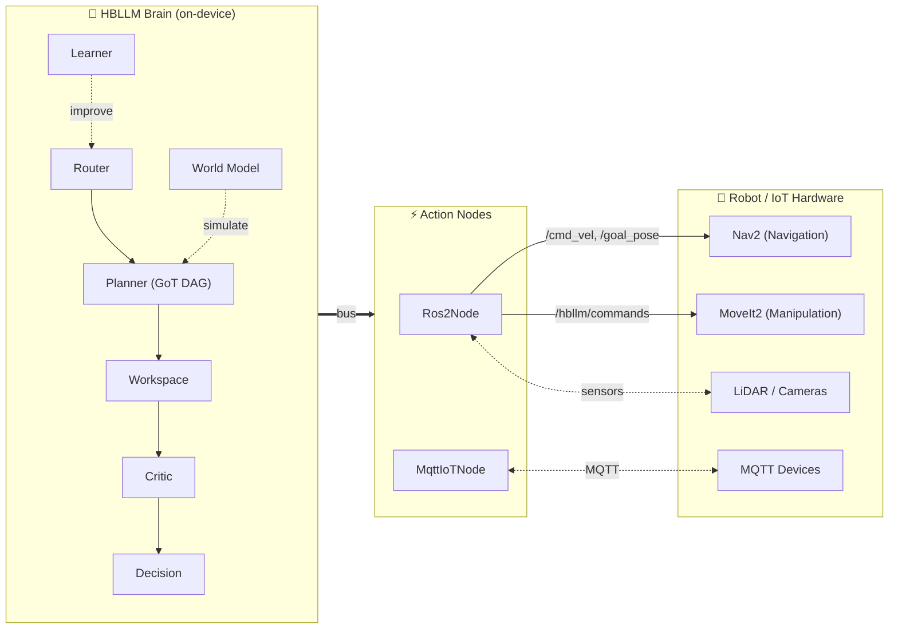

# Robotics & IoT Integration

HBLLM isn't just a chatbot framework — it's a **cognitive layer for physical systems**. The architecture's async message bus, multi-tiered memory, and planning nodes make it a natural fit as the "brain" behind robots, drones, and smart home systems.

!!! success "Runs on Robot Hardware — No GPU Needed"
    Most robot compute platforms (Raspberry Pi, Jetson Nano, industrial PLCs) don't have massive GPUs. HBLLM's 125M model runs in ~500MB RAM on CPU, making it deployable **directly on the robot** — no cloud round-trip, no latency.

---

## Architecture: Brain ↔ Robot



The key insight: HBLLM's cognitive nodes (**Router**, **Planner**, **Critic**, **WorldModel**, **Learner**) run as pure logic with **zero model parameters**. Only the base model inference needs compute — and that's just 500MB at INT4.

---

## ROS2 Robotics {: #ros2 }

The `Ros2Node` bridges HBLLM's cognitive architecture to ROS2 robots. It supports **mobile robots, robot arms, drones, and humanoids**.

### Dual-Mode Operation

| Mode | ROS2 Installed? | Behavior |
|---|---|---|
| **Simulation** (default) | ❌ No | Commands logged to bus — perfect for development and testing |
| **Real Robot** | ✅ Yes (`rclpy`) | Publishes to actual ROS2 topics (`/cmd_vel`, `/goal_pose`, etc.) |

!!! tip "Start Without ROS2"
    You don't need ROS2 installed to develop with `Ros2Node`. It runs in simulation mode by default — all bus messages flow normally, commands are logged. Install `rclpy` later when deploying to real hardware.

### Setup

```bash
# Development (no ROS2 needed)
pip install -e .
# The Ros2Node works in simulation mode automatically

# Production (with ROS2 Humble/Iron)
source /opt/ros/humble/setup.bash
pip install rclpy
export HBLLM_ROS2_ENABLED=1
```

### Supported Robot Types

The `Ros2Node` supports 4 robot categories with type-specific commands:

=== "Mobile Robots"

    | Command | Description |
    |---|---|
    | `move` | Send velocity (`linear_x`, `angular_z`) via `/cmd_vel` |
    | `navigate` | Nav2 goal pose (`x`, `y`, `yaw`) via `/goal_pose` |
    | `stop` | Emergency stop (zero velocity) |
    | `rotate` | Rotate by angle in degrees |
    | `dock` | Return to charging dock |

=== "Robot Arms"

    | Command | Description |
    |---|---|
    | `move_joint` | Move to joint angle positions |
    | `move_pose` | Move end-effector to Cartesian pose |
    | `gripper` | Open/close gripper |
    | `home` | Return to home configuration |
    | `pick` | Pick object at location |
    | `place` | Place object at location |

=== "Drones"

    | Command | Description |
    |---|---|
    | `takeoff` | Take off to specified altitude |
    | `land` | Land at current position |
    | `move` | Fly to coordinates |
    | `hover` | Maintain current position |
    | `return_home` | Return to launch point |

=== "Humanoids"

    | Command | Description |
    |---|---|
    | `walk` | Walk to target position |
    | `gesture` | Perform a predefined gesture |
    | `speak` | Text-to-speech output |
    | `look` | Direct gaze at target |

### Python API

```python
from hbllm.actions.ros2_node import Ros2Node, RobotState

# Create the ROS2 bridge node
ros2 = Ros2Node(
    node_id="ros2",
    ros2_node_name="hbllm_brain",
    cmd_vel_topic="/cmd_vel",
    nav_goal_topic="/goal_pose",
)

# Register a mobile robot
robot = ros2.register_robot(
    robot_id="turtlebot",
    name="TurtleBot3",
    robot_type="mobile",
)

# Register a multi-step behavior
ros2.register_behavior("patrol", [
    {"command": "navigate", "params": {"x": 1.0, "y": 0.0, "yaw": 0.0}},
    {"command": "navigate", "params": {"x": 1.0, "y": 1.0, "yaw": 1.57}},
    {"command": "navigate", "params": {"x": 0.0, "y": 1.0, "yaw": 3.14}},
    {"command": "navigate", "params": {"x": 0.0, "y": 0.0, "yaw": 0.0}},
])
```

### Message Bus Topics

The `Ros2Node` communicates with the brain via the async message bus:

| Direction | Topic | Purpose |
|---|---|---|
| **Brain → Robot** | `ros2.command` | Execute robot commands |
| **Brain → Robot** | `ros2.navigate` | Send navigation goals |
| **Brain → Robot** | `ros2.behavior` | Trigger multi-step behaviors |
| **Brain → Robot** | `ros2.query` | Query robot state |
| **Robot → Brain** | `ros2.event` | State changes, command completions |
| **Robot → Brain** | `ros2.sensor` | Sensor data forwarded to brain |
| **Robot → Brain** | `sensory.input` | Contextual awareness for brain |

### RobotState Tracking

Each registered robot has tracked state:

```python
@dataclass
class RobotState:
    id: str
    name: str
    type: str = "mobile"    # mobile, arm, drone, humanoid
    status: str = "idle"    # idle, moving, executing, error
    position: dict          # {"x": 0.0, "y": 0.0, "z": 0.0}
    orientation: dict       # {"roll": 0.0, "pitch": 0.0, "yaw": 0.0}
    battery: float = 100.0
    sensors: dict           # Sensor readings
```

---

## IoT / Smart Home {: #iot }

The `MqttIoTNode` bridges HBLLM to IoT devices via MQTT, enabling intelligent home automation that **learns and adapts**.

### Supported Integrations

| Platform | Protocol | HBLLM Subscribes To |
|---|---|---|
| **Home Assistant** | MQTT Discovery | `homeassistant/#` |
| **Zigbee2MQTT** | MQTT | `zigbee2mqtt/+` |
| **Custom Devices** | MQTT | `hbllm/devices/+/state` |
| **Sensors** | MQTT | `hbllm/sensors/+/data` |

### Device Categories

| Device Type | Actions |
|---|---|
| `light` | `on`, `off`, `brightness`, `color`, `toggle` |
| `thermostat` | `set_temp`, `mode`, `schedule` |
| `lock` | `lock`, `unlock`, `status` |
| `sensor` | `read`, `subscribe` |
| `switch` | `on`, `off`, `toggle` |
| `camera` | `snapshot`, `stream`, `motion_detect` |
| `speaker` | `play`, `stop`, `volume`, `tts` |
| `blinds` | `open`, `close`, `position` |
| `fan` | `on`, `off`, `speed` |
| `plug` | `on`, `off`, `power_reading` |

### Setup

```python
from hbllm.actions.iot_mqtt_node import MqttIoTNode

iot = MqttIoTNode(
    node_id="iot_mqtt",
    broker_host="192.168.1.100",  # Your MQTT broker
    broker_port=1883,
    username="hbllm",
    password="secret",
    topic_prefix="hbllm",
    ha_discovery=True,  # Auto-discover Home Assistant devices
)

# Register a scene
iot.register_scene("movie_night", [
    {"device_id": "living_room_light", "action": "brightness", "params": {"level": 20}},
    {"device_id": "tv_plug", "action": "on"},
    {"device_id": "blinds_1", "action": "close"},
])
```

### Why HBLLM for Smart Homes?

Traditional home automation uses **static rules** ("if motion detected, turn on lights"). HBLLM adds **cognitive intelligence**:

1. **Observation** — The `MqttIoTNode` forwards sensor data to the brain
2. **Pattern Learning** — The `LearnerNode` recognizes your routines (you dim lights when watching TV)
3. **Procedural Encoding** — Learned patterns become reusable skills in `ProceduralMemory`
4. **Anticipation** — The `WorldModelNode` predicts your needs and takes proactive action
5. **Adaptation** — The `SleepCycleNode` consolidates and refines learned routines overnight

---

## Why HBLLM Over Cloud APIs for Robotics?

| Factor | Cloud LLM API | HBLLM On-Device |
|---|---|---|
| **Latency** | 200-2000ms (network round-trip) | <50ms (local inference) |
| **Privacy** | Sensor data sent to cloud | All data stays on-device |
| **Reliability** | Fails without internet | Works offline |
| **Cost** | Per-token API charges | Free (MIT license) |
| **Memory** | Stateless per request | 5 memory systems for learning |
| **Hardware** | Requires cloud GPU | Runs on Raspberry Pi (no GPU) |
| **Adaptation** | No on-device learning | Continuous DPO + sleep consolidation |

---

## Deployment on Robot Hardware

| Platform | Model | RAM | Notes |
|---|---|---|---|
| **Raspberry Pi 5** (8GB) | 125M (INT4) | ~1GB | Full cognitive brain, NEON SIMD |
| **Jetson Orin Nano** (8GB) | 500M (INT4) | ~2GB | GPU-accelerated inference |
| **Intel NUC** (16GB) | 1.5B (INT4) | ~4GB | Desktop-class robot brain |
| **Industrial PC** | 1.5B (FP16) | ~6GB | Maximum quality |

```bash
# On Raspberry Pi 5
pip install -e .
export HBLLM_ROS2_ENABLED=1
HBLLM_PROVIDER=local HBLLM_QUANTIZE=int4 hbllm serve --port 8000
```
