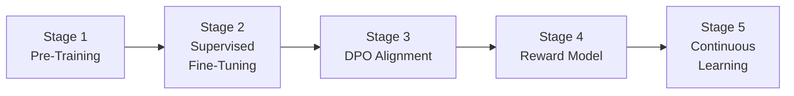

# Training Pipeline

HBLLM implements a multi-stage training pipeline that supports both offline pre-training and continuous online learning.

## Training Stages



---

## Stage 1: Pre-Training

Trains the base transformer from scratch on large text corpora.

### CLI

```bash
# Prepare data
hbllm data --dataset fineweb --samples 100000 --vocab-size 32768

# Start pre-training
hbllm train --model-size 125m --work-dir ./workspace
```

### Configuration

Model sizes available:

| Size | Parameters | Layers | Heads | Embed Dim |
|---|---|---|---|---|
| `125m` | ~125M | 12 | 12 | 768 |
| `500m` | ~500M | 24 | 16 | 1024 |
| `1.5b` | ~1.5B | 28 | 16 | 2048 |

---

## Stage 2: Supervised Fine-Tuning (SFT)

**Module:** `hbllm.training.sft`

Fine-tunes on instruction-following datasets. Supports both full fine-tuning and LoRA.

---

## Stage 3: DPO Alignment

**Module:** `hbllm.training.dpo`

Direct Preference Optimization using paired preference data (chosen vs rejected responses). Provides contrastive learning without a separate reward model.

---

## Stage 4: Reward Model

**Module:** `hbllm.training.reward_model`

Trains a neural reward model that scores response quality. Used by the `ProcessRewardNode` for step-level verification during inference.

---

## Stage 5: Continuous Learning

**Module:** `hbllm.training.cognitive_trainer`

The `CognitiveTrainer` implements the online learning loop:

1. **Feedback Collection** — The `LearnerNode` records user feedback as preference pairs in an atomic JSON queue.
2. **Sleep Consolidation** — During idle periods, the `SleepCycleNode` triggers DPO training on accumulated feedback.
3. **Weight Update** — New LoRA delta weights are merged into the active adapter.
4. **Evaluation** — The `RewardModel` verifies improvement before promoting weights.

---

## Training Support Modules

| Module | File | Purpose |
|---|---|---|
| Trainer | `training/trainer.py` | Core pre-training loop with gradient accumulation |
| SFT | `training/sft.py` | Supervised fine-tuning on instruction data |
| DPO | `training/dpo.py` | Direct Preference Optimization |
| Reward Model | `training/reward_model.py` | Neural response quality scorer |
| Cognitive Trainer | `training/cognitive_trainer.py` | Online continuous learning loop |
| Policy Optimizer | `training/policy_optimizer.py` | RLHF policy gradient updates |
| Evaluator | `training/evaluator.py` | Benchmark evaluation suite |
| Embeddings | `training/embeddings.py` | Embedding extraction for semantic search |
| KG Builder | `training/knowledge_graph_builder.py` | Builds knowledge graphs from corpora |
| Simulation | `training/simulation.py` | Synthetic data generation for training |
| Training Memory | `training/training_memory.py` | Training data management and sampling |
