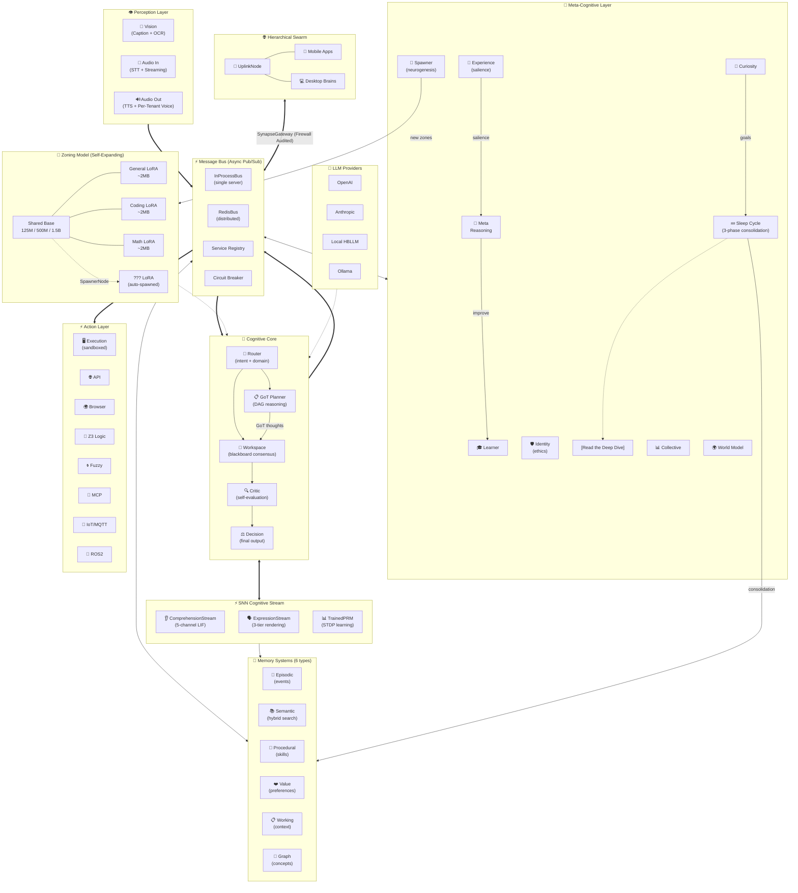

<!-- SEO Keywords: Sovereign Personal AI, Open Source AGI, Cognitive Architecture, Large Language Models, Multi-Agent Systems, Edge AI, No GPU Required, Low VRAM AI, Privacy-First AI, On-Premise AI, Hybrid Quantization, INT4 Quantization, Graph of Thoughts, LoRA Tuning, Python AI Framework, Rust AI Inference, Autonomous Agents, LLMOps, On-Device AI, Small Language Model, Multi-Tenant AI -->

<div class="hero-title">🧠 HBLLM Core</div>
<div class="hero-subtitle">An AI that thinks like a person — runs entirely on your own hardware, no cloud required. Local by default. Distributed when you want it.</div>

<div class="badges" markdown>

[](https://www.python.org/)
[](https://pytorch.org/)
[](https://www.rust-lang.org/)
[](#)
[](https://github.com/hbllm/hbllm-core/blob/master/LICENSE.md)

</div>

---

## Why HBLLM Core?

Most AI systems answer questions when you ask them. HBLLM Core does something fundamentally different — **it thinks all the time, entirely on your own machine**.

It has a genuine **memory** like a human does: short-term memory for what just happened, long-term memory for things it has learned, a knowledge graph of how concepts relate to each other, and even a sense of personal values built up from reward signals over time. Everything stored locally, everything private.

It can **set goals and pursue them in the background** — breaking big objectives into steps, retrying failed ones, checking that its actions actually worked in the real world, and picking up exactly where it left off after a reboot, just like a person resuming work after sleep.

When you're ready, it can **scale across your own devices** — your phone, laptop, and home server sharing knowledge and collaborating, all connected by Ed25519 cryptographic trust, with no cloud middleman involved.

And it has the **safety instincts of a responsible person** — it knows when it's overloaded and slows down, a policy engine blocks harmful actions before they happen, and every decision is logged to an immutable audit trail.

<div class="feature-grid">
<div class="feature-card">
<h3>🧠 28+ Cognitive Nodes</h3>
<p>Router, Planner, Critic, Decision, Learner, Curiosity, Identity, World Model, Sleep Cycle, and more — each running as an isolated, asynchronous service.</p>
</div>
<div class="feature-card">
<h3>💤 Sleep Cycle Consolidation</h3>
<p>3-phase memory consolidation (Replay → Prune → Strengthen) inspired by biological sleep. Refines model weights and compresses knowledge while idle. [Architecture &rarr;](architecture/sleep-cycle.md)</p>
</div>
<div class="feature-card">
<h3>💾 6 Memory Systems</h3>
<p>Working, Episodic, Semantic, Procedural, Value, and Knowledge Graph — mirroring human cognitive psychology for lifelong learning.</p>
</div>
<div class="feature-card">
<h3>🧬 Self-Expanding Zones</h3>
<p>The SpawnerNode automatically creates new domain-specialist LoRA adapters at runtime. The brain literally grows new regions.</p>
</div>
<div class="feature-card">
<h3>🖥️ No Massive GPU Required</h3>
<p>Runs on CPU-only machines, Raspberry Pi 5, and laptops. The 125M model needs just ~500MB RAM. Even the 1.5B model fits in under 4GB with INT4 quantization — no $10,000 GPU needed.</p>
</div>
<div class="feature-card">
<h3>⚡ Rust-Accelerated Inference</h3>
<p>AVX2/NEON SIMD kernels for hybrid quantization. 4-bit base + 16-bit LoRA experts on a single shared transformer backbone.</p>
</div>
<div class="feature-card">
<h3>🔀 Dynamic MoE Routing</h3>
<p>Edge-optimized ONNX Vector Router blends domain experts dynamically without heavy PyTorch dependencies. Under 15MB RAM overhead.</p>
</div>
<div class="feature-card">
<h3>🛡️ Enterprise Governance & Trust</h3>
<p>Ed25519 Distributed Trust, Vector Clock Replay Protection, Multi-tenant isolation, and Policy Engine for production-grade Sovereign networks.</p>
</div>
<div class="feature-card">
<h3>⚡ SNN Cognitive Stream</h3>
<p>Spiking Neural Networks for concept extraction (ComprehensionStream), content planning (ContentPlanner), and reward evaluation (TrainedPRM) with STDP learning. Three rendering tiers: Broca (v4) → Shallow (v3) → Deep (v1-v2).</p>
</div>
</div>

---

## System Architecture



---

## The Zoning Model — Personalization Without Retraining

While cloud AI platforms force you into a one-size-fits-all model, HBLLM champions **Sovereign Personalization** with small, specialized model zones driven by dynamic LoRA routing. Your AI adapts to *your* data, *your* coding style, and *your* documents.

!!! success "Absolute Privacy, Minimal Hardware"
    A 70B parameter model requires ~140GB of RAM even at FP16. HBLLM's 125M model runs in **under 500MB** — allowing you to host an incredibly smart, personalized agent strictly on your own hardware without the data privacy risks of the cloud.

| Component | Size | VRAM/RAM | Purpose |
|---|---|---|---|
| **Base Model (125M)** | ~250MB | ~500MB | Shared transformer backbone (GQA + SwiGLU + RoPE) |
| **Base Model (1.5B)** | ~3GB | ~4GB (INT4) | Larger backbone for higher-quality generation |
| **LoRA Adapters** | ~2MB each | ~4MB loaded | Domain specialization (General, Coding, Math, etc.) |
| **MoE Router** | ~15MB | ~15MB | Edge-optimized ONNX Vector Router |
| **Cognitive Nodes** | Zero params | ~50MB total | Orchestration, planning, memory — pure logic |

### 🖥️ Hardware Requirements

| Deployment Target | Model Size | RAM Needed | GPU Required? |
|---|---|---|---|
| **Raspberry Pi 5** (8GB) | 125M | ~1GB | ❌ No |
| **Laptop** (no GPU) | 125M–500M | ~2–4GB | ❌ No |
| **Desktop** (16GB RAM) | 1.5B (INT4) | ~4GB | ❌ Optional |
| **Desktop + GPU** (6GB VRAM) | 1.5B (FP16) | ~6GB | ✅ Faster |
| **Cloud / API Mode** | Any (via OpenAI/Anthropic) | ~200MB | ❌ No |

!!! tip "CPU-Only is a First-Class Target"
    Rust SIMD kernels (AVX2 on x86, NEON on ARM) accelerate INT4/INT8 quantized inference on CPU. You do **not** need CUDA to use HBLLM productively.

### 🧬 Artificial Neurogenesis

HBLLM ships with 3 starter zones, but the **SpawnerNode** automatically creates new specialist zones when you enter an unfamiliar domain:

1. **Registry Resolution** — Checks `AdapterRegistry` for pre-trained adapters on HuggingFace Hub or local cache.
2. **Security Audit** — Verifies SHA-256 integrity and converts from PEFT to internal HBLLM `state_dict`.
3. **Fallback Training** — Generates synthetic data and trains a new 2MB LoRA adapter in the background.
4. **Activation** — Spawns a new `DomainModuleNode` and hot-swaps weights into the shared backbone.

**The brain literally grows a new region at runtime — and each new adapter is just ~2MB.**

---

## Quick Start

### Installation

```bash
git clone https://github.com/hbllm/hbllm-core.git
cd HBLLM/core
pip install -e .

# Optional integrations:
pip install paho-mqtt        # IoT / MQTT Home Automation
export HBLLM_ROS2_ENABLED=1  # ROS2 Robotics (requires rclpy)
```

### CLI Utilities

```bash
hbllm info                         # View active brain architecture
hbllm nodes                        # List all loaded cognitive nodes
hbllm plugin list                  # List installed plugins
hbllm plugin new my-plugin         # Scaffold a new custom plugin
hbllm serve --port 8000            # Start the FastAPI + MCP Server
hbllm train --model-size 125m      # Start local pre-training loop
hbllm data --dataset fineweb       # Run data preparation pipeline
```

### Python API

```python
import asyncio
from hbllm.brain.factory import BrainFactory

async def main():
    brain = await BrainFactory.create("openai/gpt-4o")
    
    result = await brain.process(
        "Analyze our server logs and design a firewall rule.",
        tenant_id="tenant-001",
    )
    
    print(f"Decision: {result.text}")
    print(f"Stages: {result.stages_completed}")
    print(f"Confidence: {result.confidence:.2f}")
    print(f"Latency: {result.latency_ms:.0f}ms")
    
    await brain.shutdown()

asyncio.run(main())
```

---

## Core Capabilities

### 🧠 Agentic Reasoning & Evaluation

- **Lock-Free LoRA Concurrency** — Isolated `ContextVars` share a single GPU without blocking.
- **Secure Adapter Registry** — SHA-256 integrity checks and `weights_only=True` for all downloads.
- **Continuous Lifetime Learning** — Contrastive DPO with atomic JSON queue and sleep-cycle consolidation.
- **Dynamic MoE Blending** — Cross-domain queries synthesize custom blend-weights at runtime.
- **Graph-of-Thoughts Planning** — Dynamic DAG reasoning for multi-step goals.
- **Process Reward Models** — Neural scoring `[0-1]` of intermediate reasoning steps.

### ⚡ SNN Cognitive Stream

- **ComprehensionStream** — 5-channel LIF ensemble extracts concepts from input. Event-triggered embeddings (3× faster).
- **ExpressionStream** — 3-tier rendering: Broca (~80 tokens) → Shallow (~300 tokens) → Deep (~600 tokens).
- **ContentPlanner** — 8→12→6→3 SNN for content type selection. SNN decides what to say.
- **TrainedPRM** — 6→8→4→2 SNN evaluates response quality with STDP online learning.
- **STDP Plasticity** — All SNN networks learn via spike-timing-dependent plasticity.

### 💾 Multi-Tiered Memory

| Memory Type | Purpose |
|---|---|
| **Working** | Adaptive context windows with middle-out truncation |
| **Episodic** | Event-based timelines per session |
| **Semantic** | Hybrid dense/sparse vector search with UUID stability |
| **Procedural** | Learned tool patterns and skill registries |
| **Knowledge Graph** | LRU-bounded entity-relation concept graphs |

### 🛡️ Enterprise Governance

- **Tenant Isolation** — API keys, per-tenant rate limiters, isolated memory domains.
- **Policy Engine & Sentinel** — YAML governance with proactive bus traffic scanning.
- **Owner Rules** — Auto-extracted behavioral guardrails from high-salience interactions.

### ⚙️ Infrastructure — Built for Minimal Hardware

- **No GPU Requirement** — CPU-first design with Rust SIMD acceleration (AVX2/NEON).
- **128k+ Context** via Sliding Window Attention — $O(1)$ VRAM scaling.
- **Hybrid Quantization** — INT4 base + FP16 LoRA experts reduce memory 4× with minimal quality loss.
- **Distributed Message Bus** — `InProcessBus` or `RedisBus` with HMAC auth, TTLs, and backoff.
- **Sandboxed Execution** — Secure code evaluation with compute/memory bounds.
- **Edge-Ready ONNX Router** — Under 15MB RAM, ~0.0001ms inference.
- **Runs on Raspberry Pi 5** — Full cognitive brain on a $80 single-board computer.

---

## Example Use Cases

### 🏠 Smart Home Automation

HBLLM powers intelligent systems that **learn** rather than just triggering routines:

- **Observation** — Notes you dim the lights when turning on the TV.
- **Procedural Encoding** — The `LearnerNode` creates a skill binding the two actions.
- **Anticipation** — The `WorldModelNode` proactively dims lights when detecting TV audio signatures.

### 🤖 Autonomous Robotics (ROS2)

Functions as the cognitive layer for edge robots:

- **Perception** — Visual OCR (`VisionNode`) and Audio STT (`AudioInputNode`).
- **Pathing** — Complex "fetch" requests broken into DAGs via the `PlannerNode`.
- **Validation** — Physics evaluation via the `WorldSimulator` before moving servos.

---

## Writing Custom Nodes

Nodes are highly decoupled. Inject a custom sensor or API into the cognitive loop:

```python
from hbllm.network.node import Node, NodeType
from hbllm.network.messages import Message, MessageType

class TemperatureSensorNode(Node):
    """Custom perception node reading from hardware."""

    def __init__(self, node_id: str, i2c_address: str):
        super().__init__(
            node_id, NodeType.DETECTOR,
            capabilities=["temperature"]
        )
        self.i2c = i2c_address

    async def poll_hardware(self):
        temp = read_sensor(self.i2c)
        
        await self.publish("perception.temperature", Message(
            type=MessageType.EVENT,
            source_node_id=self.node_id,
            topic="perception.temperature",
            payload={"celsius": temp},
        ))
```

---

## Contributing

We welcome contributions to push AGI forward! Key areas:

- 🧠 **New Cognitive Nodes** — Emotion modeling, temporal reasoning, multi-modal alignment.
- 📱 **Edge Devices** — Optimization patches for Raspberry Pi 5 & Jetson Orin Nano.
- 🌐 **Starter Zones** — Pre-trained 2MB LoRAs for Medicine, Law, or Creative Writing.

Please review our [Contributing Guide](contributing.md) for Pull Request guidelines.

---

## License

HBLLM Core is released under the **GNU General Public License v3.0 (GPLv3)** — the world's most popular copyleft license. This ensures that the system remains free and open-source, and that all improvements made by the community must also be shared back under the same terms.

<div style="text-align: center; margin-top: 3rem;">
  <p><strong>HBLLM Core</strong> — Your Sovereign Personal AI.</p>
  <p>⭐ <a href="https://github.com/hbllm/hbllm-core">Star this project on GitHub</a> to support open-source, privacy-first cognitive architectures!</p>
</div>
