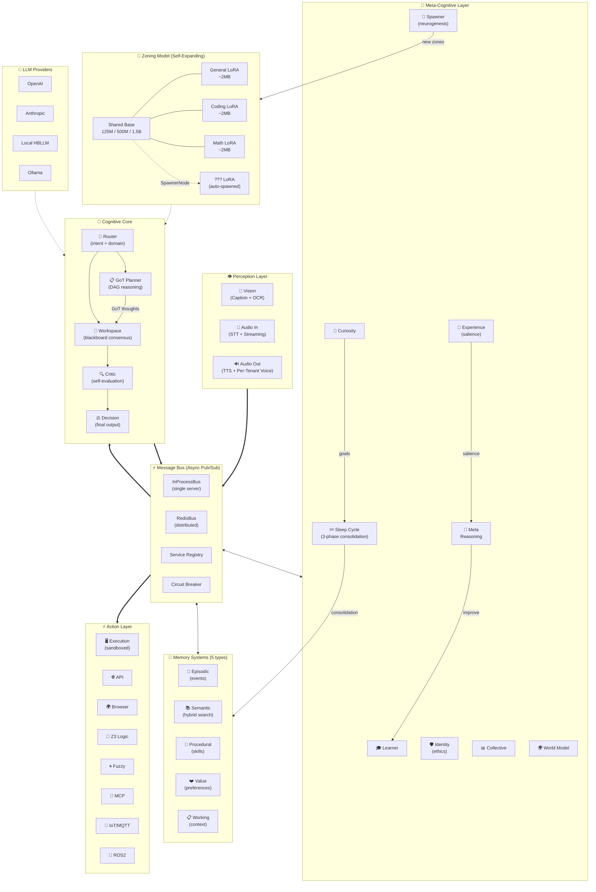

<!-- SEO Keywords: Open Source AGI, Cognitive Architecture, Large Language Models, Multi-Agent Systems, Edge AI, Hybrid Quantization, Graph of Thoughts, LoRA Tuning, Python AI Framework, Rust AI Inference, Autonomous Agents, LLMOps -->

<div class="hero-title">🧠 HBLLM Core</div>
<div class="hero-subtitle">A Human-Brain Inspired Cognitive Architecture for Autonomous AI Agents</div>

<div class="badges">

[](https://www.python.org/)
[](https://pytorch.org/)
[](https://www.rust-lang.org/)
[](#)
[](https://github.com/hbllm/hbllm-core/blob/master/LICENSE)

</div>

---

## Why HBLLM Core?

Traditional **Large Language Models (LLMs)** are monolithic, stateless transformers — prompt → model → response. They lack continuous learning, memory consolidation, and dynamic domain adaptation.

**HBLLM Core** rethinks this from the ground up. It is a **modular cognitive architecture** designed for **Edge AI deployments and Autonomous Agents**, featuring 25+ specialized "brain nodes" orchestrated via an asynchronous Pub/Sub message bus — mimicking the localized, multi-path reasoning of a biological brain.

<div class="feature-grid">
<div class="feature-card">
<h3>🧠 25+ Cognitive Nodes</h3>
<p>Router, Planner, Critic, Decision, Learner, Curiosity, Identity, World Model, Sleep Cycle, and more — each running as an isolated, asynchronous service.</p>
</div>
<div class="feature-card">
<h3>💾 5 Memory Systems</h3>
<p>Working, Episodic, Semantic, Procedural, and Knowledge Graph — mirroring human cognitive psychology for lifelong learning.</p>
</div>
<div class="feature-card">
<h3>🧬 Self-Expanding Zones</h3>
<p>The SpawnerNode automatically creates new domain-specialist LoRA adapters at runtime. The brain literally grows new regions.</p>
</div>
<div class="feature-card">
<h3>⚡ Rust-Accelerated Inference</h3>
<p>AVX2/NEON SIMD kernels for hybrid quantization. 4-bit base + 16-bit LoRA experts on a single shared transformer backbone.</p>
</div>
<div class="feature-card">
<h3>🔀 Dynamic MoE Routing</h3>
<p>Edge-optimized ONNX Vector Router blends domain experts dynamically without heavy PyTorch dependencies. Under 15MB RAM.</p>
</div>
<div class="feature-card">
<h3>🛡️ Enterprise Governance</h3>
<p>Multi-tenant isolation, Policy Engine, Sentinel monitoring, and Owner Rules for production-grade deployments.</p>
</div>
</div>

---

## System Architecture



---

## The Zoning Model — Edge-Optimized MoE

While cloud AI platforms chase computationally expensive **massive monolithic models** (70B+ parameters), HBLLM champions **Edge Computing** and **On-Device AI** with small, specialized model zones driven by dynamic LoRA routing.

| Component | Size | Purpose |
|---|---|---|
| **Base Model** | 125M–1.5B | Shared transformer backbone (GQA + SwiGLU + RoPE) |
| **LoRA Adapters** | ~2MB each | Domain specialization (General, Coding, Math, etc.) |
| **MoE Router** | ~15MB | Edge-optimized ONNX Vector Router |
| **Cognitive Nodes** | Zero params | Orchestration, planning, memory — isolated logic |

### 🧬 Artificial Neurogenesis

HBLLM ships with 3 starter zones, but the **SpawnerNode** automatically creates new specialist zones when you enter an unfamiliar domain:

1. **Registry Resolution** — Checks `AdapterRegistry` for pre-trained adapters on HuggingFace Hub or local cache.
2. **Security Audit** — Verifies SHA-256 integrity and converts from PEFT to internal HBLLM `state_dict`.
3. **Fallback Training** — Generates synthetic data and trains a new 2MB LoRA adapter in the background.
4. **Activation** — Spawns a new `DomainModuleNode` and hot-swaps weights into the shared backbone.

**The brain literally grows a new region at runtime.**

---

## Quick Start

### Installation

```bash
git clone https://github.com/hbllm/hbllm-core.git
cd HBLLM/core
pip install -e .

# Optional integrations:
pip install paho-mqtt        # IoT / MQTT Home Automation
export HBLLM_ROS2_ENABLED=1  # ROS2 Robotics (requires rclpy)
```

### CLI Utilities

```bash
hbllm info               # View active brain architecture
hbllm nodes              # List 25+ loaded cognitive nodes
hbllm serve --port 8000  # Start the FastAPI + MCP Server
hbllm train --size 125m  # Kickoff local reinforcement loops
```

### Python API

```python
import asyncio
from hbllm.brain.factory import BrainFactory

async def main():
    brain = await BrainFactory.create("openai/gpt-4o")
    
    result = await brain.process(
        "Analyze our server logs and design a firewall rule."
    )
    
    print(f"Decision: {result.text}")
    print(f"Nodes Activated: {result.path}")
    print(f"Latency: {result.latency_ms:.0f}ms")
    
    await brain.shutdown()

asyncio.run(main())
```

---

## Core Capabilities

### 🧠 Agentic Reasoning & Evaluation

- **Lock-Free LoRA Concurrency** — Isolated `ContextVars` share a single GPU without blocking.
- **Secure Adapter Registry** — SHA-256 integrity checks and `weights_only=True` for all downloads.
- **Continuous Lifetime Learning** — Contrastive DPO with atomic JSON queue and sleep-cycle consolidation.
- **Dynamic MoE Blending** — Cross-domain queries synthesize custom blend-weights at runtime.
- **Graph-of-Thoughts Planning** — Dynamic DAG reasoning for multi-step goals.
- **Process Reward Models** — Neural scoring `[0-1]` of intermediate reasoning steps.

### 💾 Multi-Tiered Memory

| Memory Type | Purpose |
|---|---|
| **Working** | Adaptive context windows with middle-out truncation |
| **Episodic** | Event-based timelines per session |
| **Semantic** | Hybrid dense/sparse vector search with UUID stability |
| **Procedural** | Learned tool patterns and skill registries |
| **Knowledge Graph** | LRU-bounded entity-relation concept graphs |

### 🛡️ Enterprise Governance

- **Tenant Isolation** — API keys, per-tenant rate limiters, isolated memory domains.
- **Policy Engine & Sentinel** — YAML governance with proactive bus traffic scanning.
- **Owner Rules** — Auto-extracted behavioral guardrails from high-salience interactions.

### ⚙️ Infrastructure

- **128k+ Context** via Sliding Window Attention — $O(1)$ memory scaling.
- **Per-Block Quantization** with Rust SIMD (AVX2/NEON).
- **Distributed Message Bus** — `InProcessBus` or `RedisBus` with HMAC auth, TTLs, and backoff.
- **Sandboxed Execution** — Secure code evaluation with compute/memory bounds.
- **Edge-Ready ONNX Router** — Under 15MB RAM, ~0.0001ms inference.

---

## Example Use Cases

### 🏠 Smart Home Automation

HBLLM powers intelligent systems that **learn** rather than just triggering routines:

- **Observation** — Notes you dim the lights when turning on the TV.
- **Procedural Encoding** — The `LearnerNode` creates a skill binding the two actions.
- **Anticipation** — The `WorldModelNode` proactively dims lights when detecting TV audio signatures.

### 🤖 Autonomous Robotics (ROS2)

Functions as the cognitive layer for edge robots:

- **Perception** — Visual OCR (`VisionNode`) and Audio STT (`AudioInputNode`).
- **Pathing** — Complex "fetch" requests broken into DAGs via the `PlannerNode`.
- **Validation** — Physics evaluation via the `WorldSimulator` before moving servos.

---

## Writing Custom Nodes

Nodes are highly decoupled. Inject a custom sensor or API into the cognitive loop:

```python
from hbllm.network.node import Node, NodeType
from hbllm.network.messages import Message, MessageType

class TemperatureSensorNode(Node):
    """Custom perception node reading from hardware."""

    def __init__(self, node_id: str, i2c_address: str):
        super().__init__(
            node_id, NodeType.DETECTOR,
            capabilities=["temperature"]
        )
        self.i2c = i2c_address

    async def poll_hardware(self):
        temp = read_sensor(self.i2c)
        
        await self.publish("perception.temperature", Message(
            type=MessageType.EVENT,
            source_node_id=self.node_id,
            payload={"celsius": temp},
        ))
```

---

## Contributing

We welcome contributions to push AGI forward! Key areas:

- 🧠 **New Cognitive Nodes** — Emotion modeling, temporal reasoning, multi-modal alignment.
- 📱 **Edge Devices** — Optimization patches for Raspberry Pi 5 & Jetson Orin Nano.
- 🌐 **Starter Zones** — Pre-trained 2MB LoRAs for Medicine, Law, or Creative Writing.

Please review our [Contributing Guide](contributing.md) for Pull Request guidelines.

---

## License

HBLLM Core is released under the **MIT License** — free for personal, commercial, and academic research use.

<div style="text-align: center; margin-top: 3rem;">
  <p><strong>HBLLM Core</strong> — Autonomous Agent AI that thinks, not just responds.</p>
  <p>⭐ <a href="https://github.com/hbllm/hbllm-core">Star this project on GitHub</a> to support open-source cognitive architectures!</p>
</div>
