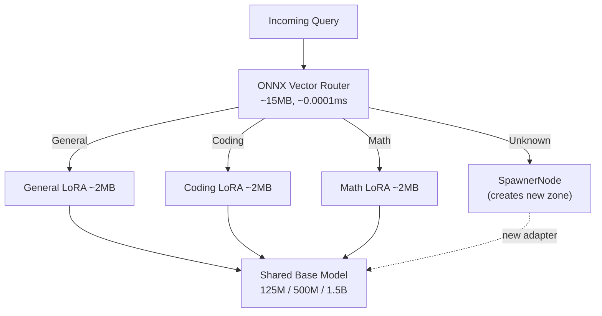

# How the Zoning Model Works

The Zoning Model is HBLLM's approach to **running intelligent AI without massive GPU/VRAM requirements**. Instead of deploying a single 70B+ model that demands 80GB+ VRAM, HBLLM uses **one shared transformer backbone** (125M–1.5B parameters, ~500MB–4GB RAM) paired with **lightweight ~2MB LoRA adapters** that hot-swap at inference time. The result: domain-expert intelligence on a laptop or Raspberry Pi.

## Core Principle



## Components

| Component | Size | Role |
|---|---|---|
| **Base Model** | 125M–1.5B params | Shared transformer with GQA + SwiGLU + RoPE |
| **LoRA Adapters** | ~2MB each | Domain specialization via low-rank weight deltas |
| **ONNX Vector Router** | ~15MB | Classification-free routing using cosine similarity |
| **SpawnerNode** | Zero params | Creates new adapters when encountering unknown domains |

## Why LoRA Instead of Full Fine-Tuning?

LoRA (Low-Rank Adaptation) modifies only a tiny fraction of the base model's weights:

- **Full fine-tune of 1.5B model:** ~6GB of weight updates
- **LoRA adapter:** ~2MB of weight deltas
- **Hot-swap time:** <10ms (PCIe bus transfer)

This means you can have dozens of domain experts loaded simultaneously with negligible memory overhead.

## Lock-Free Concurrency

HBLLM uses Python's `ContextVars` to isolate adapter selection per-request:

```python
# Each async request gets its own adapter context
# No locks, no blocking, no GPU contention
async def process_query(domain: str, text: str):
    adapter = await registry.get_adapter(domain)
    with adapter.activate():  # Sets ContextVar
        return await model.generate(text)
```

Multiple concurrent requests can use different domain adapters on the same GPU without any locking mechanism.

## Dynamic MoE Blending

When a query spans multiple domains (e.g., "Write a Python function to solve this differential equation"), the router computes blend weights:

```
Input: "Write Python to solve dy/dx = 3x²"
Router scores: coding=0.6, math=0.4
Blend: W_final = 0.6 * W_coding + 0.4 * W_math
```

This creates a virtual expert optimized for the specific cross-domain query.
