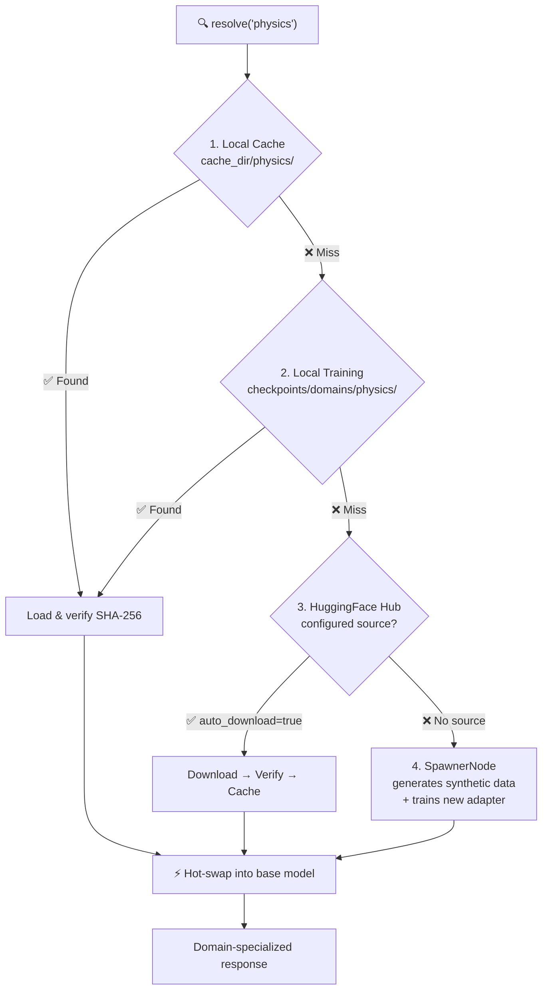
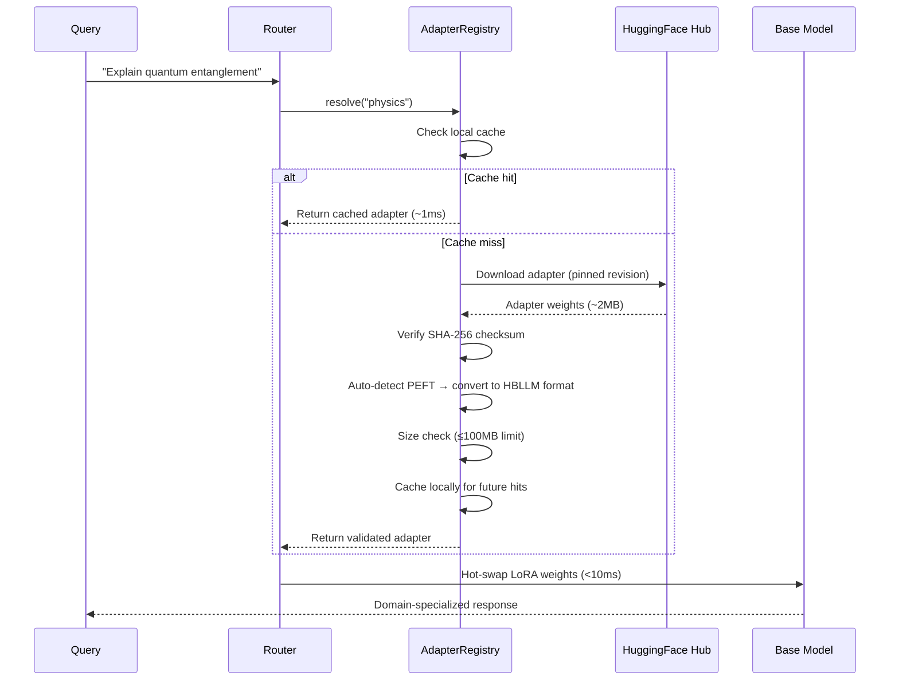

# LoRA Routing & Adapter Registry

HBLLM doesn't ship one massive model that tries to do everything. Instead, it uses **tiny ~2MB LoRA adapters** that specialize the base model for specific domains — and the system **automatically downloads the right expert** when it encounters a new domain.

!!! success "Why This Matters"
    Traditional domain adaptation requires full fine-tuning (6GB+ for a 1.5B model) and manual deployment. HBLLM downloads a 2MB file, verifies its integrity, and hot-swaps it in under 10ms — **no retraining, no downtime, no massive downloads**.

!!! tip "Read-Only Security"
    To protect expertise from "catastrophic forgetting", **all downloaded adapters are loaded as strictly `read-only` in memory**. Continuous learning and DPO operations update a separate, dedicated `personalization` adapter, ensuring domain knowledge is never degraded by daily conversational drift.

---

## How Automatic Resolution Works

When a query arrives for a domain, the `AdapterRegistry` resolves the right adapter through a 3-step fallback chain:



### Resolution Order

| Step | Source | Latency | Description |
|---|---|---|---|
| **1. Local Cache** | `cache_dir/{domain}/` | ~1ms | Previously downloaded and verified adapters |
| **2. Local Training** | `checkpoints/domains/{domain}/` | ~1ms | Adapters trained locally by the LearnerNode |
| **3. HuggingFace Hub** | Remote repo | ~2-5s (first time) | Auto-downloads from configured `AdapterSource` |
| **4. SpawnerNode** | On-device training | ~minutes | Generates synthetic data and trains a new 2MB adapter |

After the first download, all subsequent requests are served from the local cache in ~1ms.

---

## Adapter Lifecycle



---

## Configuration

```python
from hbllm.modules.adapter_registry import (
    AdapterRegistry,
    AdapterRegistryConfig,
    AdapterSource,
)

config = AdapterRegistryConfig(
    enabled=True,
    cache_dir="./checkpoints/adapters",
    auto_download=True,          # Automatically fetch from HuggingFace
    require_sha256=True,         # Enforce integrity verification
    max_adapter_size_mb=100,     # Reject adapters larger than 100MB
    sources=[
        AdapterSource(
            domain="coding",
            repo_id="hbllm/coding-lora-v2",
            revision="v2.1.0",   # Pinned to Git tag for reproducibility
            sha256="abc123...",   # SHA-256 of the adapter file
            rank=8,              # LoRA rank
            peft_format=False,   # Native HBLLM format
        ),
        AdapterSource(
            domain="math",
            repo_id="hbllm/math-lora-v1",
            revision="main",
            peft_format=True,    # Auto-converted from PEFT
        ),
        AdapterSource(
            domain="medical",
            repo_id="hbllm/medical-lora-v1",
            revision="a1b2c3d",  # Pinned to specific commit SHA
        ),
    ],
)

registry = AdapterRegistry(config)
```

### `AdapterSource` Fields

| Field | Type | Default | Description |
|---|---|---|---|
| `domain` | `str` | — | Domain name (e.g., `"coding"`, `"physics"`) |
| `repo_id` | `str` | — | HuggingFace repo ID (e.g., `"hbllm/coding-lora-v2"`) |
| `filename` | `str \| None` | Auto-generated | Custom filename in the repo |
| `sha256` | `str \| None` | `None` | SHA-256 checksum for integrity verification |
| `rank` | `int` | `8` | LoRA rank (size of the low-rank matrices) |
| `peft_format` | `bool` | `False` | If `True`, auto-converts from PEFT format |
| `revision` | `str \| None` | `None` | Git tag, branch, or commit SHA |

---

## Registry Management API

```python
# List all cached adapters
registry.list_cached()
# ["coding", "math", "general"]

# List all configured sources with cache status
registry.list_configured()
# [{"domain": "coding", "repo_id": "hbllm/coding-lora-v2", "revision": "v2.1.0", "cached": True, "has_sha256": True}]

# Resolve an adapter (downloads if needed)
weights = await registry.resolve("coding")

# Evict from cache (forces re-download next time)
registry.evict("coding")

# Save a custom adapter with provenance metadata
registry.save_adapter(
    state_dict=my_weights,
    path=Path("./checkpoints/adapters/custom/adapter.pt"),
    domain="custom",
    rank=8,
    source_repo="local-training",
)
```

---

## PEFT Compatibility

The registry **auto-detects** PEFT-format adapters on HuggingFace and converts them:

1. Checks for `adapter_config.json` in the HF repo
2. Downloads the full PEFT bundle (config + safetensors/bin)
3. Converts PEFT key format (`base_model.model.model.*.lora_A.weight`) to HBLLM format
4. Caches the converted weights locally

This means you can use **any PEFT-compatible LoRA adapter** from HuggingFace — thousands are available for domains like code, medicine, law, and creative writing.

---

## Security

All adapter operations are security-hardened:

| Protection | Description |
|---|---|
| **SHA-256 Verification** | Every download is verified against its configured checksum |
| **`weights_only=True`** | Enforced on all `torch.load()` calls — no arbitrary code execution |
| **Size Limits** | Adapters exceeding `max_adapter_size_mb` (default: 100MB) are rejected |
| **Revision Pinning** | Lock to specific Git tags or commit SHAs for reproducible deployments |
| **Cache Integrity** | Stored hashes are re-verified on every cache load; corrupt files auto-evict |
| **Async Locks** | Per-domain locks prevent duplicate concurrent downloads |

---

## How Small Are These Adapters?

LoRA adapters modify only a tiny fraction of the base model's weights:

| Comparison | Size | Description |
|---|---|---|
| **Full fine-tune of 1.5B model** | ~6GB | Every weight updated — impractical for edge |
| **Single LoRA adapter** | ~2MB | Low-rank weight deltas only |
| **10 domain experts** | ~20MB total | Run 10 specializations simultaneously |
| **Hot-swap time** | <10ms | PCIe bus transfer — imperceptible to users |

You can load **dozens of domain experts** with negligible memory overhead — each one adding just ~4MB of RAM when active.
