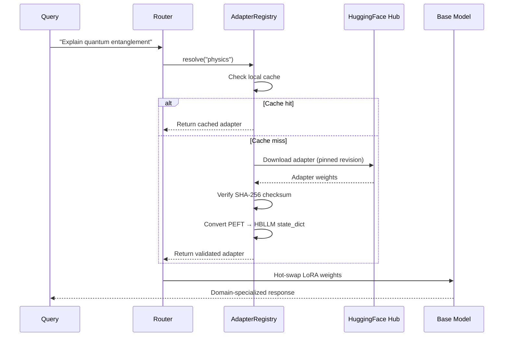

# LoRA Routing & Adapter Registry

## Adapter Lifecycle



## AdapterRegistry Configuration

```python
from hbllm.modules.adapter_registry import (
    AdapterRegistry,
    AdapterRegistryConfig,
    AdapterSource,
)

config = AdapterRegistryConfig(
    enabled=True,
    cache_dir="./checkpoints/adapters",
    auto_download=True,
    require_sha256=True,
    max_adapter_size_mb=100,
    sources=[
        AdapterSource(
            domain="coding",
            repo_id="hbllm/coding-lora-v2",
            revision="v2.1.0",  # Pinned Git tag
            sha256="abc123...",
            rank=8,
            peft_format=False,
        ),
        AdapterSource(
            domain="math",
            repo_id="hbllm/math-lora-v1",
            revision="main",
        ),
    ],
)

registry = AdapterRegistry(config)
```

## Security

- All downloaded adapters are verified against their SHA-256 checksum
- `weights_only=True` enforced on all `torch.load()` calls
- PEFT format conversion is sandboxed
- Revisions can be pinned to specific Git tags, branches, or commit SHAs
