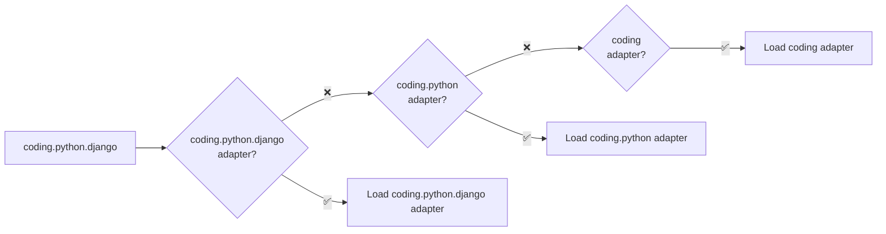
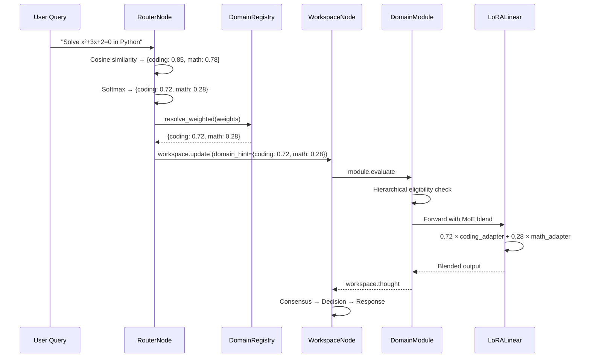

# Weighted Domains & Sub-Domain LoRA

HBLLM's domain system supports **hierarchical specialization** via dot-notation domains (e.g., `coding.python`, `math.calculus`) and **softmax-weighted MoE blending** across multiple domains simultaneously.

!!! success "Why This Matters"
    Flat domain routing forces a binary choice: is this "coding" or "math"? Real queries often span multiple domains. Weighted routing blends experts proportionally, while sub-domains allow razor-sharp specialization without losing generalization.

---

## Hierarchical Domain Registry

The `DomainRegistry` manages a tree of domain specializations using dot-notation:

```
general
coding
├── coding.python
│   └── coding.python.django
├── coding.rust
└── coding.javascript
math
├── math.calculus
└── math.statistics
```

### Adapter Fallback Chain

When the Router identifies a query as `coding.python.django`, the system resolves the LoRA adapter by walking **up** the hierarchy:



This means you only need adapters at the granularity level you've trained — sub-domains automatically inherit from their parent's expertise.

---

## Softmax-Weighted Routing

The Router outputs a **probability distribution** over domains using temperature-scaled softmax, instead of picking a single winner.

### How It Works

1. **Vector Similarity**: The Router embeds the query and computes cosine similarity against all domain centroids
2. **Filter**: Only domains above the noise threshold (0.3) are considered
3. **Softmax**: Temperature-scaled softmax (`τ=0.1`) produces sharp but smooth weights
4. **Top-K**: Only the top 2 (max 3) domains are kept; domains below 5% weight are pruned

```python
# Example output for "Write a Python script to solve quadratic equations"
domain_weights = {
    "coding": 0.72,   # Primary domain
    "math":   0.28,   # Secondary domain
}
# → Both coding and math LoRA adapters are blended at inference time
```

### Configuration

```python
from hbllm.brain.router_node import RouterNode

router = RouterNode(
    node_id="router",
    # Weighted routing parameters
    _softmax_temperature=0.1,   # Lower = sharper distribution
    _max_blend_domains=3,       # Maximum domains in blend
    _min_blend_weight=0.05,     # Minimum weight to include (5%)
)
```

---

## DomainRegistry API

```python
from hbllm.modules.domain_registry import DomainRegistry, DomainSpec

# Create with defaults (general, coding, math, planner, api_synth, fuzzy)
registry = DomainRegistry()

# Register a sub-domain
registry.register(DomainSpec(
    name="coding.python",
    centroid_text="Python programming, Django, Flask, pandas, numpy",
    adapter_name="coding.python",  # defaults to name if not set
))

# Adapter resolution with fallback
registry.resolve_adapter("coding.python.django")
# → "coding.python" (nearest registered ancestor)

registry.resolve_adapter("coding.rust")
# → "coding" (falls back to parent)

# Resolve weighted domains to adapter weights
registry.resolve_weighted({"coding.python": 0.7, "math": 0.3})
# → {"coding.python": 0.7, "math": 0.3}

# If coding.python adapter doesn't exist:
# → {"coding": 0.7, "math": 0.3}  (falls back to parent)

# Hierarchy queries
registry.children("coding")     # ["coding.python", "coding.rust", ...]
registry.root_domains           # ["coding", "general", "math", ...]
registry.leaf_domains()         # ["coding.python", "math.calculus", ...]
```

---

## Auto-Discovery

Sub-domain adapters are automatically discovered from the filesystem:

```
data/lora/
├── coding/
│   └── lora_adapter.pt          → registered as "coding"
├── coding.python/
│   └── lora_adapter.pt          → registered as "coding.python"
├── math/
│   └── lora_adapter.pt          → registered as "math"
└── math.calculus/
    └── lora_adapter.pt          → registered as "math.calculus"
```

The `BrainFactory` scans `data/lora/` at startup and registers any directories as sub-domains in the `DomainRegistry`.

### Training Sub-Domain Adapters

```bash
# Train a Python-specific LoRA adapter
hbllm sft --domain coding.python --data python_corpus.jsonl

# The adapter is saved to:
# data/checkpoints/coding.python/lora_adapter.pt
```

---

## How MoE Blending Works at Inference

When the Router outputs weighted domains, the `LoRALinear` layer blends multiple adapters:

```python
# Inside LoRALinear.forward():
# active_adapter = {"coding": 0.72, "math": 0.28}

lora_output = 0.0
for adapter_name, weight in active_adapter.items():
    h = F.linear(x, lora_A[adapter_name])
    out = F.linear(h, lora_B[adapter_name])
    lora_output += weight * out

result = base_output + (lora_output * scaling)
```

This means the model produces a response informed by **both** domain experts, weighted by their relevance to the query.

---

## Architecture Integration


